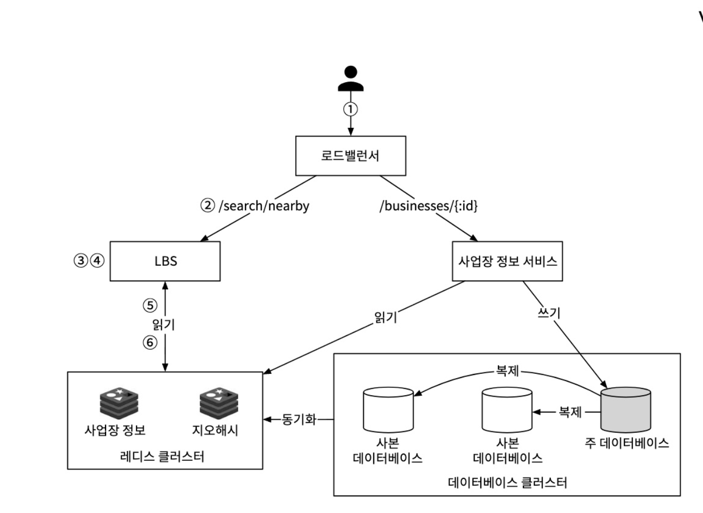

# 근접성 서비스
근접성 서비스는 음식점, 호텔, 극장, 박물관 등 현재 위치에서 가까운 시설을 찾는 데 이용된다.

### 기능 요구사항

- 사용자가 검색반경을 지정하여 반경 내 사업장 리스트를 반환한다.
- 검색 최대 허용반경은 20km 이며, 0.5km, 2km, 5km, 20km 를 선택할 수 있다.
- 고객은 사업장의 상세 정보를 확인할 수 있다.
- 사업장 소유주가 사업장 정보를 시스템에 추가,삭제,갱신할 수 있어야한다.
### 비기능 요구사항
- 사용자는 주변 사업장을 신속히 검색할 수 있어야한다.
- 사업장 정보는 사용자에게 실시간으로 보여질 필요는 없다.
- 새로운 사업장 정보는 다음날까지 반영되어야 한다.
- 사용자의 위치는 민감정보이므로, 이를 보호할 방법을 고려해야한다.
- 인구 밀집지역에서 이용자가 집중되는 시간에 트래픽이 급증해도 감당할 수 있도록 시스템을 설계해야 한다.

#### 일간 능동 사용자는 1억명이며, 등록된 사업장 수는 2억이다.
#### 한 사람당 하루 5회의 검색요청을 보낸다 가정하여, 개략적인 QPS는 5000으로 계산한다.


## API 설계
### 위치 기반 검색 API
GET `/v1/search/nearby`

| field | description | type |
|---|---|-------|
| `latitude` | 검색할 위도 | decimal |
| `longitude` | 검색할 경도 | decimal |
| `radius` | (optional) 검색반경 default : 5000m | int |

#### result:
```json
{
    "total": 10,
    "businesses" : [
        {business_object}...
    ]
}
```

### 사업장 API

| Method | url | description |
|---|---|-------|
| `GET` | /v1/businesses/:id | id값으로 사업장 상세정보 조회 |
| `POST` | /v1/businesses | 새로운 사업장 등록 |
| `PUT` | /v1/businesses/:id | 사업장 상세정보 갱신 |
| `DELETE` | /v1/businesses/:id | 사업장 정보 삭제 |

## 데이터 모델
위치정보의 경우 읽기의 비중이 압도적이다.

쓰기 성능의 감소를 감수하고서라도 읽기에 최적화된 데이터 모델과 아키텍처를 구성하는것이 중요할 것으로 보인다.

## 개략적 설계


모든 요청은 로드밸런서를 거쳐 각 서비스로 전달된다.

사업장 서비스는 마스터 DB 에 쓰여지며, LBS (Location-Based Service)는 복제된 DB에서 읽을 수 있다.

이를 통해 스케일아웃이 가능해지고, 서버는 고가용성을 유지할 수 있다.

## 주변 사업장 검색 알고리즘
여러 기술의 동작방식과 한계점을 알아보자.


각 색인법의 구현방법은 서로 다르지만 개략적인 아이디어는 같다.

-> 지도를 작은 영역으로 분할하고 고속 검색이 가능하도록 색인을 만드는 것


#### 2차원 검색
- 가장 단순하게 주어진 반경으로 원 안에 놓인 사업장을 query로 검색
- 테이블을 전부 읽어야 하므로 비효율적
- 색인을 하더라도 위도/경도별 합집합을 구하는 연산이 레코드의 수가 많으므로 효율적이지 않다.

### 균등격자

- 각 사업장은 하나의 격자에 속하므로, 격자를 통해 검색할 대상 데이터 풀을 줄일 수 있다.
- 하지만 사업장 분포는 고르지 않으므로, 밀집지역의 경우 결국 많은데이터를 찾아야함.
- 또한 주어진 격자의 인접격자를 찾기 까다로울 수 있다.
 
### 지오해시


- 지오해시는 위도/경도 데이터를 1차원 문자열로 반환한다.
- 비트를 하나씩 늘려가면서 세계를 작은 격자로 분할해나간다.
- 원하는 정밀도를 얻을 때까지 반복해서 수행. -> 통상적으로 base32 표현법 사용


- 지오해시는 12단계 정밀도를 가지며, 이 정밀도가 격자의 크기를 결정한다.

#### 지오해시 관련 이슈
- 격자자리 이슈
    - 지오해시는 해시값의 공통 접두어가 긴 격자들이 서로 더 가깝게 놓이도록 보장하지만, 가까운 격자더라도 접두어가 존재하지 않을 수 있다.
    - 이로 인해 접두어 기반 질의는 주변 모든 사업장을 가져올 수 없다.
- 격자 가장자리
    
    - 두 지점이 공통 접두어 길이는 다르지만, 서로 다른격자에 놓임
    - 흔히 사용되는 해결책으로 인접한 모든 격자의 사업장 정보를 가져오는 것.

##### 표시할 사업장이 충분하지 않은 경우
- 지오해시 마지막 비트를 지워가며 반경을 키워가며 격자를 확장시켜 검색한다.

### 쿼드트리

쿼드트리는 격자의 내용이 특정기준(사업장 수 등) 을 만족할때까지 2차원 공간을 재귀적으로 사분면 분할한다.

쿼드트리는 자료구조이며, DB가 아니기 때문에 메모리에 적재된다. 따라서 해당 데이터는 서버가 시작되는 시점에 구축된다.


최하위 밑단 노드는 특정조건(그림에선 사업장 수가 100개 이하)을 무조건 충족한다.

쿼드트리 인덱스는 메모리를 많이 잡아먹지 않으므로 서버 한대에 충분히 올릴 수 있다
대략 200m 개의 사업장 정보를 인덱싱하는 쿼드트리를 구축하기 위해 몇분 정도 소요된다.

- 서버를 시작하는 시점에 트리를 구축하려면 서버 시작시간이 길어질 수 있다는 점을 간과하면 안된다.
- 트리를 만드는 동안 서버는 트래픽을 처리할 수 없다.
- 갱신한 사업장 정보는 다음날 반영되면 된다고 명시되어있지만, 이는 밤 사이 갱신된 정보의 캐시들이 한번에 무효화되어 캐시서버에 부하가 가해질 수 있다는 점을 간과하면 안된다.


실제 쿼드트리 사례

### 구글 S2
구글에서 발표한 라이브러리로, 이 분야에서 아주 유명한 솔루션이다.

메모리 기반 솔루션이며, 힐베르트 곡선이라는 공간채움곡선을 사용하여 지리데이터를 1차원 색인화 하는 방안이다.

힐베르트 공선상에서 인접한 두 지점은 1차원공간 내에서도 인접한 위치에 있다.

1차원 공간 내 검색은 2차원 검색보다 훨씬 더 효울적이다.


- S2는 지오펜스(geofence) 구현에 좋다. 다양한 수준의 영역지정이 가능하기 때문
- 스쿨존, 동네 경계 등 현실세계의 경계를 설정 가능하다.


## 최종 추천

면접 시에는 지오해시나 쿼드트리 둘 중 하나를 택하길 추천한다.

S2의 경우 면접시간동안 분명하게 설명하기 까다롭기 때문.


### 지오해시
- 구현과 사용이 쉽다. 트리를 구축할 필요가 없다.
- 지정반경 이내 사업장 검색을 지원.
- 정밀도를 고정하면 격자 크기도 고정된다.
- 다만 인구밀도에 따라 동적으로 격자 크기 조정 어려움.
- 색인 갱신이 쉽다.
### 쿼드트리
- 트리 구축이 조금 더 까다로움
- n번째 가까운 사업장까지 목록을 구할 수 있다.
- 인구 밀도에 따라 격자 크기 동적으로 조절 가능
- 색인이 지오해시보다 까다롭다. 처음부터 다시 생산해야하므로 캐시도 무효화된다.


## 상세 설계

### 사업장 테이블
사업장 테이블 데이터는 한 서버에 담을 수 없을만큼 크다.
샤딩을 적용하여 모든 샤드에 부하를 고르게 분산하도록 하여야한다.

### 지리정보 색인 테이블
1. 각각 지오해시에 연결되는 모든 사업장 ID를 JSON 배열로 같은열에 저장.
    - geohash : businesses_list
2. 같은 지오해시에 속한 사업장 ID를 별도의 레코드로 저장
    - 색인데이터 하나당 레코드 하나

1번의 경우 색인 갱신 시 전체 데이터 수정이 필요하다. 전체 데이터를 읽고 확인하고 수정하는 작업 비효율적
2번은 지오해시+사업장ID를 합친 복합키로 사용하여 사업장 정보를 추가/삭제할 때 락을 사용할 필요 없어짐.


## 최종 설계



## 추가 생각 - 우버 H3 Index

H3는 Uber가 글로벌 시장에서 위치기반 데이터 분석, 배차/가격 결정, 수요-공급 매칭 등 여러 목적으로 개발한 헥사고날(육각형) 격자 기반의 계층적 공간 인덱스 시스템이다.

### H3 특징
1. 육각형 격자 사용
- 육각형 셀은 모든 인접 셀 간 중심점 간 거리가 동일하다는 장점이 있다. 정사각형이나 삼각형 그리드 대비 ‘거리 균질성’이 좋다는 설명이 H3 공식 블로그에 나와 있다.
- 이로 인해 "근접 셀 찾기" 같은 공간연산을 단순화 할 수 있다.
2. 계층구조 지원
- 각 해상도(resolution)에서 셀을 더 세밀하게 나눌 수 있으며, 상위 셀에서 하위 셀(child)로 내려가거나 그 반대로 올릴 수 있다.
- 이를 통해 “지역 단위 집계”, “세밀한 위치 분석”, “해상도 전환” 등이 효율적으로 가능해진다.
3. 효율적인 공간 인덱싱 및 분석 가능
- Uber에서는 도시 내 수요/공급을 각 헥사고날 셀 단위로 집계하고, 가격 상승(surge) 또는 배차 우선순위 등을 셀 단위 분석으로 수행했다.
- 셀 ID는 64-비트 정수 형태로 표현되며, 연산도 비교적 경량화되어 있다. 
4. 다양한 API 함수/기능 제공
- 위도/경도 → H3 셀 인덱스 변환 (geoToH3 등)
- H3 셀 → 중심 좌표 또는 경계(다각형) 반환 (h3ToGeoBoundary 등)
- 인접 셀 탐색(kRing), 거리 계산(h3Distance), 셀 집합 압축/해제(compact, uncompact) 등. 
5. RDBMS, NoSQL, 검색엔진(Elasticsearch 등) 결합사용 가능
- H3는 위도/경도 -> H3 Index값으로 매핑 및 셀 연산을 도와주는 라이브러리로, 해당 기능을 이용해 다른 검색엔진 및 DB와 연계하여 사용이 가능하다.

### 참고

