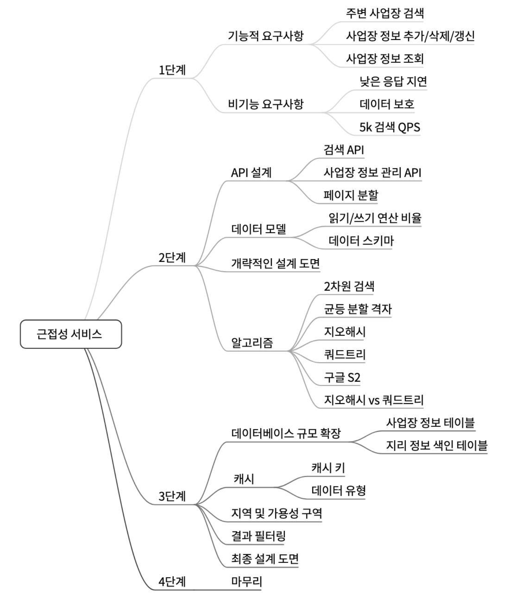

# 1장.  근접성 서비스

> 근접성 서비스란?
> 

음식점, 호텔 등 현재 위치에서 가장 가까운 시설을 찾는데 이용됨.

e.g) 구글맵, 네이버 지도에서의 검색

## 문제 이해 및 설계 범위

### 기능 요구사항

- 사용자 위치, 검색 반경 정보에 매칭되는 사업장 목록 반환
- 사업장 소유주가 사업장 정보를 추가,삭제,갱신할 수 있음.
    - 이 정보는 실시간으로 반영될 필요는 없다.
- 고객은 사업장 상세정보를 조회할 수 있다.

### 비기능 요구사항

- 낮은 응답 지연
    - 사용자는 주변 사업장을 신속히 검색할 수 있어야한다.
- 데이터 보호
    - 위치는 민감정보
    - 위치기반 서비스에서는 사용자 정보를 보호할 방법을 고려해야함.
- 고가용성 및 규모 확장성
    - 인구 밀집지역, 이용자 급증 시간대에 트래픽이 몰려도 감당 가능해야함.

### 개략적 규모 추정

DAU 1억명

사업장 수 2억개

## 개략적 설계안 제시 및 동의 구하기

- api 설계
- 개략적 설계안
- 주변 사업장 검색 알고리즘
- 데이터 모델

### API 설계

> 사업장 목록 조회
> 

`GET /v1/search/nearby`

기준에 맞는 사업장 목록을 반환.

페이징 처리를 한다면 반경이 20km이내이니 충분히 가능할듯함.

20km 보다 더 큰 범위의 거리가 주어지게 된다면 offset pagination 보다는 cursor 기반의 pagination 구성 고려 필요.

> 사업장 관련 API
> 

현업에서 현재도 api 버전 + 도메인

단순 CRUD에서는 id를 받게 구현하고 있음.

### 데이터 모델

사업장이 새롭게 추가되거나 정보가 변경되는것보다 이 사업장들을 조회하는 api가 훨씬 많이 수행되게 할 것이기에 관계형 db가 설계하기 좋다.

### 개략적 설계

> 로드밸런서
> 

유입 트래픽을 자동으로 여러 서비스에 분산시키는 컴포넌트.

책에서 말하는 것으로 보면 URL 경로를 분석하여 트래픽을 어디 서버에 전달할지 결정한다고 하니

L7 로드밸런서로 구현하게 될 것이다.

> 위치기반 서비스(LBS)
> 

시스템의 핵심요소로, 사용자의 위치와 반경 정보를 이용하여 사업장을 탐색한다.

- 쓰기 요청이 없고, 읽기 요청만 빈번하게 발생하는 서비스
- QPS가 높다.
    - 인구 밀집 지역일수록 심해진다.
- 무상태 서비스로 수평적 규모확장이 쉽다.
    - 세션같은것이 각 서버마다 저장되는 구조라면 확장이 쉽지 않을것.

> 사업장 서비스
> 
- 사업장 소유주
    - 사업장 정보 C, U, D 수행
    - 기본적으로 Write 기반 요청이 많고 QPS가 낮다
- 고객
    - 사업장 정보를 조회한다
    - 특정 시간대 QPS 높아짐

> 데이터베이스 클러스터
> 

primary, secondary replication db 구조를 사용

위의 조건에서 복제지연을 염두에 두고 설계를 하였음.

→ 만약 복제지연을 고려해서 사업장 정보가 즉시 반영되어야 한다면?

1. 같은 트랜잭션 내에서만 primary를 읽게 구성해볼 수 있음
2. 사업장 정보가 추가되었을 때 세션에 최근 추가되었다는 어떤 플래그값을 짧게 세션에 준다
    1. 해당 세션값이 발견되었을때에는 write db를  통해 조회하면서 캐싱을 건다.

> 사업장 서비스와 LBS의 규모 확장성
> 

특정 시간대에 집중적으로 몰리는 트래픽에는 자동으로 서버를 추가하여 대응

→ 어떻게 대응할건데?

그냥 auto scaling 을 걸어주게 되면 이미 트래픽이 쏟아진 시점에서부터 늘어나기에 오류가 있을 수 있음.

### 주변 사업장 검색 알고리즘

레디스 geoHash or PostgreSQL 사용

> 2차원 탐색
> 

x축의 데이터, y축의 데이터의 교집합을 찾는 연산이 들어가서 검색에 굉장한 비효율이 발생함.

데이터 모수가 너무 많음.

색인을 만드는 방법

- 해시 기반
    - 균등 격자
        - 사업장 분포가 균등하지 않음
        - 밀집도에 따른 격자 크기를 동적으로 지정이 필요
            - 인접 격자를 찾기 까다로울 수 있음
    - 지오해시
        - 2차원 위경도 데이터를 1차원 문자열로 반환
        - 비트를 늘리며 재귀를 사용해 작은 격자로 분할
- 트리 기반
    - 쿼드트리
    - 구글 S2

## 상세 설계

- 데이터베이스 규모 확장
- 캐시
- 지역 및 가용성 구역
- 시간대 또는 사업장 유형에 따른 검색
- 최종 아키텍처 다이어그램

### 데이터베이스의 규모 확장성

> 사업장 테이블
> 

테이블에 데이터를 구성하지만, 지역이나 다른 요인들로 인해 데이터를 각각 저장할 필요가 있을 수 있다.

샤딩을 함에 있어 핫스팟 문제가 발생할 수 있기 때문에 골고루 분산시키기 위해서 모듈러 연산으로 노드를 지정하도록 구성한다.

> 지리 정보 색인 테이블
> 

### 캐시

캐시 레이어 도입 전에는 정말 필요한지 한번 더 생각해보아야 함.

- 처리 부하가 읽기 중심 & 크기가 상대적으로 작아서 모든 데이터는 한대 데이터베이스 서버에 수용 가능
    - 질의문의 성능이 I/O에 좌우되지 않아 memcached 를 사용할 때와 비슷
- 읽기 성능이 병목이라면 read db replication을 추가한다.

> 캐시 키
> 

위치 정보는 조회할때마다, 실시간성으로 계속해서 바뀌기 때문에 키로 적절하지 않다.

이를 지오해시나 쿼드트리는 격자 내 모든 사업장이 같은 해시값을 갖도록 할 수 있다.

### 지역 및 가용성 구역

- 여러 지역과 가용성 구역에 설치하게 되면  물리적으로 거리를 줄일 수 있고, 해당 지역의 데이터센터로 이동하기에 빠른 접근이 가능하다.
- 트래픽을 인구에 따라 분산시킬 수 있다
    - 우리나라 밀도가 높기에 여러 구역을 활용해서 부하 분산을 하는것이 필요할 수 있음
- 지역별로 보안이나 사생활 보호법 정책을 지킬 수 있다

## 마무리

