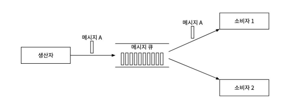
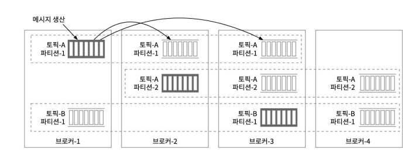
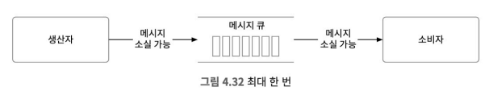
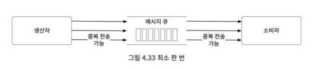
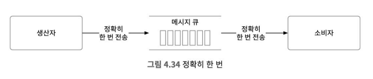

# 4장 분산 메시지 큐

현대적 소프트웨어 아키텍처를 잘 따르는 시스템은 잘 정의된 인터페이스를 경계로 나뉜 작고 독립적인 블록들로 구성된다.

메시지 큐는 이 블록 사이의 통신과 조율을 담당한다.

#### 메세지 큐를 사용하면 얻을 수 있는 이득
- 결합도 완화 (decoupling): 컴포넌트 사이의 강한 결합이 사라지므로 각 컴포넌트를 독립적으로 갱신할 수 있다.
- 규모 확장성 개선: 메시지 큐에 데이터를 생산하는 producer와 메세지 큐를 소비하는 consumer 시스템 규모를 트래픽 부하에 맞게 독립적으로 늘릴 수 있다.
- 가용성 개선: 특정 컴포넌트에 장애가 발생해도 다른 컴포넌트는 큐와 계속 상호작용을 이어갈 수 있다.
- 성능 개선: 메시지 큐를 통해 비동기 통신을 쉽게 구축할 수 있다. producer와 consumer는 서로의 상태를 고려하지 않고 각자의 역할에만 수행하면 된다.


### 메시지 큐 (Message Queue) vs 이벤트 스트리밍 플랫폼 (Event Streaming Platform)

| 구분            | 메시지 큐 (Message Queue)        | 이벤트 스트리밍 플랫폼 (Event Streaming Platform) |
| ------------- | ---------------------------- | --------------------------------------- |
| **대표 기술**     | RabbitMQ, ActiveMQ, SQS      | Apache Kafka, Redpanda, Pulsar          |
| **주요 목적**     | 안정적인 비동기 메시지 전달              | 대량의 이벤트 데이터를 실시간 스트리밍 처리                |
| **데이터 모델**    | 메시지 단위 (개별 작업 또는 명령)         | 이벤트 로그 (시간 순서가 있는 데이터 스트림)              |
| **메시지 소비 방식** | 1회 소비 (queue → consumer)     | 다회 소비 가능 (topic → 여러 consumer group)    |
| **데이터 보존 정책** | 소비 후 삭제 (ACK 기반)             | 로그 기반 보존 (기간 또는 용량 단위로 유지)              |
| **처리 보장 방식**  | At most once / At least once | At least once / Exactly once (Kafka 가능) |


메세지 큐는 하나에 메시지는 한명의 consumer만 처리한다.
이벤트 스트리밍 플랫폼은 pub/sub 구조로 1회 이벤트를 구독하는 여러 consumer가 존재한다. (이는 consumer group으로 구분됨)

메세지 큐는 소비된 메세지를 영구저장하지 않는다. 반면 이벤트 스트리밍 플랫폼은 로그 기반 보존이 가능하다.


## 문제 이해 및 설계범위 확정

### 기능 요구사항 
- 생산자는 메시지 큐에 메시지를 보낼 수 있어야 한다.
- 소비자는 메시지 큐를 통해 메시지를 수신할 수 있어야 한다.
- 메시지는 반복적으로 수신할 수도 있어야 하고, 단 한 번만 수신하도록 설정 될 수도 있어야 한다.
- 오래된 이력 데이터는 삭제될 수 있다.
- 메시지 크기는 킬로바이트 수준이다.
- 메시지가 생산된 순서대로 소비자에게 전달할 수 있어야 한다.
- 메시지 전달 방식은 최소 한 번, 최대 한 번, 정확히 한 번 가운데 설정할 수 있어야 한다.

### 비기능 요구사항 
- 높은 대역폭과 낮은 전송 지연 가운데 하나를 설정으로 선택 가능하게 하는 기능
- 규모 확장성. 이 시스템은 특성상 분산 시스템일 수밖에 없다. 메시지 양이 급증해도 처리 가능해야 한다.
- 지속성 및 내구성(persistency and durability). 데이터는 디스크에 지속적으로 보관되어야 하며 여러 노드에 복제되어야 한다.

## 개략적인 설계안

전통적인 메세지 큐는 이력에 대한 영구저장을 지원하지 않으며, 메세지는 단 한 소비자만 수신이 가능하다.
또한 메세지 큐는 메세지 전달 순서도 보장하지 않는다.

## 이벤트 스트리밍 플랫폼
### 일대일 모델
전송된 메시지는 오직 한 소비자만 가져갈 수 있다. 소비자가 아무리 많아도 결국 가져가는건 소비자 한명 뿐이다.


소비자가 메세지를 가져갔다는 사실을 큐에 알리면 해당 메세지는 큐에서 삭제된다.

이 모델은 데이터 보관을 지원하지 않는다.

본 설계는 2주 동안은 보관을 지속할 수 있어야 하므로, pub-sub 모델쪽이 더 부합한다

### 발행-구독 모델(pub-sub model)

#### 토픽
일대일 메시지 큐에 파이프라인과 비슷한 역할이다.

메세지는 토픽으로 발행된다.

#### 파티션
하나의 토픽은 여러개의 파티션으로 나뉠 수 있다.

소비자는 토픽이 아닌 파티션 단위로 메세지를 처리한다. 

하나의 파티션은 FIFO(First In First Out) 큐처럼 동작한다. (순서가 보장됨)

토픽으로 발행된 메세지는 key나 알고리즘에 의해 분류되어 각 파티션에 분배된다.

이로 인해 대역폭을 높일 수 있다.

## 상세 설계

- 회전디스크가 느려지는건 Randim IO에 대한 접근이 발생 할 경우이다.

- 현대의 운영체제는 디스크 데이터를 메모리에 적극적으로 캐시한다. -> 디스크 저장매체로 사용 가능



복제를 통한 가용성 높은 설계가 가능하다.

사본 분산 계획은 메타데이터 저장소 (아파치 Zookeeper 등)에 저장된다.

메시지 브로커는 복제된 브로커가 죽으면 이를 Zookeeper 가 헬스체크를 통하여 확인하고 남아있는 브로커들로 파티션 재분배 계획을 세운다.

또한 복제 된 브로커들은 동기화를 통해 최신 상태를 유지한다. 복제화 된 사본들은 ISR(In-Sync Replicas) 그룹으로 불린다.


## 메세지 전달 보장 방식
메세지 큐가 지원하는 전달 보장 방식이다.

### 최대 한 번 ( at-most once )
메세지를 최대 한 번만 전달하는 방식.

`메세지가 전달 과정에서 소실되더라도 다시 전달되는 일은 없다.`

- producer는 topic에 비동기적으로 메세지를 보낸 후 수신 응답을 기다리지 않는다 (ACK=0)
- consumer는 메세지를 읽고 처리하기 전에 offset부터 갱신한다. offset이 갱신된 직후에 소비자에게 장애가 발생하면 메세지는 다시 소비될 수 없다.



이 전달 방식은 지표 모니터링(monitoring metrics) 등, 소량의 데이터 손실은 감수할 수 있고 빠른 처리가 필요한 애플리케이션에 적합하다.


### 최소 한 번 ( at-least once )
메세지가 한번 이상은 전달될 수 있다.

`메세지의 소실은 발생하지 않아 여러번 소비가 발생할 수 있다.`

- producer는 메세지를 동기/비동기적으로 보낼 수 있다.
- ACK=1 or ACK=all 구성을 이용하여 producer는 메세지가 브로커에게 전달되었음을 반드시 확인 후 연결을 종료한다.
- 메세지 전달이 실패하거나 타임아웃이 발생한 경우에는 계속해서 재시도
- consumer는 메세지를 성공적으로 처리한 이후에 offset을 갱신한다. 이로 인해 처리가 실패하더라도 메세지를 다시 가져와 처리를 시도하므로, 데이터의 손실은 없다.
- offset이 갱신되지 않은 채 장애가 발생한다면 메세지는 중복 처리될 것이다.
- 따라서 최소 한번 이상은 전달이 보장된다.



key값을 통해 메세지 확인 후 버리는 방식으로 한번만 처리할 수 있다.

### 정확히 한 번
`사용자 입장에서 가장 편리하지만, 가장 구현하기 까다로운 전송방식.`

`시스템의 성능 및 구현 복잡도 측면에서는 가장 비용이 크다.`



지불, 매매, 회계 등 금융 관련 응용에는 이 전송방식이 적합하다.
`멱등성(idempotency)`이 구현되어있지 않은 애플리케이션에 특히 중요한 전송방식이다.

## 추가로 살펴볼 사항들

### 프로토콜
프로토콜은 노드 사이에 오고 가능 데이터에 관한 규칙, 문법, 그리고 API를 규정한다.
- 메세지 생산과 소비, 박동메세지 교환 등의 모든 활동을 설명해야 한다.
- 대용량 데이터를 효과적으로 전송할 방법을 설명해야 한다.
- 데이터의 무결성을 검증할 방법을 기술해야 한다.

유명한 프로토콜로는 AMQP(Advanced MEssage Queuing Protocol), Kafka Protocol 등이 있다.

### 메세지 소비 재시도 (retry consumption)
처리되지 못한 메세지는 일정 시간 뒤 다시 처리를 시도해야한다.

새로 몰려드는 메세지들이 제대로 처리되지 못하는 일을 막으려면 실패한 메세지는 재시도 전용 토픽 (Dead Letter Queue)을 만들어 처리하는 등의 방법을 통해 신규 발행된 메세지에 대한 처리의 지연을 방지한다.

### 이력 데이터 아카이브 (history data archive)
시간 기반 혹은 용량 기반 로그 보관 매커니즘이 있다고 가정할 때,

이미 삭제된 메세지를 다시 처리해야 한다면 어떻게 해야될까?

몇가지 예로 오래된 데이터는 HDFS 같은 대용량 저장소 시스템이나 객체 저장소에 보관해 두는 방법이 있다.


## 핵심 내용 정리

- producer - subscriber 사이에 메세지를 생성하고 읽을 수 있어야한다.
- 메세지 모델별 특징 (일대일, 발행-구독)
- 대역폭과 지연시간의 트레이드 오프
- 이벤트 스트리밍 플랫폼의 각 컴포넌트 설명
    - 토픽
    - 파티션
    - 브로커
    - 소비자 그룹
    - ...
- 이 외 서비스에 맡는 고려사항


---

## 기타 의견

- 메타 데이터 저장소의 경우에도 클러스터링이 필수 아닌가? 이는 어떻게 브로커들의 상태를 공유하는가?
    - 주키퍼가 브로커들을 관리하는 형태가 아닌, 브로커들이 주키퍼에게 살아있다는 사인을 보냄.
    - 주키퍼도 클러스터링 구성이 가능하며, leader-follower 구성이다.
- 파티션은 순서보장 Queue 처럼 동작한다. 따라서 순서의 보장이 필요한 메세지의 경우 key 값을 통해 같은 파티션으로 보내 순서를 보장하여 처리할 수 있다. 근데 트래픽이 급증하여 파티션의 증설이 필요할 경우 이 key가 보장이 되나?
    - kafka는 key값이 있는 데이터는 기본적으로 아래의 알고리즘으로 파티션을 선정한다. 

        ``` partition = hash(key) % numPartitions ```

        3개 -> 6개로 변경 시나리오 
        | Key   | hash(key) | 추가 이전 %3 | 추가 이후 %6                 |
        | ----- | --------- | ----- | --------------------- |
        | userA | 12        | 0     | 0                     |
        | userB | 25        | 1     | 1                     |
        | userC | 30        | 0     | **0→0 (우연히 같을 수 있음)** |
        | userD | 19        | 1     | **1→1 (같을 수 있음)**     |
        | userE | 17        | 2     | **2→5 (달라짐)**        |


    - 파티션 수가 늘어나면 같은 key값이더라도 향하는 파티션이 달라질 수 있다.
    - 단기적으로 처리되는 데이터는 위험이 적지만, 작업단위가 길고 순서가 보장되어야 하는 작업이라면 위험.
    - `custom partitioner` 를 통해 키-파티션 매칭 로직 별도 구현 필요
