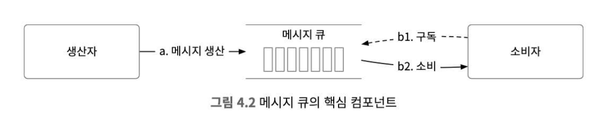
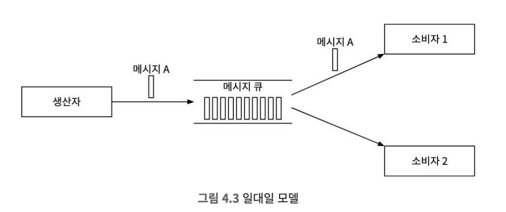
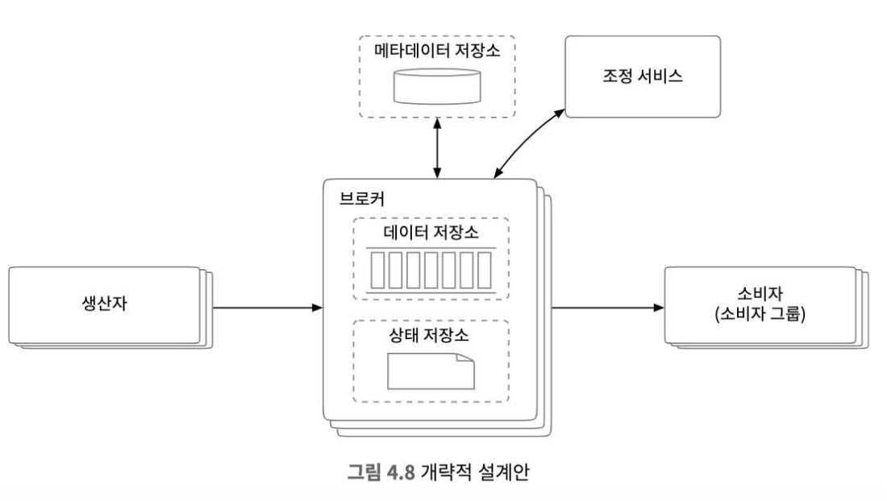
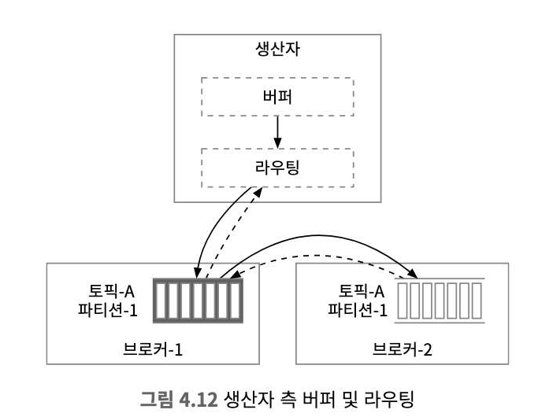
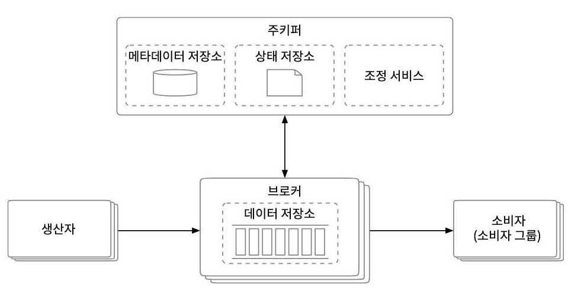
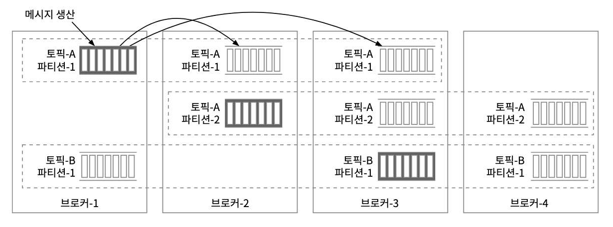

# 4장. 분산 메시지 큐

# 분산 메시지 큐

면접 질문에서 자주 나온다. 요즘 이벤트 기반으로 하는 아키텍처 많음.

## 메시지 큐를 사용하면 얻는 이득?

- 결합도 완화
    - 컴포넌트 사이의 강결합이 사라져 독립적 갱신이 가능
- 규모 확장성 개선
    - producer, consumer 규모를 각각 트래픽 부하에 맞게 독립적으로 늘릴 수 있다.
- 가용성 개선
    - 시스템의 특정 컴포넌트에 장애가 발생해도 다른 컴포넌트는 큐와 계속 상호작용을 이어갈 수 있다.
- 성능 개선
    - 비동기 통신이 쉽게 가능
    - Producer
        - 응답 기다림 없이 메시지 보냄
    - Consumer
        - 읽을 메시지가 있는경우만 메시지 소비

### 메시지 큐 종류

- Apache
    - Kafka
    - RocketMQ
    - RabbitMQ
    - Pulsar
    - ActiveMQ
- ZeroMQ

### Message Queue vs Event Streaming Platform

Kafka나 Pulsa 는 큐가 아니라 이벤트 스트리밍 플랫폼이다.

근데 이 차이를 지원하는 기능이 서로 수렴하며 경계가 모호해지는중

## 1단계 - 문제 이해 및 설계 범위 확정

producer는 메시지를 큐에 보낸다.

consumer는 메시지를 꺼낼 수 있으면 된다.

### 기능 요구사항

- Producer 는 메시지큐에 메시지를 보낼 수 있어야 한다.
- Consumer는 메시지 큐를 통해 메시지를 수신할 수 있어야 한다.
- 메시지는 반복적으로 수신할 수 있어야하고, 단 한번만 수신하도록 설정될 수도 있어야 한다.
- 오래된 이력 데이터는 삭제될 수 있다.
- 메시지 크기는 KB 수준
- 메시지가 생산된 순서대로 소비자에게 전달할 수 있어야 한다.
- 메시지 전달방식은 아래 3가지를 모두 설정할 수 있어야 한다.
    - at least once
    - exactly once
    - at most once

### 비기능 요구사항

- 높은 대역폭, 낮은 전송지연 중 하나를 설정으로 선택 가능하게 하는것
- 메시지 양이 급증해도 처리 가능해야 한다.
- 지속성 및 내구성.
    - 디스크에 지속적으로 보관되어야 하며 여러 노드에 복제되어야 한다.

### 전통적 메시지 큐와 다른 점

RabbitMQ와 같은 전통적 메시지 큐는 메시지 보관 문제를 중요하게 다루지 않는다.

## 2단계 - 개략적 설계안 제시 및 동의 구하기

### 메시지 모델

point-to-point, pub/sub 모델 2가지가 있다

> point to point 모델

전통적 메시지 큐에서 발견되는 모델

하나의 큐에선 하나의 컨슈머만 가져갈 수 있다.

ack 신호를 주면 해당 메시지는 처리한것으로 간주하고 메시지를 삭제한다.

데이터 보관을 지원하지 않는다.

> Pub-Sub 모델

topic 이라는 개념을 도입한다.

메시지를 주제별로 정리하는데에 사용한다.

메시지를 보내고 받을땐 토픽에 보내고 받는다.

### 토픽, 파티션, 브로커

메시지는 토픽에 보낸다고 했는데 메시지가 너무 많다면?

브로커를 통해 파티션을 관리해주면 된다.

> 브로커란?

파티션을 유지하고 관리하는 친구

그러나 파티션을 함부로 늘려선 안된다.

→ 늘리는건 자유지만 줄이는건 할 수 없다

각 토픽의 파티션은 큐 구조로 동작하며, 같은 파티션 내에서는 순서가 보장된다.

파티션 내에서의 메시지 위치는 offset이라고 한다.

> 순서를 보장하고 싶다.

순서를 보장하고 싶다면 파티션 Key를 통해 값을 지정하여 한개의 파티션으로 데이터를 몰게하고 그에따라 순서대로 처리될 수 있게 하면 된다.

컨슈머는 한개 이상의 파티션에서 데이터를 가져오게 된다.

컨슈머가 여러개인 경우 토픽을 구성하는 파티션 일부의 메시지들을 받게되고, 이들을 컨슈머 그룹이라고 한다.

### Consumer Group

컨슈머 그룹 내의 컨슈머들은 토픽에서 메시지를 소비하기 위해서 서로 협력한다.

컨슈머 그룹은 여러 토픽을 구독할 수 있고 offset을 별도로 관리한다.

아래 컨슈머가 동일한 그룹으로 묶인 2개라면 이 두개는 한개의 토픽을 나눠서 병렬로 처리 가능하다.

- Consumer Group (A)
- Consumer Group (A)

컨슈머 그룹이 여러개면 이제 순서보장은 할 수 없는데, 이를 위에서 정리한 Partition Key를 사용하여 

설정해준다.

- 파티션 > 컨슈머
    - 컨슈머가 여러 파티션을 동시에 맡아 처리한다
- 파티션 == 컨슈머
    - 하나의 파티션엔 하나의 컨슈머가 붙어 동작한다
- 파티션 < 컨슈머
    - 파티션과 매칭되지 않은 컨슈머 n개는 논다.

## 3단계 - 상세 설계

- 디스크 기반 자료구조 활용
- 불변 자료구조들을 통한 메시지 자료구조 설계
- 일괄 처리를 우선하는 시스템 설계
    - producer는 메시지 일괄 전송, 메시지 큐는 그 메시지들을 더 큰단위로 묶어 보관
    - consumer도 메시지를 일괄 수신하도록 한다.

### 데이터 저장소

큐의 패턴

- 읽기와 쓰기가 빈번하게 일어남
- 갱신/삭제 연산은 발생하지 않는다
- 순차적인 읽기/쓰기가 대부분

> 데이터베이스

- RDBMS
    - 토픽별 테이블 생성
    - 토픽에 보내는 메시지는 해당 테이블에 새로운 row insert
- NoSQL
    - 토픽별 collection
    - 메시지 = 한개의 document

데이터 베이스들은 저장하는 구조에선 요구사항을 맞출 수 있는데, 읽기/쓰기 동시에 빈번하다면 설계하기 어려울 수 있다.

> 쓰기 우선 로그 (Write-Ahead Log; WAL)

새로운 항목이 추가되기만 하는 일반 파일이다.

다양한 시스템에서 사용되는 기술이고, MySQL의 redo log나 zookeeper 가 이 기술을 활용한다

지속적을 보장해야 되는 메시지는 디스크에 WAL로 보관을 추천한다

WAL 접근 패턴은 전부 순차적이다.

순차적인 경우 디스크는 아주 좋은 성능을 보인다.

→ 디스크 헤드가 계속 왔다갔다 하면 조회 시간이 늘어나게 됨

파일의 크기는 무한정으로 커질 수 없으니까 세그먼트 단위로 나누는 것이 바람직함.

세그먼트가 일정 크기에 도달하면 새 활성 세그먼트 파일이 만들어지고, 기존의 것은 비활성 상태로 변경된다.

이 비활성 세그먼트 파일은 보관 기한이 만료되거나 용량 한계에 도달하면 삭제해버릴 수 있다.

> 디스크 성능 관련 유의사항

결국 장기 보관에 대한 문제로 인해 디스크 드라이브를 활용하여 다량의 데이터를 보관한다.

회전식 디스크가 느리다는건 데이터 접근 패턴이 무작위일 때다.

순차적 데이터 접근 패턴을 적극 활용하는 디스크 기반 자료구조를 활용하면, RAID로 구성된 현대적 디스크 드라이브에서 수백 MB/sec 수준의 읽기/쓰기 성능을 달성하는 것은 어렵지 않다.

현대적 운영체제는 디스크 데이터를 메모리에 아주 적극적으로 캐싱하는데 WAL도 OS 제공하는 디스크 캐시 기능을 적극적으로 활용한다.

### 메시지 자료 구조

높은 대역폭 달성의 키다. procuder, consumer 그리고 큐 사이의 약속이다.

> 메시지 키

- 파티션을 정할때 사용
- 키가 주어지지 않은 메시지 파티션은 무작위적으로 결정된다
- 키가 주어진 경우는 모듈러 연산에 의해 결정된다

> 메시지 값

- payload를 의미함

> 메시지 기타 필드

- 토픽
    - 메시지가 속한 토픽의 이름
- 파티션
    - 메시지가 속한 파티션 id
- 오프셋
    - 파티션 내 메시지 위치
- 타임스탬프
    - 메시지 저장 시간
- 크기
    - 메시지 크기
- CRC
    - 순환 중복검사의 약자, 주어진 데이터의 무결성을 보장하는데 이용
- 이외의 선택적 필드

### 일괄 처리

일괄 처리가 성능 개선에 중요한 이유

- 비싼 네트워크 비용을 제거할 수 있음
- 브로커가 여러 메시지를 한번에 로그에 기록하면 큰 규모의 순차 쓰기 연산 발생
    - 높은 디스크 접근 대역폭 달성 가능

이 2가지를 동시에 달성하기는 어렵다

- 낮은 응답 지연 목표
    - 일괄 처리되는 메시지 양을 줄인다
- 처리량을 높여야 함
    - 토픽당 파티션 수를 늘려 대역폭을 향상

### Producer 측 작업 흐름

파티션에 메시지를 보내야할 때 어떤 브로커를 통해 보낼지 라우팅 계층을 통해 설정한다.

클러스터링된 환경이라면 리더 브로커가 될 것이다.

이렇게 되면 라우팅 계층과의 네트워크 교류 시간이 있어 이만큼 지연이 발생한다.

일괄처리가 가능하면 효율을 높일 수 있는데 그렇지 않다.

> 개선된 구조

producer에 라우팅을 같이 유지하고 버퍼를 둔다.

- 장점
    - 전송 지연을 줄일 수 있음
    - 어느 파티션에 보낼지 결정하는 로직을 가질 수 있음
    - 메시지를 버퍼에 뒀다가 목적지로 한번에 전송하여 대역폭을 늘릴수도 있다

## 푸시 vs 풀

### 푸시

- 장점
    - 낮은 지연
        - 브로커는 메시지를 받는 즉시 소비자에게 보낼 수 있다
- 단점
    - consumer가 메시지 처리하는 속도가 producer가 메시지를 만드는 속도보다 느린경우 consumer에는 lag 이 발생한다
    - producer가 전송 속도를 좌우하므로, consumer가 항상 그에맞는 처리가 가능한 자원을 구비해야한다.

### 풀

- 장점
    - 메시지 소비 속도를 소비자가 알아서 결정
    - 실시간 consume, 배치 consume 등의 구성 가능
    - 메시지를 소비하는 속도가 느려지면 consumer를 증설하여 해결할 수 있고 대기를 해도 된다.
    - 일괄처리에 적합
        - 마지막으로 가져간 로그 위치 이후에 오는 모든 메시지를 한번에 가져갈 수 있음
- 단점
    - 메시지가 없어도 consumer는 계속 poll 중
        - 컴퓨터 자원 낭비
        - long polling 모드를 지원한다

그래서 대부분 메시지 큐는 풀 모델을 지원한다

## consumer rebalancing

어떤 consumer가 어떤 파티션을 책임질지 정하는 프로세스

### 코디네이터

consumer로부터 제공되는 heartbeat 메시지를 살피고 offset 정보들을 관리한다

heartbeat 가 제대로 수신되지 않으면 리밸런싱을 통해 컨슈머 재조정을 수행함

### 상태 저장소

- 소비자에 대한 파티션의 배치 관계
- 각 consumer group이 각 파티션에서 마지막으로 가져간 오프셋

위의 2가지를 관리한다

> 위 데이터가 이용되는 패턴

- 읽기와 쓰기가 빈번하게 발생하지만 양이 많지 않음
- 데이터 갱신은 빈번하게 일어나지만 삭제되는 일은 거의 없다
- 읽기와 쓰기 연산은 무작위적 패턴을 보인다
- 데이터의 일관성이 중요

### 메타데이터 저장소

토픽 설정이나 속성 정보를 보관한다.

파티션 수, 메시지 보관 기간, 사본 배치 정보 등

자주 변경되지 않고 양도 적다.  하지만 높은 일관성을 요구한다.  → 주키퍼가 적절하다

### 주키퍼

주키퍼는 계층 키-값 저장소 기능을 제공하는 서비스

분산 설정 서비스, 동기화 서비스, 이름 레지스트리 등으로 이용된다

- 메타성 정보들은 주키퍼를 이용해 구현한다
- 브로커는 이제 데이터 저장소만 유지한다
- 주키퍼가 브로커 클러스터의 리더 선출 과정을 진행한다

### 복제

분산 시스템에서 하드웨어 장애는 무시해선 안된다.

디스크 손상이나 영구 장애가 발생하면 데이터 소실 위험이 있다.

### 사본 동기화

위에서 한 노드의 장애로 메시지 소실되는걸 방지하기 위해 여러 파티션에 두고 파티션이 여러 사본으로 복제된다고 했다.

> 동기화는 어떻게?

그래서 해당 오프셋 이전의 메시지들은 어떤 브로커에서든 전부 읽을 수 있는 상태라고 알려주어 정상적인 서비스가 가능하다. 이를 ISR(In-Sync Replicas) 이라고 한다

이 합의 오프셋보다 이전까지의 동기화만 이루어진 브로커들은 ISR이 되지 못한다

> ISR 이 필요한 이유

성능과 영속성 사이의 타협점이고  어떤 메시지도 소실하지 않는 가장 안전한 방법은 생산자에게 메시지를 잘 받았다는 응답을 보내기 전에 모든 사본을 동기화 하는 것이다.

이게 느려지면 파티션 전부가 지연응답을 주거나, 아예 못쓰게 되는 일이 발생할 것

> ACK all

모든 ISR이 메시지를 수신한뒤에 ACK 응답을 받는다.

가장 느린 ISR의 응답을 받아야 되기에 메시지를 보내기 위한 시간이 길어진다

→ 영속성 측면에선 가장 좋다

> ACK 1

리더가 메시지를 저장하고 나면 바로 ack 응답을 받는다.

동기화를 기다리지 않으니까 응답 지연은 개선되지만, ack 직후 리더가 죽어버리게 되면 메시지가 다른 브로커들에게 복사되지 못해 소실될 수 있다.

> ACK 0

이것은 리더도 제외하고 그냥 보낸이후 수신에 대한 메시지를 기다리지 않고 바로 메시지를 전송한다. 어떤 재시도도 없다.

낮은 응답지연을 달성하기 위해 메시지 손실을 감수하는 구성이다.

mertic 수집에 이용될 확률이 높다.

> 리더 사본에 요청이 몰리면?

그래도 다른 사본에서 메시지를 가져가지 않는다.

- 설계 및 운영이 단순
- 특정 파티션의 메시지는 같은 컨슈머 그룹 내에서 하나의 컨슈머만 읽어갈 수 있기에 연결이 많지 않다.
- 인기있는 토픽이 아니면 연결 수가 많지 않다.
- 인기있는 토픽인 경우엔 파티션과 컨슈머 수를 늘려 규모를 확장하면 된다.

> 리더 사본이 바람직하지 않은 경우

글로벌 서비스를 구현했는데 리더 사본이 존재하는 데이터센터와 다른 지역에 있는 컨슈머라면 지연이 발생할 수 있다.

### 규모 확장성

> Producer

그냥 단순하게 새로 추가하거나 삭제한다.

> Consumer

컨슈머 그룹은 서로 독립적이기에 새로운 소비자 그룹은 추가 삭제가 쉽다.

같은 컨슈머 그룹에 컨슈머가 새롭게 추가/삭제되거나 장애로 제거되는 경우에 리밸런싱이 맡아서 처리한다.

규모 확장성과 내결함성을 보장하는게 바로 이 그룹과 리밸런싱이다.

> Broker

사본들을 정상적으로 서비스할 수 있는 브로커에 옮기고, 단순 사본들을 새롭게 추가시키고 ISR에 도달할때까지 싱크를 맞추는 동작을 지속적으로 수행한다.

새로운 브로커가 다시 올라왔다면 이전에 옮겨졌던 파티션들을 따라잡아 복구할 수 있게 만들고 복구완료된 파티션은 이전에 남아있던 브로커에서 제거한다.

> 파티션

토픽의 규모 증가, 대역폭 조정, 가용성과 대역폭 균형을 맞추는 이유로 파티션을 조정해야됨.

파티션 수 증가는 producer, consumer의 안전성엔 영향을 끼치지 않는다.

파티션을 늘리게 되면 리밸런싱이 수행된다.

- 파티션 삭제
    - kafka에서는 지원하지 않으니 생략

### 메시지 전달 방식

> At most once

최대 한번만 전달하는 방식으로, 전달 과정에서 소실되더라도 다시 전달되는 일은 없다.

- 프로듀서는 토픽에 비동기적으로 메시지를 보내고 수신 응답을 기다리지 않는다.
    - 전달이 실패해도 다시 시도하지 않는다.
- 컨슈머는 메시지를 읽고 처리 전에 오프셋부터 갱신한다
    - 갱신된 직후에 장애로 죽어도 메시지는 다시 소비될 수 없다.

> At least one

메시지 소실은 발생하지 않는 전략

- Producer
    - 동기/비동기적으로 메시지를 보낼 수 있고, Ack = 1 or Ack = all 구성을 사용함
    - 브로커에게 메시지가 전달되었음을 확인한다.
    - 전달이 실패하거나 타임아웃이 발생한 경우엔 계속 재시도
- Consumer
    - 성공적으로 처리한 뒤에 오프셋을 갱신한다
    - 처리가 실패한 경우에는 메시지를 다시 가져오므로 손실되는 일은 없다.
    - 컨슈머가 오프셋을 갱신하지 못하고 죽었다가 다시 시작하면 메시지는 중복처리된다.
        - **그래서 한번 이상 전달될 수 있다.**
    - 이런 경우에는 db 가 관리할 확률이 크기에 이미 처리된 경우라면 별다른 행동 없이 ack 를 날려주면 될듯

> exatcly once

- 사용자 입장에서는 편리하지만, 시스템의 성능이나 구현 복잡도에선 큰 대가가 필요하다
- 중복을 허용하지 않고, 구현에 이용할 서비스 같은 입력에 항상 같은 결과를 내놓도록 구현되지 않은 서비스에 적합하다.

## 4단계 마무리

- 프로토콜
    - 노드 사이에 오고 가는 데이터에 관한 규칙, 문법, 그리고 API 를 규정함.
        - 메시지 producer, consumer, heartbeat 관련 값들을 전부 설정해야함.
        - 대용량 데이터를 효과적으로 전송할 방법을 설명해야 한다.
        - 데이터의 무결성을 검증할 방법을 기술해야 한다.
    - AMQP, Kafka 등이 있다.
- 메시지 소비 재시도
    - 제대로 받아 처리하지 못한 메시지라면 재시도를 해야한다.
    - 새로 몰려드는 메시지들이 제대로 처리되지 못하는 일을 막으려면, 어떻게 재시도 하는것이 좋을까?
    - e.g) DLQ