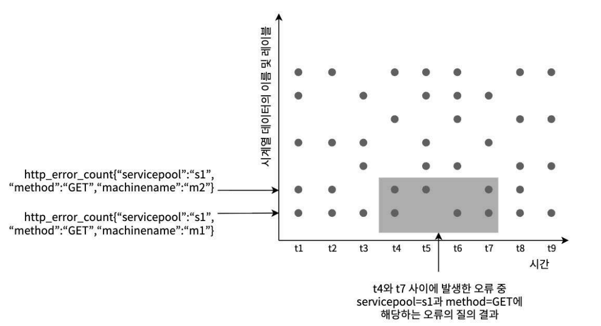
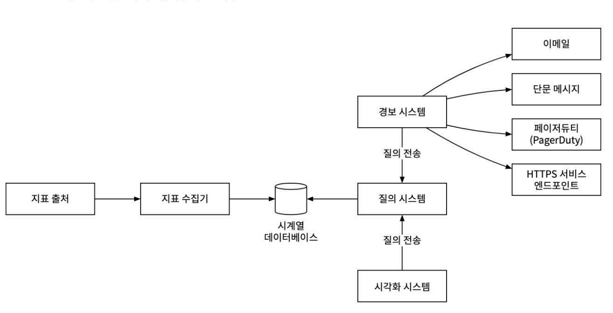
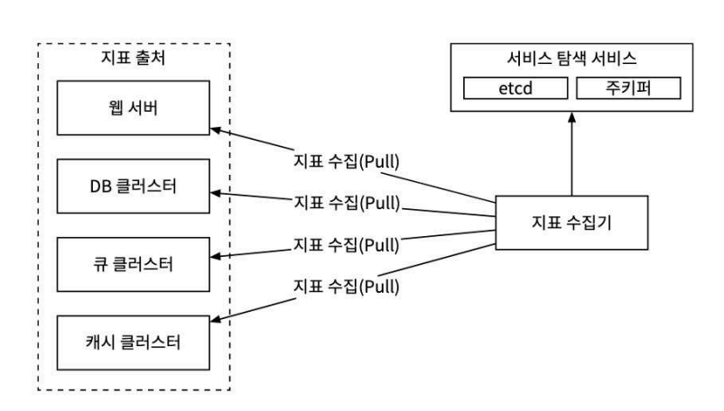
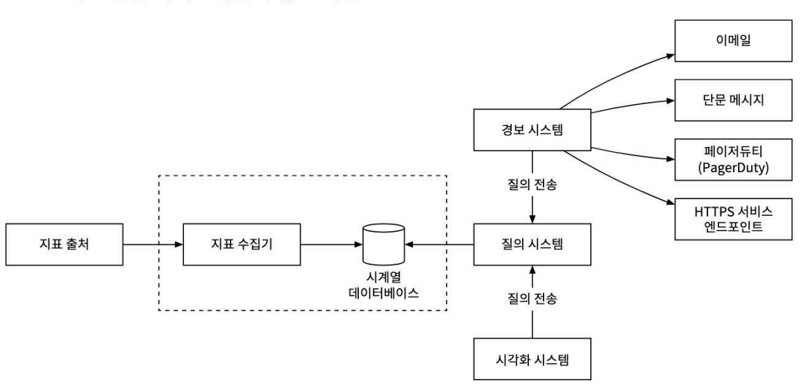
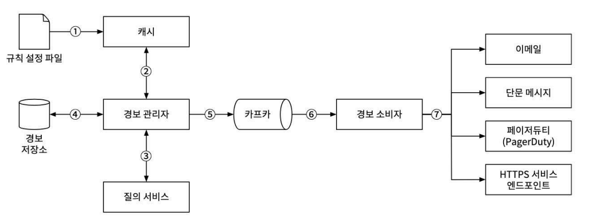
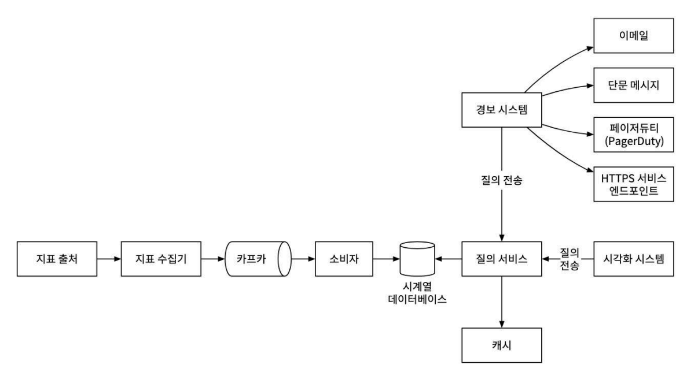

# 5장. 지표 모니터링 및 경보 시스템

# 1단계 문제 이해 및 설계 범위 확정

- 대규모 인프라 모니터링
    - 일간 능동 사용자 1억명
    - 서버 풀 1천개, 풀당 서버수 100개.
        - 모니터링 지표 수는 천만개 수준
    - 데이터 보관 기간 1년
    - 수집 데이터 보관 기간 일주일, 1분단위 데이터 변환 후 30일 보관, 1시단 단위 데이터로 변환한 뒤 1년간 보관
- 모니터링 지표
    - CPU 사용률
    - 요청 수
    - 메모리 사용량
    - 메시지 큐 내의 메시지 수

### 비기능 요구사항

- 규모 확장성
- 낮은 응답 지연
- 안정성
- 유연성

# 2단계 개략적 설계안 제시 및 동의 구하기

## 기본적 사항

5가지 컴포넌트

- 데이터 수집
    - 지표 데이터 수집
- 데이터 전송
    - 지표 데이터를 모니터링 시스템으로 전송
- 데이터 저장소
    - 전송되어 오는 데이터를 정리 및 저장
- 경보
    - 데이터 분석 후 이상 징후 감지하여 경보 발생
    - 다양한 통신 채널로 경보를 발송할 수 있어야 한다.
- 시각화
    - 데이터를 차트나 그래프로 제공
    - 패턴, 추이, 문제점을 더 쉽게 파악 가능

## 데이터 모델

시계열 형태로 기록

### 데이터 접근 패턴

이 시스템은 쓰기 부하가 힘하다.

읽기 부하는 일시적으로 치솟고 사라지는 유형이 반복된다.

## 데이터 저장소 시스템

이 모니터링 정보를 위한 저장소를 직접 설계하거나, RDBMS는 추천하지 않는다.

### 범용 데이터 베이스

시계열 데이터 처리가 가능하지만, 부하 규모에 맞추려면 전문가 수준의 튜닝이 필요하다.

> 관계형 DB
> 

시계열 데이터 대상으로 수행하는 연산들에 최적화 되어있지 않다.

태그, 레이블 쿼리를 하려면 인덱스가 태그마다 잡혀야해서 좋지않다.

쓰기 연산이 굉장히 많기 때문에 좋은 성능을 끌어낼 수 없다.

> NoSQL
> 

카산드라나 빅테이블은 시계열 데이터 처리에 사용될 수 있다.

시계열 데이터를 효과적으로 다루려면 확장이 용이한 스키마 설계가 필요한데, NoSQL 내부 구조에 대한 깊은 지식이 필요하다.

시계열 DB가 시장에 있으니 NoSQL을 사용하는 방안이 좋지않다.

> 시계열 DB
> 

OpenTSDB 는 하둡과 HBase에 기반하고 있어 하둡/HBase 클러스터를 구성하고 운영해야되서 복잡하다.

시장에서 가장 인기있는 시계열데이터 베이스

- InfluxDB
- Prometheus

다량의 시계열 데이터를 저장하고 빠른 실시간 분석을 지원한다.

메모리 캐시와 디스크 저장소를 함께 사용한다.

영속성 요건과 높은 성능 요구사항도 잘 만족한다.

## 개략적 설계안

- 지표 출처
    - 지표 데이터가 만들어지는곳, 어떤것이든 될 수 있다.

## 3단계 상세설계

### 지표 수집

카운터나 CPU 사용량은 데이터가 소실되어도 심각하게 문제되지는 않는다.

지표를 보내는 클라이언트는 데이터 전송 실패를 신경쓰지 않아도 된다.

> 풀 모델
> 

지표 수집기는 각 지표 출처에 대한 엔드포인트들을 알아야 하는데, 이들의 DNS/IP 주소를 수집기가 알고있으면 가장 간단하다.

> 푸시 모델
> 

풀모델과 반대로 서버들이 직접 지표 수집기에 전송하는 모델이다.

|  | 풀 | 푸시 |
| --- | --- | --- |
| 손쉬운 디버깅 | 애플리케이션 서버에 `/metrics` 엔드포인트를 두도록 강제하므로 필요하면 언제든 지표 데이터를 볼 수 있다.
풀 모델이 더 낫다. |  |
| 상태 진단 | 애플리케이션 서버가 풀 요청에 응답하지 않으면 바로 해당 서버에 장애가 발생한 것으로 진단할 수 있다. | 지표 수집기가 지표를 받지 못하면 네트워크 장애가 원인인지 서버 장애가 원인인지 알기 어렵다. |
| 생존 기간이 짧은 프로세스 |  | 생명 주기가 짧은 일괄 작업 프로세스의 경우 수집기가 미처 지표를 끌어가기도 전에 종료되어 버릴 수 있다.
그런 점에서는 푸시모델이 낫다. 푸시 게이트웨이를 도입하면 해당 문제점 해결이 가능하다. |
| 방화벽 등의 복잡한 네트워크 구성 | 수집기 서버가 지표 데이터를 제대로 끌어가려면 모든 `/metrics` 엔드포인트가 접근 가능하도록 구성되어야 한다. 데이터센터를 여러개 사용하는 경우에는 문제가 될 수 있다. 네트워크 인프라를 세심히 설계해야 할 것이다. | 지표 수집기가 로드밸런서 및 자동 규모 확장 클러스터 형태로 구성되었다면 어디서 오는 지표라도 수집 가능하다. 푸시 모델이 낫다. |
| 성능 | 풀 모델은 일반적으로 TCP를 사용한다 | 푸시 모델은 보통 UDP를 사용한다. 푸시 모델의 지표 전송 지연이 더 낮다는 뜻이다. 이에 대한 반론은 TCP연결을 맺는데 드는 오버헤드가 지표 데이터를 전송하는 것에 비해 낮다는 것이다. |
| 데이터 신빙성 | 지표 데이터를 가져올 애플리케이션 서버의 목록이 이미 정의된 상태이므로 해당 서버에서 수집한 데이터는 믿을 수 있다. | 아무나 지표 수집기에 데이터를 보낼 수 있다는 문제가 있다.
지표 전송을 허용할 서버의 목록을 수집기 측에 유지하거나 인증을 강제하면 문제를 해결할 수 있다. |

### 지표 전송 파이프라인의 규모 확장

시계열 db에 장애가 발생하면 데이터 손실이 발생할 가능성이 많다.

그래서 큐를 사용하여 문제를 해소한다.

- 카프카는 고도로 안정적이고 규모 확장성이 뛰어난 분산 메시지 플랫폼이다.
- 데이터 수집 컴포넌트와 처리 컴포넌트 사이의 결합도를 낮춘다.
- DB 장애가 생겨도 데이터는 소실되지 않는다.
    - 카프카가 보관중

> 카프카를 통한 규모 확장
> 
- 대역폭 요구사항에 따라 파티션 수를 설정
- 지표 이름에 따라 어떤 지표를 어느 파티션에 배치할지 결정하면 컨슈머는 이름따라 데이터를 집계할 수 있다.
- 태그/레이블에 따라 지표 데이터를 더욱 세분화한 파티션으로 나눈다
- 중요 지표가 먼저 처리될 수 있도록 지표를 분류하고 우선순위를 지정한다

> 카프카의 대안
> 

상용 규모의 카프카 시스템 구축은 쉽지 않다

메타의 메모리 기반 시계열 DB인 고릴라가 카프카를 사용하지 않고도 구축 가능하다.

### 데이터 집계 지점

지표 집계는 다양한 지점에서 실행 가능

수집 에이전트, 수집 파이프라인 어디서든 할 수 있고, 질의 시점에도 가능하다.

- 수집 에이전트 집계
    - 어떤 카운터 값을 분 단위로 집계하여 수집기에 보내는정도 가능
- 파이프라인
    - 기록하기 이전에 집계하려면 플링크 같은 스트림 프로세싱 엔진이 필요
    - DB에는 계산 결과만 기록하므로, 기록되는 양은 줄어들 것이다
    - 늦게 도착하는 지표들의 데이터 처리가 어렵기에 원본 데이터를 보관하지 않아 정밀도나 유연성 측면에서 손해를 보게 된다는 문제가 있다
- 질의 집계
    - 날것 그대로 보관한 다음 질의할때 필요한 시간 구간에 맞게 집계한다
    - 손실 문제는 없으나 질의를 처리하는 순간에 전체 데이터세트 대상으로 집계 결과를 계산해야 하므로 속도는 느림

## 질의 서비스

질의 서버 클러스터 형태로 구성되며 시각화 또는 경보 시스템에서 접수된 요청을 시계열 DB를 통해 처리하는 역할을 담당한다.

질의 처리 전담 서비스를 두게되면 클라이언트와 시계열 DB사이의 결합도를 낮출 수 있다.

### 캐시 계층

캐시 서버를 넣어 질의 부하를 낮추고 성능을 끌어올릴 수 있다.

### 질의 서비스를 두면 곤란한 경우

시각화나 경보 시스템에선 시계열 DB와의 연동을 처리하는 강력한 플러그인들이 이미 많다.

그래서 캐시 도입할 필요가 없는 시계열 DB가 있는것도 고려해야한다.

## 저장소 계층

### 저장 용량 최적화

### 데이터 인코딩 및 압축

데이터를 인코딩후 압축하면 크기를 많이 줄일 수 있다.

### 다운샘플링

데이터의 해상도를 낮춰 저장소 요구량을 줄이는 기법

보관 기간이 1년이기에 낡은 데이터들은 해상도를 줄여도 된다

→ 수집 간격 스펙트럼을 넓게 잡고 구조를 변경한다는 뜻?

## 경보 시스템

## 시각화 시스템

프로메테우스를 많이 사용할텐데 이를 그라파나 시각화와 연결해서 사용하여 대시보드를 잘 구현해보자

# 4단계 마무리

# 요약

- 모니터링 데이터 수집 시 푸시, 풀 모델을 경우에 따라 잘 적용하자.