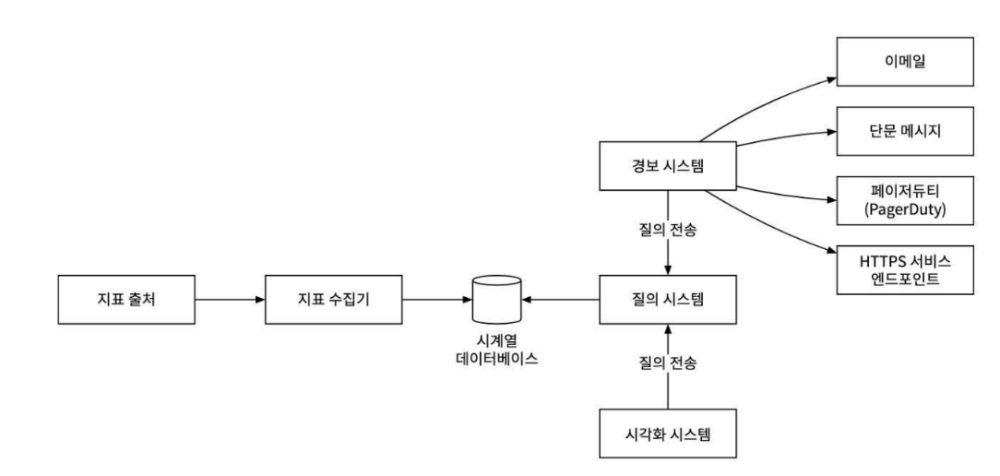

# 5장: 지표 모니터링 및 경보 시스템 설계

## 1. 시스템 개요

지표 모니터링 및 경보 시스템은 인프라의 상태를 명확하게 파악할 수 있도록 지원하여, 시스템의 높은 가용성과 안정성을 달성하는데 핵심적인 역할을 함

## 2. 1단계: 문제 이해 및 설계 범위 확정

### 기능 요구사항

- 수집 대상: 시스템 운영 지표 (CPU 부하, 메모리 사용률, 초당 요청 수)
- 데이터 보관 : 1년간 보관
- 데이터 해상도
    - 새로 수집한 원본 데이터는 7일
    - 7일 후에는 1분 단위 데이터로 변환 후 30일
    - 30일 이후에는 1시간 단위 데이터로 변환 후 1년
- 경보 채널 : 이메일, 전화, PagerDuty, 웹훅 등 다양한 채널 지원
- 처리 규모
    - 일간 능동 사용자 수 (DAU) : 1억 명
    - 서버 규모 : 1,000 개의 서버 풀, 풀당 100개 (총 100,000대 수집 대상)

### 비기능 요구사항

- 규모 확장성 : 지표 및 경보의 양이 증가함에 따라 시스템이 유연하게 확장될 수 있어야 함
- 낮은 응답 지연 : 대시보드 조회 및 경보 처리를 위해, 질의에 대한 낮은 응답 지연 시간 보장
- 안정성 : 중요 경보를 놓치지 않도록 높은 안정성을 제공
- 유연성 : 미래의 신기술을 쉽게 통합할 수 있도록 유연한 파이프라인으로 구축
- 고려 제외 : 로그 모니터링 및 분산 시스템 추적 기능 제외

## 3. 2단계: 개략적 설계안

시스템은 5가지 구성요소로 나눌 수 있음

- **데이터 수집:** 여러 출처로부터 지표 데이터를 수집
- **데이터 전송:** 지표 데이터를 모니터링 시스템으로 전송
- **데이터 저장소:** 전송된 데이터를 정리하고 저장
- **경보:** 데이터를 분석하여 이상 징후를 감지하고 경보를 발생
- **시각화:** 데이터를 차트나 그래프 형태로 제공

### 데이터 모델 및 저장소

- 데이터 모델 : 지표 데이터는 타임 스탬프가 붙은 시계열 데이터 형태. 각 시계열은 고유한 “지표 이름”과 식별을 위한 “레이블(태그) 집합” 을 가짐
- 데이터 접근 패턴 : 이 시스템은 막대한 양의 쓰기 연산 부하를 감당해야함. 반면, 읽기 부하는 대시 보드 조회나 경보 확인 시에 일시적으로 치솟는 특징이 있음
- 저장소 선택
    - 범용 RDBMS 는 시계열 연산에 최적화되지 않고, 대규모 쓰기 연산 환경에서 좋은 성능을 보이지 못해 권장하지 않음
    - 범용 NoSQL (예, 카산드라) 도 사용은 가능하지만, 시계열 데이터에 맞게 스키마를 설계하려면 해당 DB 에 대한 지식이 필요
    - 시계열 데이터베이스를 사용하는 것이 가장 좋음. 시계열 DB 는 다량의 시계열 데이터를 저장하고, 레이블(태그) 기반의 빠른 실시간 분석 및 집계 기능을 제공하도록 최적화 되어 있음

### 개략적 설계도



## 4. 3단계: 상세 설계

### 지표 수집 모델 (pull vs push)

지표 수집 방식은 크게 풀, 푸시 모델로 나뉨

- 풀 모델 (프로메터우스)
    - 동작 : 지표 수집기가 대상 서비스의 HTTP 앤드포인트에서 주기적으로 메트릭을 수집
    - 구성 : 수집 대상 목록 관리를 위해 서비스 탐색 기술이 필요 (주키퍼, etcd)
    - 확장 : 수집기 자체의 규모 확장을 위해 “안정 해시 링”을 사용하여 각 수집기가 담당한 서버 구간을 나눌 수 있음
    - 장점 : 디버깅이 용이하고, 수집기가 요청에 응답하지 않으면 즉시 장애로 진단할 수 있음 (서버 단에서 모두 처리 가능)
    - 단점 : 생명 주기가 짧은 일괄 작업의 지표를 수집하기 어렵고, 방화벽 등 복잡한 네트워크 환경 구성이 필요함
- 푸시 모델 (아마존 클라우드 와치)
    - 동작 : 지표 출처 서버에 설치된 수집 에이전트가 지표를 수집기로 전송
    - 구성 : 수집기는 로드밸런서 뒤에 클러스터 형태로 구성하여 자동 규모 확장이 가능하도록 하는 것이 좋음
    - 장점 : 생명 주기가 짧은 작업에 유리, 네트워크 구성이 복잡한 환경에서도 상재거으로 유리함
    - 단점 : 지표를 받지 못했을 시, 이것이 네트워크 장애인지 서버 장애인지 판별이 어려움

### 지표 전송 파이프라인 규모 확장 (Kafka)

지표 수집기와 시계열 데이터베이스 사이에 메시지 큐를 도입하여 시스템의 안정성과 확장성을 높일 수 있음

- 장점
    - 데이터베이스에 장애가 발생해도 카프카가 데이터를 일정 기간 보관해서 데이터 손실을 일부 방지할 수 있음
    - 데이터 수집 컴포넌트와 처리 컴포넌트 간의 결합도를 낮출 수 있음
- 확장 : 카프카의 파티션 메커니즘을 통해 지표 이름이나, 태그에 따라 데이터 분산 처리가 가능

### 저장소 계층 및 최적화

막대한 양의 데이터를 효율적으로 저장하기 위한 전략이 필요

- 데이터 인코딩 및 압축 : 좋은 시계열 데이터베이스는 데이터 인코딩 및 압축 기능을 내장하고 있음
    - 이중 델타 인코딩 : 타임스탬프의 전체 값이 아닌, 이전 값과의 차이만 저장
- 다운샘플링 : 요구사항에 따라, 오래된 데이터의 해상도를 낮추어 저장소 요구량을 줄이는 기법
    - 요구 사항에 있는 것처럼 7일이 지난 데이터는 1분 해상도로, 30일이 지난 데이터는 1시간 해상도로 평균을 내에 집계 보관
- 냉동 저장소 : 잘 사용되지 않는 비활성 데이터를 훨씬 저렴한 비용의 저장소에 보관하는 방식

### 질의, 경보, 시각화 시스템

- 질의 서비스 : 시각화 시스템이나 경보 시스템과 데이터 베이스 사이의 중개자 역할, 캐시 계층을 도입하여 자주 요청되는 질의 결과를 지정하면 시계열 데이터베이스의 부하를 줄이고 응답 성능을 높일 수 있음
  > 지속적으로 변화되는 데이터를 조회하는데, 캐싱을 한다고 해서 눈에 띄는 변화가 생길까?
  > 이전의 데이터를 반복적으로 조회하는 기능이 있는 경우 성능이 개선되겠지만,
  > 경보 시스템과 같이 지속적으로 최신의 정보를 계속 조회하는 서비스에는 그닥 효과 없을듯 함
- 경보 시스템
    - 경보 관리자는 YAML 등으로 작성된 “경보 규칙 설정 파일” 을 기반으로 주기적으로 질의 서비스를 호출
    - 질의 결과가 임계값을 위반하면 경보 이벤트를 발생
    - 짧은 시간 내 발생한 동일 인스턴스의 경보를 하나로 병합 or 중복 제거 역할 수행
    - 생성된 경보 이벤트는 카프카로 전달, 경보 소비자가 이벤트를 읽어 최종 채널로 알림을 전송
- 시각화 시스템 (그라파나)
    - 지표 데이터를 대시보드에 다양한 차트와 그래프로 보여주는 시스템
    - 품질 좋은 시각화 시스템을 구현하는 것은 매우 어렵기 때문에, 그라파나와 같은 검증된 상용/오픈소스 솔루션을 사용하는 것이 바람직함

### 최종 설계도


## 추가

- 데이터 집계 시점 : 지표 집계는 파이프라인의 여러 지점에서 수행할 수 있음
    - 수집 에이전트 : 구현이 간단하지만 복잡한 집계 로직은 지원하기 어려움
    - 데이터 수집 및 파이프라인 : 스트림 처리 엔진이 필요함 (또는 별도의 수집기를 구현) 저장 용량은 엄청나게 줄일 수 있지만, 원본 데이터가 소실되어 유연성이 떨어짐
    - 질의 시 : 데이터를 날 것 그대로 보관하므로 유연성이 높으나, 질의 시점에 전체 데이터를 계산하기 때문에 속도가 느릴 수 있음
- **경보 및 시각화 (Build vs. Buy) :** 실무에서는 경보 시스템과 시각화 시스템을 밑바닥부터 구현하는 경우는 드뭄. 그라파나와 같은 고품질의 솔루션이 시장에 많으며 , 이들은 대부분의 유명 시계열 데이터베이스와의 연동을 이미 지원함.

## `node_` (노드/시스템 메트릭)

이 부분이 **`node_exporter`의 핵심으로, 서버(노드) 자체의 하드웨어 및 운영체제(OS) 상태**를 나타냅니다.

- `node_cpu_seconds_total`: CPU가 각 모드(`idle`, `user`, `system`, `iowait` 등)에서 보낸 총 시간을 초 단위로 누적 표시합니다.
- `node_memory_...`: **시스템의 전체 메모리 상태**를 바이트 단위로 보여줍니다.
    - `node_memory_MemTotal_bytes`: 총 물리 메모리
    - `node_memory_MemFree_bytes`: 현재 여유 메모리
    - `node_memory_MemAvailable_bytes`: 애플리케이션이 실제로 사용 가능한 메모리 (버퍼/캐시 포함)
    - `node_memory_Cached_bytes`, `node_memory_Buffers_bytes`: 파일 시스템 캐시 및 버퍼로 사용 중인 메모리
- `node_disk_...`: 디스크(블록 디바이스)의 I/O 통계입니다.
    - `node_disk_read_bytes_total`: 총 읽은 바이트 수
    - `node_disk_written_bytes_total`: 총 쓴 바이트 수
    - `node_disk_io_time_seconds_total`: I/O 작업에 소요된 총 시간
- `node_filesystem_...`: 마운트된 **파일 시스템의 사용량** 정보입니다.
    - `node_filesystem_size_bytes`: 파일 시스템의 전체 크기
    - `node_filesystem_avail_bytes`: (non-root) 사용자가 사용 가능한 여유 공간
    - `node_filesystem_files`: 총 inode 수
    - `node_filesystem_files_free`: 사용 가능한 inode 수
- `node_network_...`: **네트워크 인터페이스(NIC)별** 트래픽 및 상태 정보입니다.
    - `node_network_receive_bytes_total`: 총 수신 바이트
    - `node_network_transmit_bytes_total`: 총 송신 바이트
    - `node_network_receive_packets_total`: 총 수신 패킷 수
    - `node_network_up`: 인터페이스가 활성화(up)되었는지 여부 (1=up, 0=down)
- `node_load1`, `node_load5`, `node_load15`: 시스템의 1분, 5분, 15분 **평균 부하(Load Average)**입니다.
- `node_boot_time_seconds`: 서버가 부팅된 시간 (Unix 타임스탬프)
- `node_procs_...`: 프로세스 상태 (`running` - 실행 중, `blocked` - I/O 대기)
- `node_context_switches_total`: CPU 컨텍스트 스위칭 총 횟수
- `node_info`, `node_os_info`, `node_uname_info`: 시스템 하드웨어(DMI), OS 버전(Ubuntu 22.04), 커널 버전 등 시스템 식별 정보입니다.
- `node_pressure_...`: PSI(Pressure Stall Information)로, CPU, 메모리, I/O 등 리소스 부족으로 인해 작업이 '대기'한 시간을 나타냅니다. (시스템 병목 현상 파악에 유용)
- `node_scrape_collector_...`: `node_exporter`가 이 메트릭들을 수집하는 데 걸린 시간(`...duration_seconds`)과 성공 여부(`...success`)를 보여줍니다. (특정 컬렉터가 느린지 확인 가능)
- `node_netstat_...`, `node_sockstat_...`: TCP, UDP, 소켓 등 커널 레벨의 네트워크 스택 통계입니다.

## `process_` (프로세스 메트릭)

이 메트릭들은 **`node_exporter` 프로세스 자체의 리소스 사용량**을 나타냅니다. (위의 `go_` 메트릭과 유사하지만 더 일반적인 프로세스 관점)

- `process_cpu_seconds_total`: `node_exporter` 프로세스가 사용한 총 CPU 시간
- `process_open_fds`: `node_exporter` 프로세스가 현재 열고 있는 파일 디스크립터 수
- `process_resident_memory_bytes`: `node_exporter` 프로세스가 사용 중인 물리 메모리(RSS)
- `process_start_time_seconds`: `node_exporter` 프로세스가 시작된 시간

---

## `promhttp_` (Prometheus HTTP 메트릭)

이 메트릭들은 **Prometheus 서버가 `node_exporter`의 `/metrics` 엔드포인트에서 메트릭을 수집(scrape)해 갈 때의 HTTP 요청 관련 통계**입니다.

- `promhttp_metric_handler_requests_total`: 총 스크랩 요청 횟수 (HTTP 상태 코드별)
- `promhttp_metric_handler_requests_in_flight`: 현재 처리 중인 스크랩 요청 수

```sql
# HELP go_gc_duration_seconds A summary of the pause duration of garbage collection cycles.
# TYPE go_gc_duration_seconds summary
go_gc_duration_seconds{quantile="0"} 3.3809e-05
go_gc_duration_seconds{quantile="0.25"} 3.8863e-05
go_gc_duration_seconds{quantile="0.5"} 4.1538e-05
go_gc_duration_seconds{quantile="0.75"} 4.8771e-05
go_gc_duration_seconds{quantile="1"} 0.000281936
go_gc_duration_seconds_sum 3.965160262
go_gc_duration_seconds_count 84467
# HELP go_goroutines Number of goroutines that currently exist.
# TYPE go_goroutines gauge
go_goroutines 9
# HELP go_info Information about the Go environment.
# TYPE go_info gauge
go_info{version="go1.21.4"} 1
# HELP go_memstats_alloc_bytes Number of bytes allocated and still in use.
# TYPE go_memstats_alloc_bytes gauge
go_memstats_alloc_bytes 2.658592e+06
# HELP go_memstats_alloc_bytes_total Total number of bytes allocated, even if freed.
# TYPE go_memstats_alloc_bytes_total counter
go_memstats_alloc_bytes_total 1.45809725976e+11
# HELP go_memstats_buck_hash_sys_bytes Number of bytes used by the profiling bucket hash table.
# TYPE go_memstats_buck_hash_sys_bytes gauge
go_memstats_buck_hash_sys_bytes 2.111103e+06
# HELP go_memstats_frees_total Total number of frees.
# TYPE go_memstats_frees_total counter
go_memstats_frees_total 2.003624848e+09
# HELP go_memstats_gc_sys_bytes Number of bytes used for garbage collection system metadata.
# TYPE go_memstats_gc_sys_bytes gauge
go_memstats_gc_sys_bytes 4.333392e+06
# HELP go_memstats_heap_alloc_bytes Number of heap bytes allocated and still in use.
# TYPE go_memstats_heap_alloc_bytes gauge
go_memstats_heap_alloc_bytes 2.658592e+06
# HELP go_memstats_heap_idle_bytes Number of heap bytes waiting to be used.
# TYPE go_memstats_heap_idle_bytes gauge
go_memstats_heap_idle_bytes 3.866624e+06
# HELP go_memstats_heap_inuse_bytes Number of heap bytes that are in use.
# TYPE go_memstats_heap_inuse_bytes gauge
go_memstats_heap_inuse_bytes 4.063232e+06
# HELP go_memstats_heap_objects Number of allocated objects.
# TYPE go_memstats_heap_objects gauge
go_memstats_heap_objects 21308
# HELP go_memstats_heap_released_bytes Number of heap bytes released to OS.
# TYPE go_memstats_heap_released_bytes gauge
go_memstats_heap_released_bytes 3.178496e+06
# HELP go_memstats_heap_sys_bytes Number of heap bytes obtained from system.
# TYPE go_memstats_heap_sys_bytes gauge
go_memstats_heap_sys_bytes 7.929856e+06
# HELP go_memstats_last_gc_time_seconds Number of seconds since 1970 of last garbage collection.
# TYPE go_memstats_last_gc_time_seconds gauge
go_memstats_last_gc_time_seconds 1.763374263971358e+09
# HELP go_memstats_lookups_total Total number of pointer lookups.
# TYPE go_memstats_lookups_total counter
go_memstats_lookups_total 0
# HELP go_memstats_mallocs_total Total number of mallocs.
# TYPE go_memstats_mallocs_total counter
go_memstats_mallocs_total 2.003646156e+09
# HELP go_memstats_mcache_inuse_bytes Number of bytes in use by mcache structures.
# TYPE go_memstats_mcache_inuse_bytes gauge
go_memstats_mcache_inuse_bytes 1200
# HELP go_memstats_mcache_sys_bytes Number of bytes used for mcache structures obtained from system.
# TYPE go_memstats_mcache_sys_bytes gauge
go_memstats_mcache_sys_bytes 15600
# HELP go_memstats_mspan_inuse_bytes Number of bytes in use by mspan structures.
# TYPE go_memstats_mspan_inuse_bytes gauge
go_memstats_mspan_inuse_bytes 65520
# HELP go_memstats_mspan_sys_bytes Number of bytes used for mspan structures obtained from system.
# TYPE go_memstats_mspan_sys_bytes gauge
go_memstats_mspan_sys_bytes 97776
# HELP go_memstats_next_gc_bytes Number of heap bytes when next garbage collection will take place.
# TYPE go_memstats_next_gc_bytes gauge
go_memstats_next_gc_bytes 4.194304e+06
# HELP go_memstats_other_sys_bytes Number of bytes used for other system allocations.
# TYPE go_memstats_other_sys_bytes gauge
go_memstats_other_sys_bytes 623705
# HELP go_memstats_stack_inuse_bytes Number of bytes in use by the stack allocator.
# TYPE go_memstats_stack_inuse_bytes gauge
go_memstats_stack_inuse_bytes 458752
# HELP go_memstats_stack_sys_bytes Number of bytes obtained from system for stack allocator.
# TYPE go_memstats_stack_sys_bytes gauge
go_memstats_stack_sys_bytes 458752
# HELP go_memstats_sys_bytes Number of bytes obtained from system.
# TYPE go_memstats_sys_bytes gauge
go_memstats_sys_bytes 1.5570184e+07
# HELP go_threads Number of OS threads created.
# TYPE go_threads gauge
go_threads 5
# HELP node_arp_entries ARP entries by device
# TYPE node_arp_entries gauge
node_arp_entries{device="br-177a7b995133"} 4
node_arp_entries{device="ens5"} 5
# HELP node_boot_time_seconds Node boot time, in unixtime.
# TYPE node_boot_time_seconds gauge
node_boot_time_seconds 1.760404859e+09
# HELP node_context_switches_total Total number of context switches.
# TYPE node_context_switches_total counter
node_context_switches_total 2.442070796e+09
# HELP node_cooling_device_cur_state Current throttle state of the cooling device
# TYPE node_cooling_device_cur_state gauge
node_cooling_device_cur_state{name="0",type="Processor"} 0
node_cooling_device_cur_state{name="1",type="Processor"} 0
# HELP node_cooling_device_max_state Maximum throttle state of the cooling device
# TYPE node_cooling_device_max_state gauge
node_cooling_device_max_state{name="0",type="Processor"} 0
node_cooling_device_max_state{name="1",type="Processor"} 0
# HELP node_cpu_guest_seconds_total Seconds the CPUs spent in guests (VMs) for each mode.
# TYPE node_cpu_guest_seconds_total counter
node_cpu_guest_seconds_total{cpu="0",mode="nice"} 0
node_cpu_guest_seconds_total{cpu="0",mode="user"} 0
node_cpu_guest_seconds_total{cpu="1",mode="nice"} 0
node_cpu_guest_seconds_total{cpu="1",mode="user"} 0
# HELP node_cpu_seconds_total Seconds the CPUs spent in each mode.
# TYPE node_cpu_seconds_total counter
node_cpu_seconds_total{cpu="0",mode="idle"} 2.92954651e+06
node_cpu_seconds_total{cpu="0",mode="iowait"} 909.73
node_cpu_seconds_total{cpu="0",mode="irq"} 0
node_cpu_seconds_total{cpu="0",mode="nice"} 126.3
node_cpu_seconds_total{cpu="0",mode="softirq"} 972.11
node_cpu_seconds_total{cpu="0",mode="steal"} 2634.77
node_cpu_seconds_total{cpu="0",mode="system"} 6708.41
node_cpu_seconds_total{cpu="0",mode="user"} 13573.99
node_cpu_seconds_total{cpu="1",mode="idle"} 2.92938711e+06
node_cpu_seconds_total{cpu="1",mode="iowait"} 896.4
node_cpu_seconds_total{cpu="1",mode="irq"} 0
node_cpu_seconds_total{cpu="1",mode="nice"} 126.55
node_cpu_seconds_total{cpu="1",mode="softirq"} 969.53
node_cpu_seconds_total{cpu="1",mode="steal"} 2654.04
node_cpu_seconds_total{cpu="1",mode="system"} 6701.86
node_cpu_seconds_total{cpu="1",mode="user"} 13583.62
# HELP node_disk_discard_time_seconds_total This is the total number of seconds spent by all discards.
# TYPE node_disk_discard_time_seconds_total counter
node_disk_discard_time_seconds_total{device="nvme0n1"} 0
# HELP node_disk_discarded_sectors_total The total number of sectors discarded successfully.
# TYPE node_disk_discarded_sectors_total counter
node_disk_discarded_sectors_total{device="nvme0n1"} 0
# HELP node_disk_discards_completed_total The total number of discards completed successfully.
# TYPE node_disk_discards_completed_total counter
node_disk_discards_completed_total{device="nvme0n1"} 0
# HELP node_disk_discards_merged_total The total number of discards merged.
# TYPE node_disk_discards_merged_total counter
node_disk_discards_merged_total{device="nvme0n1"} 0
# HELP node_disk_flush_requests_time_seconds_total This is the total number of seconds spent by all flush requests.
# TYPE node_disk_flush_requests_time_seconds_total counter
node_disk_flush_requests_time_seconds_total{device="nvme0n1"} 0
# HELP node_disk_flush_requests_total The total number of flush requests completed successfully
# TYPE node_disk_flush_requests_total counter
node_disk_flush_requests_total{device="nvme0n1"} 0
# HELP node_disk_info Info of /sys/block/<block_device>.
# TYPE node_disk_info gauge
node_disk_info{device="nvme0n1",major="259",minor="0",model="Amazon Elastic Block Store",path="pci-0000:00:04.0-nvme-1",revision="1.0",serial="vol0a8e391cfd1e10e52",wwn="nvme.1d0f-766f6c3061386533393163666431653130653532-416d617a6f6e20456c617374696320426c6f636b2053746f7265-00000001"} 1
# HELP node_disk_io_now The number of I/Os currently in progress.
# TYPE node_disk_io_now gauge
node_disk_io_now{device="nvme0n1"} 0
# HELP node_disk_io_time_seconds_total Total seconds spent doing I/Os.
# TYPE node_disk_io_time_seconds_total counter
node_disk_io_time_seconds_total{device="nvme0n1"} 2670.852
# HELP node_disk_io_time_weighted_seconds_total The weighted # of seconds spent doing I/Os.
# TYPE node_disk_io_time_weighted_seconds_total counter
node_disk_io_time_weighted_seconds_total{device="nvme0n1"} 5945.145
# HELP node_disk_read_bytes_total The total number of bytes read successfully.
# TYPE node_disk_read_bytes_total counter
node_disk_read_bytes_total{device="nvme0n1"} 2.9463719936e+10
# HELP node_disk_read_time_seconds_total The total number of seconds spent by all reads.
# TYPE node_disk_read_time_seconds_total counter
node_disk_read_time_seconds_total{device="nvme0n1"} 1355.053
# HELP node_disk_reads_completed_total The total number of reads completed successfully.
# TYPE node_disk_reads_completed_total counter
node_disk_reads_completed_total{device="nvme0n1"} 1.048298e+06
# HELP node_disk_reads_merged_total The total number of reads merged.
# TYPE node_disk_reads_merged_total counter
node_disk_reads_merged_total{device="nvme0n1"} 539722
# HELP node_disk_write_time_seconds_total This is the total number of seconds spent by all writes.
# TYPE node_disk_write_time_seconds_total counter
node_disk_write_time_seconds_total{device="nvme0n1"} 4590.091
# HELP node_disk_writes_completed_total The total number of writes completed successfully.
# TYPE node_disk_writes_completed_total counter
node_disk_writes_completed_total{device="nvme0n1"} 4.297363e+06
# HELP node_disk_writes_merged_total The number of writes merged.
# TYPE node_disk_writes_merged_total counter
node_disk_writes_merged_total{device="nvme0n1"} 2.835729e+06
# HELP node_disk_written_bytes_total The total number of bytes written successfully.
# TYPE node_disk_written_bytes_total counter
node_disk_written_bytes_total{device="nvme0n1"} 4.724517376e+10
# HELP node_dmi_info A metric with a constant '1' value labeled by bios_date, bios_release, bios_vendor, bios_version, board_asset_tag, board_name, board_serial, board_vendor, board_version, chassis_asset_tag, chassis_serial, chassis_vendor, chassis_version, product_family, product_name, product_serial, product_sku, product_uuid, product_version, system_vendor if provided by DMI.
# TYPE node_dmi_info gauge
node_dmi_info{bios_date="10/16/2017",bios_release="1.0",bios_vendor="Amazon EC2",bios_version="1.0",board_asset_tag="i-010242abffe1ee77e",board_name="",board_serial="",board_vendor="Amazon EC2",board_version="",chassis_asset_tag="Amazon EC2",chassis_serial="",chassis_vendor="Amazon EC2",chassis_version="",product_family="",product_name="t3.small",product_serial="ec289fd1-521d-8207-811c-15b64d687982",product_sku="",product_uuid="ec289fd1-521d-8207-811c-15b64d687982",product_version="",system_vendor="Amazon EC2"} 1
# HELP node_entropy_available_bits Bits of available entropy.
# TYPE node_entropy_available_bits gauge
node_entropy_available_bits 256
# HELP node_entropy_pool_size_bits Bits of entropy pool.
# TYPE node_entropy_pool_size_bits gauge
node_entropy_pool_size_bits 256
# HELP node_exporter_build_info A metric with a constant '1' value labeled by version, revision, branch, goversion from which node_exporter was built, and the goos and goarch for the build.
# TYPE node_exporter_build_info gauge
node_exporter_build_info{branch="HEAD",goarch="amd64",goos="linux",goversion="go1.21.4",revision="7333465abf9efba81876303bb57e6fadb946041b",tags="netgo osusergo static_build",version="1.7.0"} 1
# HELP node_filefd_allocated File descriptor statistics: allocated.
# TYPE node_filefd_allocated gauge
node_filefd_allocated 4224
# HELP node_filefd_maximum File descriptor statistics: maximum.
# TYPE node_filefd_maximum gauge
node_filefd_maximum 9.223372036854776e+18
# HELP node_filesystem_avail_bytes Filesystem space available to non-root users in bytes.
# TYPE node_filesystem_avail_bytes gauge
node_filesystem_avail_bytes{device="/dev/nvme0n1p15",fstype="vfat",mountpoint="/boot/efi"} 1.03053312e+08
node_filesystem_avail_bytes{device="/dev/root",fstype="ext4",mountpoint="/"} 5.3520150528e+10
node_filesystem_avail_bytes{device="tmpfs",fstype="tmpfs",mountpoint="/run"} 3.99413248e+08
node_filesystem_avail_bytes{device="tmpfs",fstype="tmpfs",mountpoint="/run/lock"} 5.24288e+06
node_filesystem_avail_bytes{device="tmpfs",fstype="tmpfs",mountpoint="/run/snapd/ns"} 3.99413248e+08
# HELP node_filesystem_device_error Whether an error occurred while getting statistics for the given device.
# TYPE node_filesystem_device_error gauge
node_filesystem_device_error{device="/dev/nvme0n1p15",fstype="vfat",mountpoint="/boot/efi"} 0
node_filesystem_device_error{device="/dev/root",fstype="ext4",mountpoint="/"} 0
node_filesystem_device_error{device="tmpfs",fstype="tmpfs",mountpoint="/run"} 0
node_filesystem_device_error{device="tmpfs",fstype="tmpfs",mountpoint="/run/lock"} 0
node_filesystem_device_error{device="tmpfs",fstype="tmpfs",mountpoint="/run/snapd/ns"} 0
# HELP node_filesystem_files Filesystem total file nodes.
# TYPE node_filesystem_files gauge
node_filesystem_files{device="/dev/nvme0n1p15",fstype="vfat",mountpoint="/boot/efi"} 0
node_filesystem_files{device="/dev/root",fstype="ext4",mountpoint="/"} 7.74144e+06
node_filesystem_files{device="tmpfs",fstype="tmpfs",mountpoint="/run"} 819200
node_filesystem_files{device="tmpfs",fstype="tmpfs",mountpoint="/run/lock"} 244559
node_filesystem_files{device="tmpfs",fstype="tmpfs",mountpoint="/run/snapd/ns"} 819200
# HELP node_filesystem_files_free Filesystem total free file nodes.
# TYPE node_filesystem_files_free gauge
node_filesystem_files_free{device="/dev/nvme0n1p15",fstype="vfat",mountpoint="/boot/efi"} 0
node_filesystem_files_free{device="/dev/root",fstype="ext4",mountpoint="/"} 7.622548e+06
node_filesystem_files_free{device="tmpfs",fstype="tmpfs",mountpoint="/run"} 818440
node_filesystem_files_free{device="tmpfs",fstype="tmpfs",mountpoint="/run/lock"} 244556
node_filesystem_files_free{device="tmpfs",fstype="tmpfs",mountpoint="/run/snapd/ns"} 818440
# HELP node_filesystem_free_bytes Filesystem free space in bytes.
# TYPE node_filesystem_free_bytes gauge
node_filesystem_free_bytes{device="/dev/nvme0n1p15",fstype="vfat",mountpoint="/boot/efi"} 1.03053312e+08
node_filesystem_free_bytes{device="/dev/root",fstype="ext4",mountpoint="/"} 5.3536927744e+10
node_filesystem_free_bytes{device="tmpfs",fstype="tmpfs",mountpoint="/run"} 3.99413248e+08
node_filesystem_free_bytes{device="tmpfs",fstype="tmpfs",mountpoint="/run/lock"} 5.24288e+06
node_filesystem_free_bytes{device="tmpfs",fstype="tmpfs",mountpoint="/run/snapd/ns"} 3.99413248e+08
# HELP node_filesystem_readonly Filesystem read-only status.
# TYPE node_filesystem_readonly gauge
node_filesystem_readonly{device="/dev/nvme0n1p15",fstype="vfat",mountpoint="/boot/efi"} 0
node_filesystem_readonly{device="/dev/root",fstype="ext4",mountpoint="/"} 0
node_filesystem_readonly{device="tmpfs",fstype="tmpfs",mountpoint="/run"} 0
node_filesystem_readonly{device="tmpfs",fstype="tmpfs",mountpoint="/run/lock"} 0
node_filesystem_readonly{device="tmpfs",fstype="tmpfs",mountpoint="/run/snapd/ns"} 0
# HELP node_filesystem_size_bytes Filesystem size in bytes.
# TYPE node_filesystem_size_bytes gauge
node_filesystem_size_bytes{device="/dev/nvme0n1p15",fstype="vfat",mountpoint="/boot/efi"} 1.09395456e+08
node_filesystem_size_bytes{device="/dev/root",fstype="ext4",mountpoint="/"} 6.2241562624e+10
node_filesystem_size_bytes{device="tmpfs",fstype="tmpfs",mountpoint="/run"} 4.00687104e+08
node_filesystem_size_bytes{device="tmpfs",fstype="tmpfs",mountpoint="/run/lock"} 5.24288e+06
node_filesystem_size_bytes{device="tmpfs",fstype="tmpfs",mountpoint="/run/snapd/ns"} 4.00687104e+08
# HELP node_forks_total Total number of forks.
# TYPE node_forks_total counter
node_forks_total 154491
# HELP node_hwmon_chip_names Annotation metric for human-readable chip names
# TYPE node_hwmon_chip_names gauge
node_hwmon_chip_names{chip="nvme_nvme0",chip_name="nvme"} 1
# HELP node_hwmon_sensor_label Label for given chip and sensor
# TYPE node_hwmon_sensor_label gauge
node_hwmon_sensor_label{chip="nvme_nvme0",label="Composite",sensor="temp1"} 1
# HELP node_hwmon_temp_alarm Hardware sensor alarm status (temp)
# TYPE node_hwmon_temp_alarm gauge
node_hwmon_temp_alarm{chip="nvme_nvme0",sensor="temp1"} 0
# HELP node_hwmon_temp_celsius Hardware monitor for temperature (input)
# TYPE node_hwmon_temp_celsius gauge
node_hwmon_temp_celsius{chip="nvme_nvme0",sensor="temp1"} -273.15000000000003
# HELP node_hwmon_temp_max_celsius Hardware monitor for temperature (max)
# TYPE node_hwmon_temp_max_celsius gauge
node_hwmon_temp_max_celsius{chip="nvme_nvme0",sensor="temp1"} 69.85000000000001
# HELP node_hwmon_temp_min_celsius Hardware monitor for temperature (min)
# TYPE node_hwmon_temp_min_celsius gauge
node_hwmon_temp_min_celsius{chip="nvme_nvme0",sensor="temp1"} 69.85000000000001
# HELP node_intr_total Total number of interrupts serviced.
# TYPE node_intr_total counter
node_intr_total 1.486152668e+09
# HELP node_load1 1m load average.
# TYPE node_load1 gauge
node_load1 0
# HELP node_load15 15m load average.
# TYPE node_load15 gauge
node_load15 0
# HELP node_load5 5m load average.
# TYPE node_load5 gauge
node_load5 0
# HELP node_memory_Active_anon_bytes Memory information field Active_anon_bytes.
# TYPE node_memory_Active_anon_bytes gauge
node_memory_Active_anon_bytes 2.33017344e+08
# HELP node_memory_Active_bytes Memory information field Active_bytes.
# TYPE node_memory_Active_bytes gauge
node_memory_Active_bytes 2.89705984e+08
# HELP node_memory_Active_file_bytes Memory information field Active_file_bytes.
# TYPE node_memory_Active_file_bytes gauge
node_memory_Active_file_bytes 5.668864e+07
# HELP node_memory_AnonHugePages_bytes Memory information field AnonHugePages_bytes.
# TYPE node_memory_AnonHugePages_bytes gauge
node_memory_AnonHugePages_bytes 0
# HELP node_memory_AnonPages_bytes Memory information field AnonPages_bytes.
# TYPE node_memory_AnonPages_bytes gauge
node_memory_AnonPages_bytes 1.124364288e+09
# HELP node_memory_Bounce_bytes Memory information field Bounce_bytes.
# TYPE node_memory_Bounce_bytes gauge
node_memory_Bounce_bytes 0
# HELP node_memory_Buffers_bytes Memory information field Buffers_bytes.
# TYPE node_memory_Buffers_bytes gauge
node_memory_Buffers_bytes 6.7801088e+07
# HELP node_memory_Cached_bytes Memory information field Cached_bytes.
# TYPE node_memory_Cached_bytes gauge
node_memory_Cached_bytes 4.81071104e+08
# HELP node_memory_CommitLimit_bytes Memory information field CommitLimit_bytes.
# TYPE node_memory_CommitLimit_bytes gauge
node_memory_CommitLimit_bytes 3.149193216e+09
# HELP node_memory_Committed_AS_bytes Memory information field Committed_AS_bytes.
# TYPE node_memory_Committed_AS_bytes gauge
node_memory_Committed_AS_bytes 4.483698688e+09
# HELP node_memory_DirectMap1G_bytes Memory information field DirectMap1G_bytes.
# TYPE node_memory_DirectMap1G_bytes gauge
node_memory_DirectMap1G_bytes 0
# HELP node_memory_DirectMap2M_bytes Memory information field DirectMap2M_bytes.
# TYPE node_memory_DirectMap2M_bytes gauge
node_memory_DirectMap2M_bytes 2.000683008e+09
# HELP node_memory_DirectMap4k_bytes Memory information field DirectMap4k_bytes.
# TYPE node_memory_DirectMap4k_bytes gauge
node_memory_DirectMap4k_bytes 8.64256e+07
# HELP node_memory_Dirty_bytes Memory information field Dirty_bytes.
# TYPE node_memory_Dirty_bytes gauge
node_memory_Dirty_bytes 49152
# HELP node_memory_FileHugePages_bytes Memory information field FileHugePages_bytes.
# TYPE node_memory_FileHugePages_bytes gauge
node_memory_FileHugePages_bytes 0
# HELP node_memory_FilePmdMapped_bytes Memory information field FilePmdMapped_bytes.
# TYPE node_memory_FilePmdMapped_bytes gauge
node_memory_FilePmdMapped_bytes 0
# HELP node_memory_HardwareCorrupted_bytes Memory information field HardwareCorrupted_bytes.
# TYPE node_memory_HardwareCorrupted_bytes gauge
node_memory_HardwareCorrupted_bytes 0
# HELP node_memory_HugePages_Free Memory information field HugePages_Free.
# TYPE node_memory_HugePages_Free gauge
node_memory_HugePages_Free 0
# HELP node_memory_HugePages_Rsvd Memory information field HugePages_Rsvd.
# TYPE node_memory_HugePages_Rsvd gauge
node_memory_HugePages_Rsvd 0
# HELP node_memory_HugePages_Surp Memory information field HugePages_Surp.
# TYPE node_memory_HugePages_Surp gauge
node_memory_HugePages_Surp 0
# HELP node_memory_HugePages_Total Memory information field HugePages_Total.
# TYPE node_memory_HugePages_Total gauge
node_memory_HugePages_Total 0
# HELP node_memory_Hugepagesize_bytes Memory information field Hugepagesize_bytes.
# TYPE node_memory_Hugepagesize_bytes gauge
node_memory_Hugepagesize_bytes 2.097152e+06
# HELP node_memory_Hugetlb_bytes Memory information field Hugetlb_bytes.
# TYPE node_memory_Hugetlb_bytes gauge
node_memory_Hugetlb_bytes 0
# HELP node_memory_Inactive_anon_bytes Memory information field Inactive_anon_bytes.
# TYPE node_memory_Inactive_anon_bytes gauge
node_memory_Inactive_anon_bytes 8.78227456e+08
# HELP node_memory_Inactive_bytes Memory information field Inactive_bytes.
# TYPE node_memory_Inactive_bytes gauge
node_memory_Inactive_bytes 1.345916928e+09
# HELP node_memory_Inactive_file_bytes Memory information field Inactive_file_bytes.
# TYPE node_memory_Inactive_file_bytes gauge
node_memory_Inactive_file_bytes 4.67689472e+08
# HELP node_memory_KReclaimable_bytes Memory information field KReclaimable_bytes.
# TYPE node_memory_KReclaimable_bytes gauge
node_memory_KReclaimable_bytes 6.6572288e+07
# HELP node_memory_KernelStack_bytes Memory information field KernelStack_bytes.
# TYPE node_memory_KernelStack_bytes gauge
node_memory_KernelStack_bytes 8.372224e+06
# HELP node_memory_Mapped_bytes Memory information field Mapped_bytes.
# TYPE node_memory_Mapped_bytes gauge
node_memory_Mapped_bytes 1.118208e+08
# HELP node_memory_MemAvailable_bytes Memory information field MemAvailable_bytes.
# TYPE node_memory_MemAvailable_bytes gauge
node_memory_MemAvailable_bytes 5.39828224e+08
# HELP node_memory_MemFree_bytes Memory information field MemFree_bytes.
# TYPE node_memory_MemFree_bytes gauge
node_memory_MemFree_bytes 1.16830208e+08
# HELP node_memory_MemTotal_bytes Memory information field MemTotal_bytes.
# TYPE node_memory_MemTotal_bytes gauge
node_memory_MemTotal_bytes 2.003431424e+09
# HELP node_memory_Mlocked_bytes Memory information field Mlocked_bytes.
# TYPE node_memory_Mlocked_bytes gauge
node_memory_Mlocked_bytes 2.828288e+07
# HELP node_memory_NFS_Unstable_bytes Memory information field NFS_Unstable_bytes.
# TYPE node_memory_NFS_Unstable_bytes gauge
node_memory_NFS_Unstable_bytes 0
# HELP node_memory_PageTables_bytes Memory information field PageTables_bytes.
# TYPE node_memory_PageTables_bytes gauge
node_memory_PageTables_bytes 1.1497472e+07
# HELP node_memory_Percpu_bytes Memory information field Percpu_bytes.
# TYPE node_memory_Percpu_bytes gauge
node_memory_Percpu_bytes 1.261568e+06
# HELP node_memory_SReclaimable_bytes Memory information field SReclaimable_bytes.
# TYPE node_memory_SReclaimable_bytes gauge
node_memory_SReclaimable_bytes 6.6572288e+07
# HELP node_memory_SUnreclaim_bytes Memory information field SUnreclaim_bytes.
# TYPE node_memory_SUnreclaim_bytes gauge
node_memory_SUnreclaim_bytes 8.3570688e+07
# HELP node_memory_SecPageTables_bytes Memory information field SecPageTables_bytes.
# TYPE node_memory_SecPageTables_bytes gauge
node_memory_SecPageTables_bytes 0
# HELP node_memory_ShmemHugePages_bytes Memory information field ShmemHugePages_bytes.
# TYPE node_memory_ShmemHugePages_bytes gauge
node_memory_ShmemHugePages_bytes 0
# HELP node_memory_ShmemPmdMapped_bytes Memory information field ShmemPmdMapped_bytes.
# TYPE node_memory_ShmemPmdMapped_bytes gauge
node_memory_ShmemPmdMapped_bytes 0
# HELP node_memory_Shmem_bytes Memory information field Shmem_bytes.
# TYPE node_memory_Shmem_bytes gauge
node_memory_Shmem_bytes 2.00704e+06
# HELP node_memory_Slab_bytes Memory information field Slab_bytes.
# TYPE node_memory_Slab_bytes gauge
node_memory_Slab_bytes 1.50142976e+08
# HELP node_memory_SwapCached_bytes Memory information field SwapCached_bytes.
# TYPE node_memory_SwapCached_bytes gauge
node_memory_SwapCached_bytes 1.3361152e+08
# HELP node_memory_SwapFree_bytes Memory information field SwapFree_bytes.
# TYPE node_memory_SwapFree_bytes gauge
node_memory_SwapFree_bytes 1.073967104e+09
# HELP node_memory_SwapTotal_bytes Memory information field SwapTotal_bytes.
# TYPE node_memory_SwapTotal_bytes gauge
node_memory_SwapTotal_bytes 2.147479552e+09
# HELP node_memory_Unaccepted_bytes Memory information field Unaccepted_bytes.
# TYPE node_memory_Unaccepted_bytes gauge
node_memory_Unaccepted_bytes 0
# HELP node_memory_Unevictable_bytes Memory information field Unevictable_bytes.
# TYPE node_memory_Unevictable_bytes gauge
node_memory_Unevictable_bytes 4.3409408e+07
# HELP node_memory_VmallocChunk_bytes Memory information field VmallocChunk_bytes.
# TYPE node_memory_VmallocChunk_bytes gauge
node_memory_VmallocChunk_bytes 0
# HELP node_memory_VmallocTotal_bytes Memory information field VmallocTotal_bytes.
# TYPE node_memory_VmallocTotal_bytes gauge
node_memory_VmallocTotal_bytes 3.5184372087808e+13
# HELP node_memory_VmallocUsed_bytes Memory information field VmallocUsed_bytes.
# TYPE node_memory_VmallocUsed_bytes gauge
node_memory_VmallocUsed_bytes 2.1901312e+07
# HELP node_memory_WritebackTmp_bytes Memory information field WritebackTmp_bytes.
# TYPE node_memory_WritebackTmp_bytes gauge
node_memory_WritebackTmp_bytes 0
# HELP node_memory_Writeback_bytes Memory information field Writeback_bytes.
# TYPE node_memory_Writeback_bytes gauge
node_memory_Writeback_bytes 0
# HELP node_memory_Zswap_bytes Memory information field Zswap_bytes.
# TYPE node_memory_Zswap_bytes gauge
node_memory_Zswap_bytes 0
# HELP node_memory_Zswapped_bytes Memory information field Zswapped_bytes.
# TYPE node_memory_Zswapped_bytes gauge
node_memory_Zswapped_bytes 0
# HELP node_netstat_Icmp6_InErrors Statistic Icmp6InErrors.
# TYPE node_netstat_Icmp6_InErrors untyped
node_netstat_Icmp6_InErrors 1
# HELP node_netstat_Icmp6_InMsgs Statistic Icmp6InMsgs.
# TYPE node_netstat_Icmp6_InMsgs untyped
node_netstat_Icmp6_InMsgs 77
# HELP node_netstat_Icmp6_OutMsgs Statistic Icmp6OutMsgs.
# TYPE node_netstat_Icmp6_OutMsgs untyped
node_netstat_Icmp6_OutMsgs 3433
# HELP node_netstat_Icmp_InErrors Statistic IcmpInErrors.
# TYPE node_netstat_Icmp_InErrors untyped
node_netstat_Icmp_InErrors 30
# HELP node_netstat_Icmp_InMsgs Statistic IcmpInMsgs.
# TYPE node_netstat_Icmp_InMsgs untyped
node_netstat_Icmp_InMsgs 66
# HELP node_netstat_Icmp_OutMsgs Statistic IcmpOutMsgs.
# TYPE node_netstat_Icmp_OutMsgs untyped
node_netstat_Icmp_OutMsgs 17
# HELP node_netstat_Ip6_InOctets Statistic Ip6InOctets.
# TYPE node_netstat_Ip6_InOctets untyped
node_netstat_Ip6_InOctets 41254
# HELP node_netstat_Ip6_OutOctets Statistic Ip6OutOctets.
# TYPE node_netstat_Ip6_OutOctets untyped
node_netstat_Ip6_OutOctets 3.626858e+06
# HELP node_netstat_IpExt_InOctets Statistic IpExtInOctets.
# TYPE node_netstat_IpExt_InOctets untyped
node_netstat_IpExt_InOctets 2.4104613084e+10
# HELP node_netstat_IpExt_OutOctets Statistic IpExtOutOctets.
# TYPE node_netstat_IpExt_OutOctets untyped
node_netstat_IpExt_OutOctets 2.4681363563e+10
# HELP node_netstat_Ip_Forwarding Statistic IpForwarding.
# TYPE node_netstat_Ip_Forwarding untyped
node_netstat_Ip_Forwarding 1
# HELP node_netstat_TcpExt_ListenDrops Statistic TcpExtListenDrops.
# TYPE node_netstat_TcpExt_ListenDrops untyped
node_netstat_TcpExt_ListenDrops 0
# HELP node_netstat_TcpExt_ListenOverflows Statistic TcpExtListenOverflows.
# TYPE node_netstat_TcpExt_ListenOverflows untyped
node_netstat_TcpExt_ListenOverflows 0
# HELP node_netstat_TcpExt_SyncookiesFailed Statistic TcpExtSyncookiesFailed.
# TYPE node_netstat_TcpExt_SyncookiesFailed untyped
node_netstat_TcpExt_SyncookiesFailed 0
# HELP node_netstat_TcpExt_SyncookiesRecv Statistic TcpExtSyncookiesRecv.
# TYPE node_netstat_TcpExt_SyncookiesRecv untyped
node_netstat_TcpExt_SyncookiesRecv 0
# HELP node_netstat_TcpExt_SyncookiesSent Statistic TcpExtSyncookiesSent.
# TYPE node_netstat_TcpExt_SyncookiesSent untyped
node_netstat_TcpExt_SyncookiesSent 0
# HELP node_netstat_TcpExt_TCPSynRetrans Statistic TcpExtTCPSynRetrans.
# TYPE node_netstat_TcpExt_TCPSynRetrans untyped
node_netstat_TcpExt_TCPSynRetrans 197949
# HELP node_netstat_TcpExt_TCPTimeouts Statistic TcpExtTCPTimeouts.
# TYPE node_netstat_TcpExt_TCPTimeouts untyped
node_netstat_TcpExt_TCPTimeouts 165294
# HELP node_netstat_Tcp_ActiveOpens Statistic TcpActiveOpens.
# TYPE node_netstat_Tcp_ActiveOpens untyped
node_netstat_Tcp_ActiveOpens 8393
# HELP node_netstat_Tcp_CurrEstab Statistic TcpCurrEstab.
# TYPE node_netstat_Tcp_CurrEstab untyped
node_netstat_Tcp_CurrEstab 3
# HELP node_netstat_Tcp_InErrs Statistic TcpInErrs.
# TYPE node_netstat_Tcp_InErrs untyped
node_netstat_Tcp_InErrs 58
# HELP node_netstat_Tcp_InSegs Statistic TcpInSegs.
# TYPE node_netstat_Tcp_InSegs untyped
node_netstat_Tcp_InSegs 1.480194e+06
# HELP node_netstat_Tcp_OutRsts Statistic TcpOutRsts.
# TYPE node_netstat_Tcp_OutRsts untyped
node_netstat_Tcp_OutRsts 3907
# HELP node_netstat_Tcp_OutSegs Statistic TcpOutSegs.
# TYPE node_netstat_Tcp_OutSegs untyped
node_netstat_Tcp_OutSegs 1.767081e+06
# HELP node_netstat_Tcp_PassiveOpens Statistic TcpPassiveOpens.
# TYPE node_netstat_Tcp_PassiveOpens untyped
node_netstat_Tcp_PassiveOpens 25417
# HELP node_netstat_Tcp_RetransSegs Statistic TcpRetransSegs.
# TYPE node_netstat_Tcp_RetransSegs untyped
node_netstat_Tcp_RetransSegs 208739
# HELP node_netstat_Udp6_InDatagrams Statistic Udp6InDatagrams.
# TYPE node_netstat_Udp6_InDatagrams untyped
node_netstat_Udp6_InDatagrams 38
# HELP node_netstat_Udp6_InErrors Statistic Udp6InErrors.
# TYPE node_netstat_Udp6_InErrors untyped
node_netstat_Udp6_InErrors 0
# HELP node_netstat_Udp6_NoPorts Statistic Udp6NoPorts.
# TYPE node_netstat_Udp6_NoPorts untyped
node_netstat_Udp6_NoPorts 1
# HELP node_netstat_Udp6_OutDatagrams Statistic Udp6OutDatagrams.
# TYPE node_netstat_Udp6_OutDatagrams untyped
node_netstat_Udp6_OutDatagrams 26130
# HELP node_netstat_Udp6_RcvbufErrors Statistic Udp6RcvbufErrors.
# TYPE node_netstat_Udp6_RcvbufErrors untyped
node_netstat_Udp6_RcvbufErrors 0
# HELP node_netstat_Udp6_SndbufErrors Statistic Udp6SndbufErrors.
# TYPE node_netstat_Udp6_SndbufErrors untyped
node_netstat_Udp6_SndbufErrors 0
# HELP node_netstat_UdpLite6_InErrors Statistic UdpLite6InErrors.
# TYPE node_netstat_UdpLite6_InErrors untyped
node_netstat_UdpLite6_InErrors 0
# HELP node_netstat_UdpLite_InErrors Statistic UdpLiteInErrors.
# TYPE node_netstat_UdpLite_InErrors untyped
node_netstat_UdpLite_InErrors 0
# HELP node_netstat_Udp_InDatagrams Statistic UdpInDatagrams.
# TYPE node_netstat_Udp_InDatagrams untyped
node_netstat_Udp_InDatagrams 339249
# HELP node_netstat_Udp_InErrors Statistic UdpInErrors.
# TYPE node_netstat_Udp_InErrors untyped
node_netstat_Udp_InErrors 0
# HELP node_netstat_Udp_NoPorts Statistic UdpNoPorts.
# TYPE node_netstat_Udp_NoPorts untyped
node_netstat_Udp_NoPorts 17
# HELP node_netstat_Udp_OutDatagrams Statistic UdpOutDatagrams.
# TYPE node_netstat_Udp_OutDatagrams untyped
node_netstat_Udp_OutDatagrams 339422
# HELP node_netstat_Udp_RcvbufErrors Statistic UdpRcvbufErrors.
# TYPE node_netstat_Udp_RcvbufErrors untyped
node_netstat_Udp_RcvbufErrors 0
# HELP node_netstat_Udp_SndbufErrors Statistic UdpSndbufErrors.
# TYPE node_netstat_Udp_SndbufErrors untyped
node_netstat_Udp_SndbufErrors 0
# HELP node_network_address_assign_type Network device property: address_assign_type
# TYPE node_network_address_assign_type gauge
node_network_address_assign_type{device="br-177a7b995133"} 3
node_network_address_assign_type{device="docker0"} 3
node_network_address_assign_type{device="ens5"} 0
node_network_address_assign_type{device="lo"} 0
node_network_address_assign_type{device="veth095085c"} 3
node_network_address_assign_type{device="veth5f10813"} 3
node_network_address_assign_type{device="veth7c71d9a"} 3
node_network_address_assign_type{device="vethb10f22d"} 3
# HELP node_network_carrier Network device property: carrier
# TYPE node_network_carrier gauge
node_network_carrier{device="br-177a7b995133"} 1
node_network_carrier{device="docker0"} 0
node_network_carrier{device="ens5"} 1
node_network_carrier{device="lo"} 1
node_network_carrier{device="veth095085c"} 1
node_network_carrier{device="veth5f10813"} 1
node_network_carrier{device="veth7c71d9a"} 1
node_network_carrier{device="vethb10f22d"} 1
# HELP node_network_carrier_changes_total Network device property: carrier_changes_total
# TYPE node_network_carrier_changes_total counter
node_network_carrier_changes_total{device="br-177a7b995133"} 2
node_network_carrier_changes_total{device="docker0"} 1
node_network_carrier_changes_total{device="ens5"} 3
node_network_carrier_changes_total{device="lo"} 0
node_network_carrier_changes_total{device="veth095085c"} 2
node_network_carrier_changes_total{device="veth5f10813"} 2
node_network_carrier_changes_total{device="veth7c71d9a"} 2
node_network_carrier_changes_total{device="vethb10f22d"} 2
# HELP node_network_carrier_down_changes_total Network device property: carrier_down_changes_total
# TYPE node_network_carrier_down_changes_total counter
node_network_carrier_down_changes_total{device="br-177a7b995133"} 1
node_network_carrier_down_changes_total{device="docker0"} 1
node_network_carrier_down_changes_total{device="ens5"} 1
node_network_carrier_down_changes_total{device="lo"} 0
node_network_carrier_down_changes_total{device="veth095085c"} 1
node_network_carrier_down_changes_total{device="veth5f10813"} 1
node_network_carrier_down_changes_total{device="veth7c71d9a"} 1
node_network_carrier_down_changes_total{device="vethb10f22d"} 1
# HELP node_network_carrier_up_changes_total Network device property: carrier_up_changes_total
# TYPE node_network_carrier_up_changes_total counter
node_network_carrier_up_changes_total{device="br-177a7b995133"} 1
node_network_carrier_up_changes_total{device="docker0"} 0
node_network_carrier_up_changes_total{device="ens5"} 2
node_network_carrier_up_changes_total{device="lo"} 0
node_network_carrier_up_changes_total{device="veth095085c"} 1
node_network_carrier_up_changes_total{device="veth5f10813"} 1
node_network_carrier_up_changes_total{device="veth7c71d9a"} 1
node_network_carrier_up_changes_total{device="vethb10f22d"} 1
# HELP node_network_device_id Network device property: device_id
# TYPE node_network_device_id gauge
node_network_device_id{device="br-177a7b995133"} 0
node_network_device_id{device="docker0"} 0
node_network_device_id{device="ens5"} 0
node_network_device_id{device="lo"} 0
node_network_device_id{device="veth095085c"} 0
node_network_device_id{device="veth5f10813"} 0
node_network_device_id{device="veth7c71d9a"} 0
node_network_device_id{device="vethb10f22d"} 0
# HELP node_network_dormant Network device property: dormant
# TYPE node_network_dormant gauge
node_network_dormant{device="br-177a7b995133"} 0
node_network_dormant{device="docker0"} 0
node_network_dormant{device="ens5"} 0
node_network_dormant{device="lo"} 0
node_network_dormant{device="veth095085c"} 0
node_network_dormant{device="veth5f10813"} 0
node_network_dormant{device="veth7c71d9a"} 0
node_network_dormant{device="vethb10f22d"} 0
# HELP node_network_flags Network device property: flags
# TYPE node_network_flags gauge
node_network_flags{device="br-177a7b995133"} 4099
node_network_flags{device="docker0"} 4099
node_network_flags{device="ens5"} 4099
node_network_flags{device="lo"} 9
node_network_flags{device="veth095085c"} 4867
node_network_flags{device="veth5f10813"} 4867
node_network_flags{device="veth7c71d9a"} 4867
node_network_flags{device="vethb10f22d"} 4867
# HELP node_network_iface_id Network device property: iface_id
# TYPE node_network_iface_id gauge
node_network_iface_id{device="br-177a7b995133"} 3
node_network_iface_id{device="docker0"} 4
node_network_iface_id{device="ens5"} 2
node_network_iface_id{device="lo"} 1
node_network_iface_id{device="veth095085c"} 13
node_network_iface_id{device="veth5f10813"} 18
node_network_iface_id{device="veth7c71d9a"} 14
node_network_iface_id{device="vethb10f22d"} 12
# HELP node_network_iface_link Network device property: iface_link
# TYPE node_network_iface_link gauge
node_network_iface_link{device="br-177a7b995133"} 3
node_network_iface_link{device="docker0"} 4
node_network_iface_link{device="ens5"} 2
node_network_iface_link{device="lo"} 1
node_network_iface_link{device="veth095085c"} 2
node_network_iface_link{device="veth5f10813"} 2
node_network_iface_link{device="veth7c71d9a"} 2
node_network_iface_link{device="vethb10f22d"} 2
# HELP node_network_iface_link_mode Network device property: iface_link_mode
# TYPE node_network_iface_link_mode gauge
node_network_iface_link_mode{device="br-177a7b995133"} 0
node_network_iface_link_mode{device="docker0"} 0
node_network_iface_link_mode{device="ens5"} 0
node_network_iface_link_mode{device="lo"} 0
node_network_iface_link_mode{device="veth095085c"} 0
node_network_iface_link_mode{device="veth5f10813"} 0
node_network_iface_link_mode{device="veth7c71d9a"} 0
node_network_iface_link_mode{device="vethb10f22d"} 0
# HELP node_network_info Non-numeric data from /sys/class/net/<iface>, value is always 1.
# TYPE node_network_info gauge
node_network_info{address="00:00:00:00:00:00",adminstate="up",broadcast="00:00:00:00:00:00",device="lo",duplex="",ifalias="",operstate="unknown"} 1
node_network_info{address="02:87:71:97:5f:73",adminstate="up",broadcast="ff:ff:ff:ff:ff:ff",device="ens5",duplex="",ifalias="",operstate="up"} 1
node_network_info{address="72:a6:83:5f:1e:47",adminstate="up",broadcast="ff:ff:ff:ff:ff:ff",device="docker0",duplex="unknown",ifalias="",operstate="down"} 1
node_network_info{address="aa:dd:41:07:52:82",adminstate="up",broadcast="ff:ff:ff:ff:ff:ff",device="veth7c71d9a",duplex="full",ifalias="",operstate="up"} 1
node_network_info{address="b2:6f:c7:57:fd:96",adminstate="up",broadcast="ff:ff:ff:ff:ff:ff",device="br-177a7b995133",duplex="unknown",ifalias="",operstate="up"} 1
node_network_info{address="c2:92:57:62:b3:38",adminstate="up",broadcast="ff:ff:ff:ff:ff:ff",device="veth5f10813",duplex="full",ifalias="",operstate="up"} 1
node_network_info{address="ce:98:5e:c9:69:33",adminstate="up",broadcast="ff:ff:ff:ff:ff:ff",device="vethb10f22d",duplex="full",ifalias="",operstate="up"} 1
node_network_info{address="da:01:aa:d1:75:10",adminstate="up",broadcast="ff:ff:ff:ff:ff:ff",device="veth095085c",duplex="full",ifalias="",operstate="up"} 1
# HELP node_network_mtu_bytes Network device property: mtu_bytes
# TYPE node_network_mtu_bytes gauge
node_network_mtu_bytes{device="br-177a7b995133"} 1500
node_network_mtu_bytes{device="docker0"} 1500
node_network_mtu_bytes{device="ens5"} 9001
node_network_mtu_bytes{device="lo"} 65536
node_network_mtu_bytes{device="veth095085c"} 1500
node_network_mtu_bytes{device="veth5f10813"} 1500
node_network_mtu_bytes{device="veth7c71d9a"} 1500
node_network_mtu_bytes{device="vethb10f22d"} 1500
# HELP node_network_name_assign_type Network device property: name_assign_type
# TYPE node_network_name_assign_type gauge
node_network_name_assign_type{device="br-177a7b995133"} 3
node_network_name_assign_type{device="docker0"} 3
node_network_name_assign_type{device="ens5"} 4
node_network_name_assign_type{device="lo"} 2
node_network_name_assign_type{device="veth095085c"} 3
node_network_name_assign_type{device="veth5f10813"} 3
node_network_name_assign_type{device="veth7c71d9a"} 3
node_network_name_assign_type{device="vethb10f22d"} 3
# HELP node_network_net_dev_group Network device property: net_dev_group
# TYPE node_network_net_dev_group gauge
node_network_net_dev_group{device="br-177a7b995133"} 0
node_network_net_dev_group{device="docker0"} 0
node_network_net_dev_group{device="ens5"} 0
node_network_net_dev_group{device="lo"} 0
node_network_net_dev_group{device="veth095085c"} 0
node_network_net_dev_group{device="veth5f10813"} 0
node_network_net_dev_group{device="veth7c71d9a"} 0
node_network_net_dev_group{device="vethb10f22d"} 0
# HELP node_network_protocol_type Network device property: protocol_type
# TYPE node_network_protocol_type gauge
node_network_protocol_type{device="br-177a7b995133"} 1
node_network_protocol_type{device="docker0"} 1
node_network_protocol_type{device="ens5"} 1
node_network_protocol_type{device="lo"} 772
node_network_protocol_type{device="veth095085c"} 1
node_network_protocol_type{device="veth5f10813"} 1
node_network_protocol_type{device="veth7c71d9a"} 1
node_network_protocol_type{device="vethb10f22d"} 1
# HELP node_network_receive_bytes_total Network device statistic receive_bytes.
# TYPE node_network_receive_bytes_total counter
node_network_receive_bytes_total{device="br-177a7b995133"} 2.0023447067e+10
node_network_receive_bytes_total{device="docker0"} 0
node_network_receive_bytes_total{device="ens5"} 4.098013757e+09
node_network_receive_bytes_total{device="lo"} 1.3761003e+07
node_network_receive_bytes_total{device="veth095085c"} 7.820557219e+09
node_network_receive_bytes_total{device="veth5f10813"} 3.42433587e+08
node_network_receive_bytes_total{device="veth7c71d9a"} 1.3145131307e+10
node_network_receive_bytes_total{device="vethb10f22d"} 3.62311102e+08
# HELP node_network_receive_compressed_total Network device statistic receive_compressed.
# TYPE node_network_receive_compressed_total counter
node_network_receive_compressed_total{device="br-177a7b995133"} 0
node_network_receive_compressed_total{device="docker0"} 0
node_network_receive_compressed_total{device="ens5"} 0
node_network_receive_compressed_total{device="lo"} 0
node_network_receive_compressed_total{device="veth095085c"} 0
node_network_receive_compressed_total{device="veth5f10813"} 0
node_network_receive_compressed_total{device="veth7c71d9a"} 0
node_network_receive_compressed_total{device="vethb10f22d"} 0
# HELP node_network_receive_drop_total Network device statistic receive_drop.
# TYPE node_network_receive_drop_total counter
node_network_receive_drop_total{device="br-177a7b995133"} 0
node_network_receive_drop_total{device="docker0"} 0
node_network_receive_drop_total{device="ens5"} 0
node_network_receive_drop_total{device="lo"} 0
node_network_receive_drop_total{device="veth095085c"} 0
node_network_receive_drop_total{device="veth5f10813"} 0
node_network_receive_drop_total{device="veth7c71d9a"} 0
node_network_receive_drop_total{device="vethb10f22d"} 0
# HELP node_network_receive_errs_total Network device statistic receive_errs.
# TYPE node_network_receive_errs_total counter
node_network_receive_errs_total{device="br-177a7b995133"} 0
node_network_receive_errs_total{device="docker0"} 0
node_network_receive_errs_total{device="ens5"} 0
node_network_receive_errs_total{device="lo"} 0
node_network_receive_errs_total{device="veth095085c"} 0
node_network_receive_errs_total{device="veth5f10813"} 0
node_network_receive_errs_total{device="veth7c71d9a"} 0
node_network_receive_errs_total{device="vethb10f22d"} 0
# HELP node_network_receive_fifo_total Network device statistic receive_fifo.
# TYPE node_network_receive_fifo_total counter
node_network_receive_fifo_total{device="br-177a7b995133"} 0
node_network_receive_fifo_total{device="docker0"} 0
node_network_receive_fifo_total{device="ens5"} 0
node_network_receive_fifo_total{device="lo"} 0
node_network_receive_fifo_total{device="veth095085c"} 0
node_network_receive_fifo_total{device="veth5f10813"} 0
node_network_receive_fifo_total{device="veth7c71d9a"} 0
node_network_receive_fifo_total{device="vethb10f22d"} 0
# HELP node_network_receive_frame_total Network device statistic receive_frame.
# TYPE node_network_receive_frame_total counter
node_network_receive_frame_total{device="br-177a7b995133"} 0
node_network_receive_frame_total{device="docker0"} 0
node_network_receive_frame_total{device="ens5"} 0
node_network_receive_frame_total{device="lo"} 0
node_network_receive_frame_total{device="veth095085c"} 0
node_network_receive_frame_total{device="veth5f10813"} 0
node_network_receive_frame_total{device="veth7c71d9a"} 0
node_network_receive_frame_total{device="vethb10f22d"} 0
# HELP node_network_receive_multicast_total Network device statistic receive_multicast.
# TYPE node_network_receive_multicast_total counter
node_network_receive_multicast_total{device="br-177a7b995133"} 0
node_network_receive_multicast_total{device="docker0"} 0
node_network_receive_multicast_total{device="ens5"} 0
node_network_receive_multicast_total{device="lo"} 0
node_network_receive_multicast_total{device="veth095085c"} 0
node_network_receive_multicast_total{device="veth5f10813"} 0
node_network_receive_multicast_total{device="veth7c71d9a"} 0
node_network_receive_multicast_total{device="vethb10f22d"} 0
# HELP node_network_receive_nohandler_total Network device statistic receive_nohandler.
# TYPE node_network_receive_nohandler_total counter
node_network_receive_nohandler_total{device="br-177a7b995133"} 0
node_network_receive_nohandler_total{device="docker0"} 0
node_network_receive_nohandler_total{device="ens5"} 0
node_network_receive_nohandler_total{device="lo"} 0
node_network_receive_nohandler_total{device="veth095085c"} 0
node_network_receive_nohandler_total{device="veth5f10813"} 0
node_network_receive_nohandler_total{device="veth7c71d9a"} 0
node_network_receive_nohandler_total{device="vethb10f22d"} 0
# HELP node_network_receive_packets_total Network device statistic receive_packets.
# TYPE node_network_receive_packets_total counter
node_network_receive_packets_total{device="br-177a7b995133"} 3.1213477e+07
node_network_receive_packets_total{device="docker0"} 0
node_network_receive_packets_total{device="ens5"} 3.6215346e+07
node_network_receive_packets_total{device="lo"} 85528
node_network_receive_packets_total{device="veth095085c"} 5.429288e+06
node_network_receive_packets_total{device="veth5f10813"} 3.779819e+06
node_network_receive_packets_total{device="veth7c71d9a"} 2.5076748e+07
node_network_receive_packets_total{device="vethb10f22d"} 1.746717e+06
# HELP node_network_speed_bytes Network device property: speed_bytes
# TYPE node_network_speed_bytes gauge
node_network_speed_bytes{device="br-177a7b995133"} 1.25e+09
node_network_speed_bytes{device="docker0"} -125000
node_network_speed_bytes{device="veth095085c"} 1.25e+09
node_network_speed_bytes{device="veth5f10813"} 1.25e+09
node_network_speed_bytes{device="veth7c71d9a"} 1.25e+09
node_network_speed_bytes{device="vethb10f22d"} 1.25e+09
# HELP node_network_transmit_bytes_total Network device statistic transmit_bytes.
# TYPE node_network_transmit_bytes_total counter
node_network_transmit_bytes_total{device="br-177a7b995133"} 3.779014832e+09
node_network_transmit_bytes_total{device="docker0"} 0
node_network_transmit_bytes_total{device="ens5"} 2.2281976425e+10
node_network_transmit_bytes_total{device="lo"} 1.3761003e+07
node_network_transmit_bytes_total{device="veth095085c"} 1.017197009e+09
node_network_transmit_bytes_total{device="veth5f10813"} 1.31208567e+08
node_network_transmit_bytes_total{device="veth7c71d9a"} 3.114917619e+09
node_network_transmit_bytes_total{device="vethb10f22d"} 7.26924106e+08
# HELP node_network_transmit_carrier_total Network device statistic transmit_carrier.
# TYPE node_network_transmit_carrier_total counter
node_network_transmit_carrier_total{device="br-177a7b995133"} 0
node_network_transmit_carrier_total{device="docker0"} 0
node_network_transmit_carrier_total{device="ens5"} 0
node_network_transmit_carrier_total{device="lo"} 0
node_network_transmit_carrier_total{device="veth095085c"} 0
node_network_transmit_carrier_total{device="veth5f10813"} 0
node_network_transmit_carrier_total{device="veth7c71d9a"} 0
node_network_transmit_carrier_total{device="vethb10f22d"} 0
# HELP node_network_transmit_colls_total Network device statistic transmit_colls.
# TYPE node_network_transmit_colls_total counter
node_network_transmit_colls_total{device="br-177a7b995133"} 0
node_network_transmit_colls_total{device="docker0"} 0
node_network_transmit_colls_total{device="ens5"} 0
node_network_transmit_colls_total{device="lo"} 0
node_network_transmit_colls_total{device="veth095085c"} 0
node_network_transmit_colls_total{device="veth5f10813"} 0
node_network_transmit_colls_total{device="veth7c71d9a"} 0
node_network_transmit_colls_total{device="vethb10f22d"} 0
# HELP node_network_transmit_compressed_total Network device statistic transmit_compressed.
# TYPE node_network_transmit_compressed_total counter
node_network_transmit_compressed_total{device="br-177a7b995133"} 0
node_network_transmit_compressed_total{device="docker0"} 0
node_network_transmit_compressed_total{device="ens5"} 0
node_network_transmit_compressed_total{device="lo"} 0
node_network_transmit_compressed_total{device="veth095085c"} 0
node_network_transmit_compressed_total{device="veth5f10813"} 0
node_network_transmit_compressed_total{device="veth7c71d9a"} 0
node_network_transmit_compressed_total{device="vethb10f22d"} 0
# HELP node_network_transmit_drop_total Network device statistic transmit_drop.
# TYPE node_network_transmit_drop_total counter
node_network_transmit_drop_total{device="br-177a7b995133"} 0
node_network_transmit_drop_total{device="docker0"} 0
node_network_transmit_drop_total{device="ens5"} 0
node_network_transmit_drop_total{device="lo"} 0
node_network_transmit_drop_total{device="veth095085c"} 0
node_network_transmit_drop_total{device="veth5f10813"} 0
node_network_transmit_drop_total{device="veth7c71d9a"} 0
node_network_transmit_drop_total{device="vethb10f22d"} 0
# HELP node_network_transmit_errs_total Network device statistic transmit_errs.
# TYPE node_network_transmit_errs_total counter
node_network_transmit_errs_total{device="br-177a7b995133"} 0
node_network_transmit_errs_total{device="docker0"} 0
node_network_transmit_errs_total{device="ens5"} 0
node_network_transmit_errs_total{device="lo"} 0
node_network_transmit_errs_total{device="veth095085c"} 0
node_network_transmit_errs_total{device="veth5f10813"} 0
node_network_transmit_errs_total{device="veth7c71d9a"} 0
node_network_transmit_errs_total{device="vethb10f22d"} 0
# HELP node_network_transmit_fifo_total Network device statistic transmit_fifo.
# TYPE node_network_transmit_fifo_total counter
node_network_transmit_fifo_total{device="br-177a7b995133"} 0
node_network_transmit_fifo_total{device="docker0"} 0
node_network_transmit_fifo_total{device="ens5"} 0
node_network_transmit_fifo_total{device="lo"} 0
node_network_transmit_fifo_total{device="veth095085c"} 0
node_network_transmit_fifo_total{device="veth5f10813"} 0
node_network_transmit_fifo_total{device="veth7c71d9a"} 0
node_network_transmit_fifo_total{device="vethb10f22d"} 0
# HELP node_network_transmit_packets_total Network device statistic transmit_packets.
# TYPE node_network_transmit_packets_total counter
node_network_transmit_packets_total{device="br-177a7b995133"} 3.4303457e+07
node_network_transmit_packets_total{device="docker0"} 0
node_network_transmit_packets_total{device="ens5"} 3.9226591e+07
node_network_transmit_packets_total{device="lo"} 85528
node_network_transmit_packets_total{device="veth095085c"} 6.138197e+06
node_network_transmit_packets_total{device="veth5f10813"} 1.005117e+06
node_network_transmit_packets_total{device="veth7c71d9a"} 2.8653178e+07
node_network_transmit_packets_total{device="vethb10f22d"} 3.332391e+06
# HELP node_network_transmit_queue_length Network device property: transmit_queue_length
# TYPE node_network_transmit_queue_length gauge
node_network_transmit_queue_length{device="br-177a7b995133"} 0
node_network_transmit_queue_length{device="docker0"} 0
node_network_transmit_queue_length{device="ens5"} 1000
node_network_transmit_queue_length{device="lo"} 1000
node_network_transmit_queue_length{device="veth095085c"} 0
node_network_transmit_queue_length{device="veth5f10813"} 0
node_network_transmit_queue_length{device="veth7c71d9a"} 0
node_network_transmit_queue_length{device="vethb10f22d"} 0
# HELP node_network_up Value is 1 if operstate is 'up', 0 otherwise.
# TYPE node_network_up gauge
node_network_up{device="br-177a7b995133"} 1
node_network_up{device="docker0"} 0
node_network_up{device="ens5"} 1
node_network_up{device="lo"} 0
node_network_up{device="veth095085c"} 1
node_network_up{device="veth5f10813"} 1
node_network_up{device="veth7c71d9a"} 1
node_network_up{device="vethb10f22d"} 1
# HELP node_nf_conntrack_entries Number of currently allocated flow entries for connection tracking.
# TYPE node_nf_conntrack_entries gauge
node_nf_conntrack_entries 733
# HELP node_nf_conntrack_entries_limit Maximum size of connection tracking table.
# TYPE node_nf_conntrack_entries_limit gauge
node_nf_conntrack_entries_limit 1.048576e+06
# HELP node_nvme_info Non-numeric data from /sys/class/nvme/<device>, value is always 1.
# TYPE node_nvme_info gauge
node_nvme_info{device="nvme0",firmware_revision="1.0",model="Amazon Elastic Block Store",serial="vol0a8e391cfd1e10e52",state="live"} 1
# HELP node_os_info A metric with a constant '1' value labeled by build_id, id, id_like, image_id, image_version, name, pretty_name, variant, variant_id, version, version_codename, version_id.
# TYPE node_os_info gauge
node_os_info{build_id="",id="ubuntu",id_like="debian",image_id="",image_version="",name="Ubuntu",pretty_name="Ubuntu 22.04.5 LTS",variant="",variant_id="",version="22.04.5 LTS (Jammy Jellyfish)",version_codename="jammy",version_id="22.04"} 1
# HELP node_os_version Metric containing the major.minor part of the OS version.
# TYPE node_os_version gauge
node_os_version{id="ubuntu",id_like="debian",name="Ubuntu"} 22.04
# HELP node_pressure_cpu_waiting_seconds_total Total time in seconds that processes have waited for CPU time
# TYPE node_pressure_cpu_waiting_seconds_total counter
node_pressure_cpu_waiting_seconds_total 10016.908603
# HELP node_pressure_io_stalled_seconds_total Total time in seconds no process could make progress due to IO congestion
# TYPE node_pressure_io_stalled_seconds_total counter
node_pressure_io_stalled_seconds_total 1009.837201
# HELP node_pressure_io_waiting_seconds_total Total time in seconds that processes have waited due to IO congestion
# TYPE node_pressure_io_waiting_seconds_total counter
node_pressure_io_waiting_seconds_total 1063.995187
# HELP node_pressure_memory_stalled_seconds_total Total time in seconds no process could make progress due to memory congestion
# TYPE node_pressure_memory_stalled_seconds_total counter
node_pressure_memory_stalled_seconds_total 131.501092
# HELP node_pressure_memory_waiting_seconds_total Total time in seconds that processes have waited for memory
# TYPE node_pressure_memory_waiting_seconds_total counter
node_pressure_memory_waiting_seconds_total 147.69873199999998
# HELP node_procs_blocked Number of processes blocked waiting for I/O to complete.
# TYPE node_procs_blocked gauge
node_procs_blocked 0
# HELP node_procs_running Number of processes in runnable state.
# TYPE node_procs_running gauge
node_procs_running 1
# HELP node_schedstat_running_seconds_total Number of seconds CPU spent running a process.
# TYPE node_schedstat_running_seconds_total counter
node_schedstat_running_seconds_total{cpu="0"} 31244.866782164
node_schedstat_running_seconds_total{cpu="1"} 31219.446399705
# HELP node_schedstat_timeslices_total Number of timeslices executed by CPU.
# TYPE node_schedstat_timeslices_total counter
node_schedstat_timeslices_total{cpu="0"} 6.33338018e+08
node_schedstat_timeslices_total{cpu="1"} 6.32278045e+08
# HELP node_schedstat_waiting_seconds_total Number of seconds spent by processing waiting for this CPU.
# TYPE node_schedstat_waiting_seconds_total counter
node_schedstat_waiting_seconds_total{cpu="0"} 2135.439342951
node_schedstat_waiting_seconds_total{cpu="1"} 2075.228850595
# HELP node_scrape_collector_duration_seconds node_exporter: Duration of a collector scrape.
# TYPE node_scrape_collector_duration_seconds gauge
node_scrape_collector_duration_seconds{collector="arp"} 0.000307156
node_scrape_collector_duration_seconds{collector="bcache"} 1.0133e-05
node_scrape_collector_duration_seconds{collector="bonding"} 1.1565e-05
node_scrape_collector_duration_seconds{collector="btrfs"} 0.00017723
node_scrape_collector_duration_seconds{collector="conntrack"} 5.2322e-05
node_scrape_collector_duration_seconds{collector="cpu"} 0.000722535
node_scrape_collector_duration_seconds{collector="cpufreq"} 5.8037e-05
node_scrape_collector_duration_seconds{collector="diskstats"} 0.000428434
node_scrape_collector_duration_seconds{collector="dmi"} 1.4861e-05
node_scrape_collector_duration_seconds{collector="edac"} 7.3256e-05
node_scrape_collector_duration_seconds{collector="entropy"} 6.2432e-05
node_scrape_collector_duration_seconds{collector="fibrechannel"} 2.031e-05
node_scrape_collector_duration_seconds{collector="filefd"} 3.1417e-05
node_scrape_collector_duration_seconds{collector="filesystem"} 0.001301245
node_scrape_collector_duration_seconds{collector="hwmon"} 0.000495283
node_scrape_collector_duration_seconds{collector="infiniband"} 9.225e-06
node_scrape_collector_duration_seconds{collector="ipvs"} 1.4411e-05
node_scrape_collector_duration_seconds{collector="loadavg"} 3.3561e-05
node_scrape_collector_duration_seconds{collector="mdadm"} 6.2927e-05
node_scrape_collector_duration_seconds{collector="meminfo"} 0.000273936
node_scrape_collector_duration_seconds{collector="netclass"} 0.003956282
node_scrape_collector_duration_seconds{collector="netdev"} 0.000421578
node_scrape_collector_duration_seconds{collector="netstat"} 0.001102733
node_scrape_collector_duration_seconds{collector="nfs"} 4.1585e-05
node_scrape_collector_duration_seconds{collector="nfsd"} 2.0336e-05
node_scrape_collector_duration_seconds{collector="nvme"} 0.000132531
node_scrape_collector_duration_seconds{collector="os"} 2.5884e-05
node_scrape_collector_duration_seconds{collector="powersupplyclass"} 2.0758e-05
node_scrape_collector_duration_seconds{collector="pressure"} 0.000188895
node_scrape_collector_duration_seconds{collector="rapl"} 2.2203e-05
node_scrape_collector_duration_seconds{collector="schedstat"} 3.5278e-05
node_scrape_collector_duration_seconds{collector="selinux"} 1.294e-06
node_scrape_collector_duration_seconds{collector="sockstat"} 0.000145924
node_scrape_collector_duration_seconds{collector="softnet"} 4.6425e-05
node_scrape_collector_duration_seconds{collector="stat"} 0.000208601
node_scrape_collector_duration_seconds{collector="tapestats"} 8.206e-06
node_scrape_collector_duration_seconds{collector="textfile"} 9.283e-06
node_scrape_collector_duration_seconds{collector="thermal_zone"} 0.000167311
node_scrape_collector_duration_seconds{collector="time"} 0.000154706
node_scrape_collector_duration_seconds{collector="timex"} 1.648e-05
node_scrape_collector_duration_seconds{collector="udp_queues"} 0.00011146
node_scrape_collector_duration_seconds{collector="uname"} 1.3881e-05
node_scrape_collector_duration_seconds{collector="vmstat"} 0.000122922
node_scrape_collector_duration_seconds{collector="xfs"} 1.1229e-05
node_scrape_collector_duration_seconds{collector="zfs"} 9.869e-06
# HELP node_scrape_collector_success node_exporter: Whether a collector succeeded.
# TYPE node_scrape_collector_success gauge
node_scrape_collector_success{collector="arp"} 1
node_scrape_collector_success{collector="bcache"} 1
node_scrape_collector_success{collector="bonding"} 0
node_scrape_collector_success{collector="btrfs"} 1
node_scrape_collector_success{collector="conntrack"} 0
node_scrape_collector_success{collector="cpu"} 1
node_scrape_collector_success{collector="cpufreq"} 1
node_scrape_collector_success{collector="diskstats"} 1
node_scrape_collector_success{collector="dmi"} 1
node_scrape_collector_success{collector="edac"} 1
node_scrape_collector_success{collector="entropy"} 1
node_scrape_collector_success{collector="fibrechannel"} 0
node_scrape_collector_success{collector="filefd"} 1
node_scrape_collector_success{collector="filesystem"} 1
node_scrape_collector_success{collector="hwmon"} 1
node_scrape_collector_success{collector="infiniband"} 0
node_scrape_collector_success{collector="ipvs"} 0
node_scrape_collector_success{collector="loadavg"} 1
node_scrape_collector_success{collector="mdadm"} 1
node_scrape_collector_success{collector="meminfo"} 1
node_scrape_collector_success{collector="netclass"} 1
node_scrape_collector_success{collector="netdev"} 1
node_scrape_collector_success{collector="netstat"} 1
node_scrape_collector_success{collector="nfs"} 0
node_scrape_collector_success{collector="nfsd"} 0
node_scrape_collector_success{collector="nvme"} 1
node_scrape_collector_success{collector="os"} 1
node_scrape_collector_success{collector="powersupplyclass"} 1
node_scrape_collector_success{collector="pressure"} 1
node_scrape_collector_success{collector="rapl"} 1
node_scrape_collector_success{collector="schedstat"} 1
node_scrape_collector_success{collector="selinux"} 1
node_scrape_collector_success{collector="sockstat"} 1
node_scrape_collector_success{collector="softnet"} 1
node_scrape_collector_success{collector="stat"} 1
node_scrape_collector_success{collector="tapestats"} 0
node_scrape_collector_success{collector="textfile"} 1
node_scrape_collector_success{collector="thermal_zone"} 1
node_scrape_collector_success{collector="time"} 1
node_scrape_collector_success{collector="timex"} 1
node_scrape_collector_success{collector="udp_queues"} 1
node_scrape_collector_success{collector="uname"} 1
node_scrape_collector_success{collector="vmstat"} 1
node_scrape_collector_success{collector="xfs"} 1
node_scrape_collector_success{collector="zfs"} 0
# HELP node_selinux_enabled SELinux is enabled, 1 is true, 0 is false
# TYPE node_selinux_enabled gauge
node_selinux_enabled 0
# HELP node_sockstat_FRAG6_inuse Number of FRAG6 sockets in state inuse.
# TYPE node_sockstat_FRAG6_inuse gauge
node_sockstat_FRAG6_inuse 0
# HELP node_sockstat_FRAG6_memory Number of FRAG6 sockets in state memory.
# TYPE node_sockstat_FRAG6_memory gauge
node_sockstat_FRAG6_memory 0
# HELP node_sockstat_FRAG_inuse Number of FRAG sockets in state inuse.
# TYPE node_sockstat_FRAG_inuse gauge
node_sockstat_FRAG_inuse 0
# HELP node_sockstat_FRAG_memory Number of FRAG sockets in state memory.
# TYPE node_sockstat_FRAG_memory gauge
node_sockstat_FRAG_memory 0
# HELP node_sockstat_RAW6_inuse Number of RAW6 sockets in state inuse.
# TYPE node_sockstat_RAW6_inuse gauge
node_sockstat_RAW6_inuse 1
# HELP node_sockstat_RAW_inuse Number of RAW sockets in state inuse.
# TYPE node_sockstat_RAW_inuse gauge
node_sockstat_RAW_inuse 0
# HELP node_sockstat_TCP6_inuse Number of TCP6 sockets in state inuse.
# TYPE node_sockstat_TCP6_inuse gauge
node_sockstat_TCP6_inuse 12
# HELP node_sockstat_TCP_alloc Number of TCP sockets in state alloc.
# TYPE node_sockstat_TCP_alloc gauge
node_sockstat_TCP_alloc 3060
# HELP node_sockstat_TCP_inuse Number of TCP sockets in state inuse.
# TYPE node_sockstat_TCP_inuse gauge
node_sockstat_TCP_inuse 9
# HELP node_sockstat_TCP_mem Number of TCP sockets in state mem.
# TYPE node_sockstat_TCP_mem gauge
node_sockstat_TCP_mem 58
# HELP node_sockstat_TCP_mem_bytes Number of TCP sockets in state mem_bytes.
# TYPE node_sockstat_TCP_mem_bytes gauge
node_sockstat_TCP_mem_bytes 237568
# HELP node_sockstat_TCP_orphan Number of TCP sockets in state orphan.
# TYPE node_sockstat_TCP_orphan gauge
node_sockstat_TCP_orphan 0
# HELP node_sockstat_TCP_tw Number of TCP sockets in state tw.
# TYPE node_sockstat_TCP_tw gauge
node_sockstat_TCP_tw 0
# HELP node_sockstat_UDP6_inuse Number of UDP6 sockets in state inuse.
# TYPE node_sockstat_UDP6_inuse gauge
node_sockstat_UDP6_inuse 2
# HELP node_sockstat_UDPLITE6_inuse Number of UDPLITE6 sockets in state inuse.
# TYPE node_sockstat_UDPLITE6_inuse gauge
node_sockstat_UDPLITE6_inuse 0
# HELP node_sockstat_UDPLITE_inuse Number of UDPLITE sockets in state inuse.
# TYPE node_sockstat_UDPLITE_inuse gauge
node_sockstat_UDPLITE_inuse 0
# HELP node_sockstat_UDP_inuse Number of UDP sockets in state inuse.
# TYPE node_sockstat_UDP_inuse gauge
node_sockstat_UDP_inuse 3
# HELP node_sockstat_UDP_mem Number of UDP sockets in state mem.
# TYPE node_sockstat_UDP_mem gauge
node_sockstat_UDP_mem 0
# HELP node_sockstat_UDP_mem_bytes Number of UDP sockets in state mem_bytes.
# TYPE node_sockstat_UDP_mem_bytes gauge
node_sockstat_UDP_mem_bytes 0
# HELP node_sockstat_sockets_used Number of IPv4 sockets in use.
# TYPE node_sockstat_sockets_used gauge
node_sockstat_sockets_used 187
# HELP node_softnet_backlog_len Softnet backlog status
# TYPE node_softnet_backlog_len gauge
node_softnet_backlog_len{cpu="0"} 0
node_softnet_backlog_len{cpu="1"} 0
# HELP node_softnet_cpu_collision_total Number of collision occur while obtaining device lock while transmitting
# TYPE node_softnet_cpu_collision_total counter
node_softnet_cpu_collision_total{cpu="0"} 0
node_softnet_cpu_collision_total{cpu="1"} 0
# HELP node_softnet_dropped_total Number of dropped packets
# TYPE node_softnet_dropped_total counter
node_softnet_dropped_total{cpu="0"} 0
node_softnet_dropped_total{cpu="1"} 0
# HELP node_softnet_flow_limit_count_total Number of times flow limit has been reached
# TYPE node_softnet_flow_limit_count_total counter
node_softnet_flow_limit_count_total{cpu="0"} 0
node_softnet_flow_limit_count_total{cpu="1"} 0
# HELP node_softnet_processed_total Number of processed packets
# TYPE node_softnet_processed_total counter
node_softnet_processed_total{cpu="0"} 7.2557732e+07
node_softnet_processed_total{cpu="1"} 7.2493332e+07
# HELP node_softnet_received_rps_total Number of times cpu woken up received_rps
# TYPE node_softnet_received_rps_total counter
node_softnet_received_rps_total{cpu="0"} 0
node_softnet_received_rps_total{cpu="1"} 0
# HELP node_softnet_times_squeezed_total Number of times processing packets ran out of quota
# TYPE node_softnet_times_squeezed_total counter
node_softnet_times_squeezed_total{cpu="0"} 936
node_softnet_times_squeezed_total{cpu="1"} 924
# HELP node_textfile_scrape_error 1 if there was an error opening or reading a file, 0 otherwise
# TYPE node_textfile_scrape_error gauge
node_textfile_scrape_error 0
# HELP node_time_clocksource_available_info Available clocksources read from '/sys/devices/system/clocksource'.
# TYPE node_time_clocksource_available_info gauge
node_time_clocksource_available_info{clocksource="acpi_pm",device="0"} 1
node_time_clocksource_available_info{clocksource="hpet",device="0"} 1
node_time_clocksource_available_info{clocksource="kvm-clock",device="0"} 1
node_time_clocksource_available_info{clocksource="tsc",device="0"} 1
# HELP node_time_clocksource_current_info Current clocksource read from '/sys/devices/system/clocksource'.
# TYPE node_time_clocksource_current_info gauge
node_time_clocksource_current_info{clocksource="tsc",device="0"} 1
# HELP node_time_seconds System time in seconds since epoch (1970).
# TYPE node_time_seconds gauge
node_time_seconds 1.7633742890878057e+09
# HELP node_time_zone_offset_seconds System time zone offset in seconds.
# TYPE node_time_zone_offset_seconds gauge
node_time_zone_offset_seconds{time_zone="UTC"} 0
# HELP node_timex_estimated_error_seconds Estimated error in seconds.
# TYPE node_timex_estimated_error_seconds gauge
node_timex_estimated_error_seconds 3e-06
# HELP node_timex_frequency_adjustment_ratio Local clock frequency adjustment.
# TYPE node_timex_frequency_adjustment_ratio gauge
node_timex_frequency_adjustment_ratio 1.0000251304016112
# HELP node_timex_loop_time_constant Phase-locked loop time constant.
# TYPE node_timex_loop_time_constant gauge
node_timex_loop_time_constant 2
# HELP node_timex_maxerror_seconds Maximum error in seconds.
# TYPE node_timex_maxerror_seconds gauge
node_timex_maxerror_seconds 0.007297
# HELP node_timex_offset_seconds Time offset in between local system and reference clock.
# TYPE node_timex_offset_seconds gauge
node_timex_offset_seconds 0
# HELP node_timex_pps_calibration_total Pulse per second count of calibration intervals.
# TYPE node_timex_pps_calibration_total counter
node_timex_pps_calibration_total 0
# HELP node_timex_pps_error_total Pulse per second count of calibration errors.
# TYPE node_timex_pps_error_total counter
node_timex_pps_error_total 0
# HELP node_timex_pps_frequency_hertz Pulse per second frequency.
# TYPE node_timex_pps_frequency_hertz gauge
node_timex_pps_frequency_hertz 0
# HELP node_timex_pps_jitter_seconds Pulse per second jitter.
# TYPE node_timex_pps_jitter_seconds gauge
node_timex_pps_jitter_seconds 0
# HELP node_timex_pps_jitter_total Pulse per second count of jitter limit exceeded events.
# TYPE node_timex_pps_jitter_total counter
node_timex_pps_jitter_total 0
# HELP node_timex_pps_shift_seconds Pulse per second interval duration.
# TYPE node_timex_pps_shift_seconds gauge
node_timex_pps_shift_seconds 0
# HELP node_timex_pps_stability_exceeded_total Pulse per second count of stability limit exceeded events.
# TYPE node_timex_pps_stability_exceeded_total counter
node_timex_pps_stability_exceeded_total 0
# HELP node_timex_pps_stability_hertz Pulse per second stability, average of recent frequency changes.
# TYPE node_timex_pps_stability_hertz gauge
node_timex_pps_stability_hertz 0
# HELP node_timex_status Value of the status array bits.
# TYPE node_timex_status gauge
node_timex_status 0
# HELP node_timex_sync_status Is clock synchronized to a reliable server (1 = yes, 0 = no).
# TYPE node_timex_sync_status gauge
node_timex_sync_status 1
# HELP node_timex_tai_offset_seconds International Atomic Time (TAI) offset.
# TYPE node_timex_tai_offset_seconds gauge
node_timex_tai_offset_seconds 37
# HELP node_timex_tick_seconds Seconds between clock ticks.
# TYPE node_timex_tick_seconds gauge
node_timex_tick_seconds 0.01
# HELP node_udp_queues Number of allocated memory in the kernel for UDP datagrams in bytes.
# TYPE node_udp_queues gauge
node_udp_queues{ip="v4",queue="rx"} 0
node_udp_queues{ip="v4",queue="tx"} 0
node_udp_queues{ip="v6",queue="rx"} 0
node_udp_queues{ip="v6",queue="tx"} 0
# HELP node_uname_info Labeled system information as provided by the uname system call.
# TYPE node_uname_info gauge
node_uname_info{domainname="(none)",machine="x86_64",nodename="ip-172-26-1-190",release="6.8.0-1040-aws",sysname="Linux",version="#42~22.04.1-Ubuntu SMP Wed Sep 24 10:26:57 UTC 2025"} 1
# HELP node_vmstat_oom_kill /proc/vmstat information field oom_kill.
# TYPE node_vmstat_oom_kill untyped
node_vmstat_oom_kill 0
# HELP node_vmstat_pgfault /proc/vmstat information field pgfault.
# TYPE node_vmstat_pgfault untyped
node_vmstat_pgfault 5.1680044e+07
# HELP node_vmstat_pgmajfault /proc/vmstat information field pgmajfault.
# TYPE node_vmstat_pgmajfault untyped
node_vmstat_pgmajfault 545593
# HELP node_vmstat_pgpgin /proc/vmstat information field pgpgin.
# TYPE node_vmstat_pgpgin untyped
node_vmstat_pgpgin 2.91e+07
# HELP node_vmstat_pgpgout /proc/vmstat information field pgpgout.
# TYPE node_vmstat_pgpgout untyped
node_vmstat_pgpgout 4.6137865e+07
# HELP node_vmstat_pswpin /proc/vmstat information field pswpin.
# TYPE node_vmstat_pswpin untyped
node_vmstat_pswpin 1.133708e+06
# HELP node_vmstat_pswpout /proc/vmstat information field pswpout.
# TYPE node_vmstat_pswpout untyped
node_vmstat_pswpout 1.252918e+06
# HELP process_cpu_seconds_total Total user and system CPU time spent in seconds.
# TYPE process_cpu_seconds_total counter
process_cpu_seconds_total 1576.09
# HELP process_max_fds Maximum number of open file descriptors.
# TYPE process_max_fds gauge
process_max_fds 524288
# HELP process_open_fds Number of open file descriptors.
# TYPE process_open_fds gauge
process_open_fds 10
# HELP process_resident_memory_bytes Resident memory size in bytes.
# TYPE process_resident_memory_bytes gauge
process_resident_memory_bytes 1.3889536e+07
# HELP process_start_time_seconds Start time of the process since unix epoch in seconds.
# TYPE process_start_time_seconds gauge
process_start_time_seconds 1.76041455346e+09
# HELP process_virtual_memory_bytes Virtual memory size in bytes.
# TYPE process_virtual_memory_bytes gauge
process_virtual_memory_bytes 1.272229888e+09
# HELP process_virtual_memory_max_bytes Maximum amount of virtual memory available in bytes.
# TYPE process_virtual_memory_max_bytes gauge
process_virtual_memory_max_bytes 1.8446744073709552e+19
# HELP promhttp_metric_handler_errors_total Total number of internal errors encountered by the promhttp metric handler.
# TYPE promhttp_metric_handler_errors_total counter
promhttp_metric_handler_errors_total{cause="encoding"} 0
promhttp_metric_handler_errors_total{cause="gathering"} 0
# HELP promhttp_metric_handler_requests_in_flight Current number of scrapes being served.
# TYPE promhttp_metric_handler_requests_in_flight gauge
promhttp_metric_handler_requests_in_flight 1
# HELP promhttp_metric_handler_requests_total Total number of scrapes by HTTP status code.
# TYPE promhttp_metric_handler_requests_total counter
promhttp_metric_handler_requests_total{code="200"} 98658
promhttp_metric_handler_requests_total{code="500"} 0
promhttp_metric_handler_requests_total{code="503"} 0
```
