# 6장 광고 클릭 이벤트 집계

온라인 미디어 생태계의 급성장 덕에 디지털 광고가 전체 광고 매출에서 차지하는 비중은 계속해서 커지고있다.

이로써 광고 클릭 이벤트 추적 작업의 중요성이 높아지고 있다.

온라인 광고의 핵심적 혜택은 실시간 데이타를 통해 광고 효과를 정량적으로 측정할 수 있다는 점이다.

디지털 광고의 핵심 프로세스는 RTB(Real-Time Bidding), 즉 실시간 경매라 부른다.

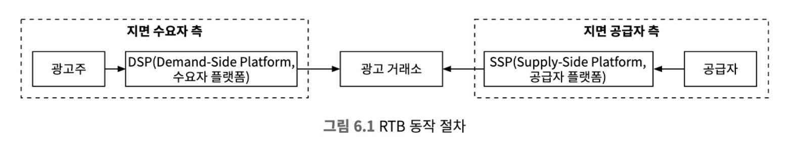

RTB 프로세스에서 속도는 중요하다. (보통 1초 내 모든 프로세스가 마무리 되어야 함)

데이터의 정확성
- 광고 클릭 이벤트 집계는 온라인 광고의 효율성을 측적하는데 결정적인 역할
- 광고주가 지불할 비용 계산

클릭 집계 결과에 따라 광고 캠페인 관리자는 광고 예산을 조정, 타깃그룹/키워드 변경 등의 광고 전략 수정

온라인 광고에 사용되는 핵심 지표
- CTR(Click-Through Rate, 클릭률)
- CVR(Conversion Rate, 전환률)
- .. 등 집계된 광고 클릭 데이터에 기반한 지표

## 1단계: 문제 이해 및 설계 범위 확정
대화 내용을 요약해보면
- 입력 데이터는 여러 서버에 분산된 로그파일
    - 클릭 이벤트는 수집될 때마다 이 로그파일의 끝에 추가
    - ad_id, click_time-stamp, user-id, ip, country 등의 속성을 가짐
- 매일 10억개의 공고 클릭이 발생, 광고느 200만 회 게재,
- 광고 클릭 이벤트 수는 매년 30%씩 증가
- 필수 지원 기능
    - 특정 광고에 대한 M분간 클릭 이벤트 수
    - 지난 1분간 가장 많이 클릭된 광고 100개.
        - 질의 기간과 광고 수는 변경 가능
        - 집계는 매분 이루어진다.
    - ip, user_id, country 등의 속성을 기준으로 상기 2개의 질의결과를 필터링 필요
- 다음과 같은 엣지 케이스를 고려해야 됨
    - 이벤트가 예상보다 늦게 도착할 수 있다.
    - 중복된 이벤트가 있을 수 있다.
    - 시스템 일부가 언제든지 다운될 수 있으므로 시스템 복구를 고려해야 한다.
- 모든 처리는 수분 내 이루어져야 한다.
    - RTB와 광고 클릭 집계의 지연시간 요건은 매우 다름
    - RTB 지연 시간은 응답성 요구사항 때문에 일반적으로 1초 미만이어야 함
    - 광고 클릭 이벤트 집계는 주로 광고 과금 및 보고에 사용되므로 몇 분 정도의 지연은 허용

### 개략적 추정
- 일간 능동 사용자(DAU) 수는 10억 명
- 각 사용자는 하루에 평균 1개의 광고를 클릭한다 가정. (하루 10억건의 광고 클릭 이벤트 발생)
- 광고 클릭 QPS 계산
    $$ QPS = {{{10^9} 이벤트} \over {하루 {10^5}초}} = 10,000 $$
- 최대 광고 클릭 QPS는 평균 QPS의 다섯 배, 즉 50,000 QPS
- 이벤트 당 0.1KB의 저장공간 필요 (하루 100GB, 한달 3TB 필요)

## 2단계: 개략적 설계안 제시 및 동의 구하기
### 질의 API 설계
필요한 기능 요구사항
- 지난 M분 동안 각 ad_id에 발생한 클릭 수 집계
- 지난 M분 동안 가장 많은 클릭이 발생한 상위 N개 ad_id 목록 반환
- 다양한 속성을 기준으로 집계 결과를 필터링하는 기능 지원

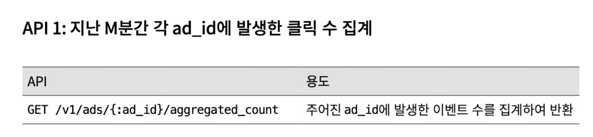
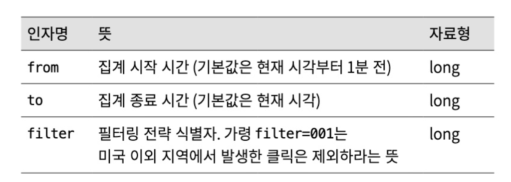
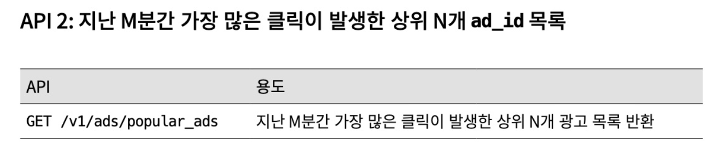
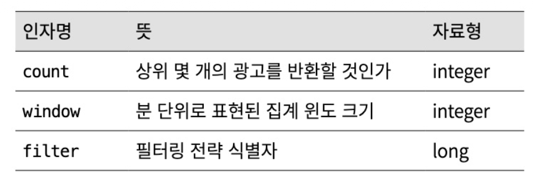

### 데이터 모델
- 원시데이터
ad_id, timestamp, user_id, up, country 등의 속성을 가지고 있다.

- 집계 결과 데이터
ad_id, minute, count 등의 분,시간 단위의 집계 후 데이터를 적재한다.

원시 데이터 vs 집계 데이터
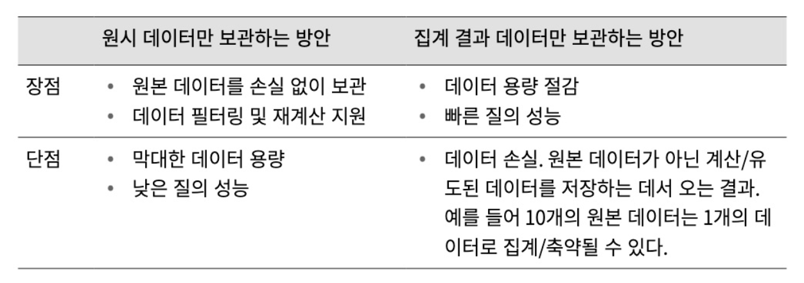

둘다 장단점이 뚜렷하기 때문에 둘 다 저장할 것을 추천한다.
- 문제 발생 시 디버깅에 활용할 수 있도록 원시 데이터 보관 필요
- 원시 데이터를 질의에 사용하기엔 데이터가 방대하므로 집계 결과로 질의를 처리
- 원시 데이터는 백업 데이터로 활용하며, 오래된 원시 데이터는 냉동 저장소로 옮기면 비용 절감 가능
- 집계 데이터는 활성 데이터 역할, 질의 성능을 높이기 위해 튜닝하는 것이 일반적

### 데이터베이스 선택
선택의 기준
- 데이터의 형태
- 읽기중심? 쓰기중심? 둘다?
- 트랙잭션 지원 필요?
- 질의 과정에서 SUM이나 COUNT 같은 온라인 분석 처리(OLAP) 함수를 많이 사용해야됨?

위의 요구사항으로 제시 된 시스템은 쓰기 중심이다.
쓰기 및 시간범위 질의에 최적화된 카산드라 or InfluxDB를 사용하는 것이 좀 더 바람직하다.

### 개략적 설계안
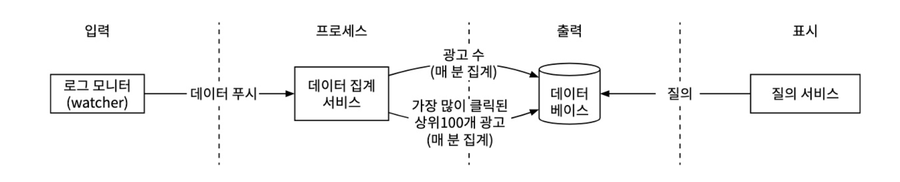

### 비동기 처리
위 제시안은 동기식 처리 방식이다. 생산자와 소비자의 용량이 항상 같을 수 없으므로 좋지 않음.

메세지 큐를 도입하여 생산자/소비자의 결합을 끊고 유연한 확장이 가능하도록 설계 필요

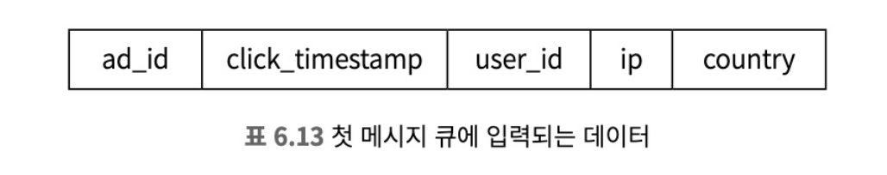

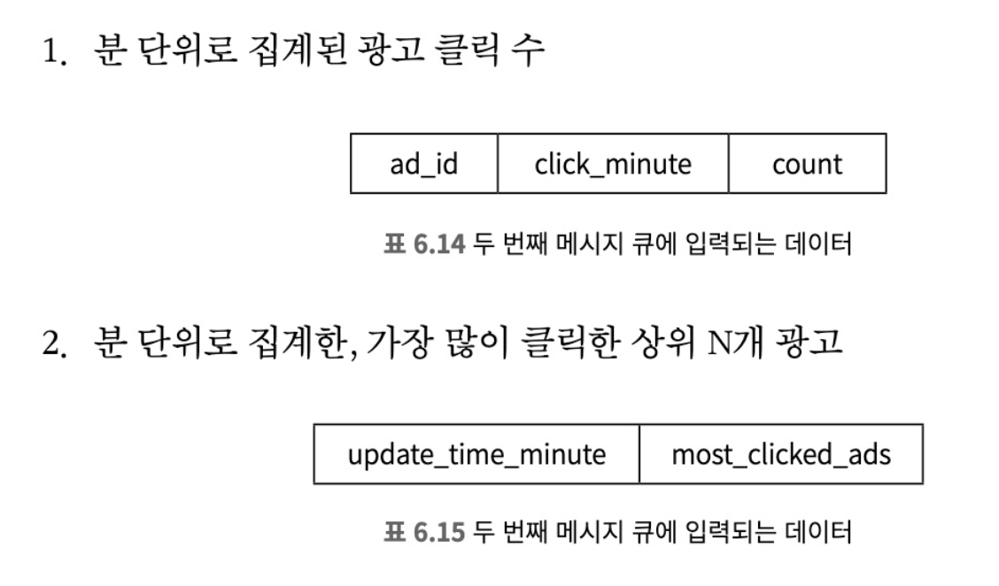

집계서비스에서 연산 후 데이터베이스로 바로 기록하지 않는 이유는 정확히 한번 처리하기 위함

### 집계 서비스
이벤트 집계의 좋은 방안 중 하나는 맵리듀스 프레임워크 사용.

맵리듓 프레임워크에 좋은 모델은 DAG 모델이다.

시스템을 맵/집계/리듀수 노드 등의 작은 컴퓨팅 단위로 세분화 하는 것.

각 노드는 한 가지 작업만 처리, 처리 결과를 다음 노트에 인계.

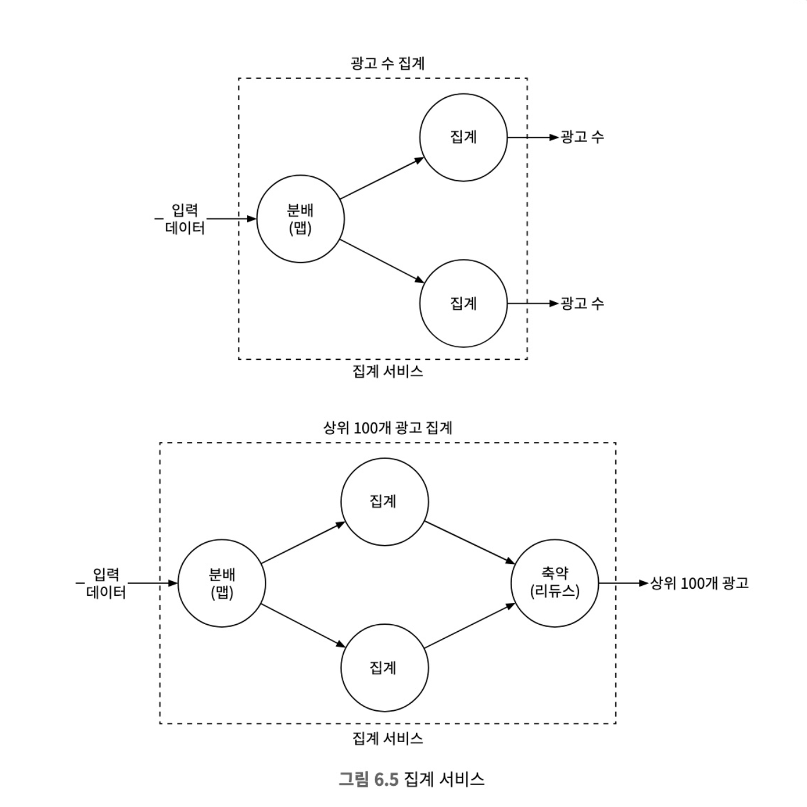

- 맵 노드
맵 노드는 데이터 출처에서 읽은 데이터를 필터링하고 변환하는 역할을 담당.
- 집계 노드 
ad_id 별 광고 클릭 이벤트 수를 매 분 메모리에서 집계한다.
- 리듀스 노드
집계노트의 결과들을 최종 결과로 축약한다.

## 3단계: 상세 설계
### 스트리밍 vs 일괄 처리
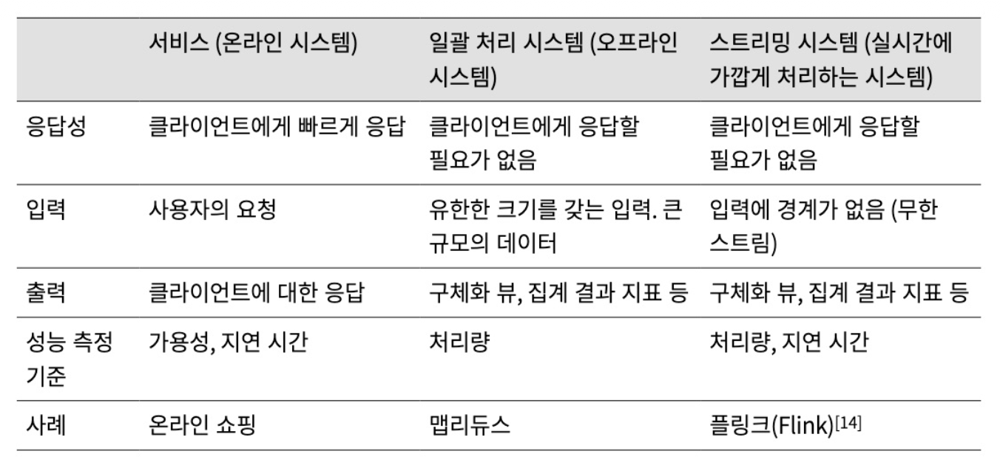

위 설계안에서는 두 방식 모두 사용.

집계 데이터는 스트리밍 방식으로 실시간 처리.

원시 데이터를 백업하기 위해 일괄 처리 방식을 사용.

### 데이터 재계산
이미 집계한 데이터를 다시 계산해야 하는경우
- 원시 데이터 저장소에서 데이터를 검색, 일괄 처리 프로세스로 처리
- 추출된 데이터는 전용 집계서비스로 전송되어 처리
    - 실시간 데이터 처리과장이 과거 데이터 재처리 프로세스와 간섭을 막기위해 별도의 서비스에서 수행
- 집계 결과는 두 번째 메시지 큐로 전송되어 집계 결과 데이터베이스에 반영

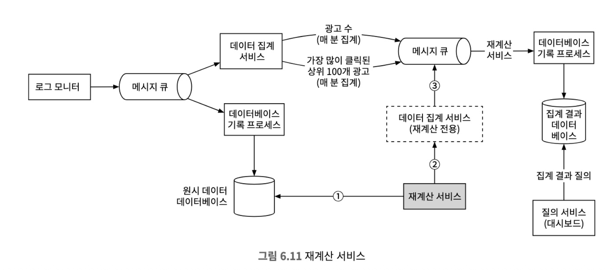

### 시간
- 이벤트 시각: 광고 클릭이 발생한 시각
  - 집계 결과가 보다 정확하다.
  - 타임스탬프에 의존하므로 설정 시각 오류 또는 의도적인 조작 문제에서 자유로울 수 없다.
- 처리 시각: 집계 서버가 클릭 이벤트를 처리한 시스템 시각
  - 서버 타임스탬프가 보다 안정적이다.
  - 집계 결과가 보다 부정확할 수 있다.

### 집계 윈도
- 텀블링 윈도는 시간을 같은 크기의 겹치지 않는 구간으로 분할한다. (매 분 발생한 클릭 이벤트 집계에 적합함)
- 슬라이딩 윈도는 데이터 스트림을 미끄러져 나아가면서 같은 구간 안에 있는 이벤트를 집계한다. (M분간 가장 많이 클릭된 상위 N개 광고를 알아내기에 적합함)

 

### 전달 보장
- 이벤트의 중복 처리를 어떻게 피할 수 있는가?
- 모든 이벤트의 처리를 어떻게 보장할 수 있는가?
- 본 설계안에서는 `정확히 한 번` 방식을 권장한다.
  - 데이터 손실을 막으려면 다운스트림에서 집계 결과 수신 확인 응답을 받은 후 오프셋을 저장해야 한다.
 
 

### 시스템 규모 확장
- 메시지 큐의 규모 확장
  - 생산자: 쉬움 (인스턴스 수 제한 X)
  - 소비자: 노드 추가/삭제를 통해 쉽게 조정 가능 (트래픽 적은 시간대에)
 
- 브로커
  - 해시 키: 같은 id를 갖는 이벤트를 전부 같은 파티션에서 구독 가능
  - 파티션의 수: 사전에 충분한 수만큼 확보 필요
  - 토픽의 물리적 샤딩: 여러 토픽을 두면 처리 대역폭을 높일 수 있지만, 유지 관리 비용도 커짐
 
- 집계 서비스의 규모 확장
  - 노드의 추가/삭제를 통해 수평적으로 조정이 가능하다.
 
- 데이터베이스의 규모 확장
  - 안정 해시와 유사한 방식으로 수평적인 규모 확장을 기본적으로 지원하고 있다.
 
 

### 핫스팟 문제
- 다른 서비스나 샤드보다 더 많은 데이터를 수신하는 서비스나 샤드를 핫스팟이라고 한다.
- 서버 과부하 문제가 발생할 수 있다.
- 더 많은 집계 서비스 노드를 할당하여 해결할 수 있다.

 

### 결함 내성
- 스냅숏을 이용하면 집계 서비스의 복구 절차가 단순해진다.
- 어떤 집계 서비스 노드 하나에 장애가 발생하면 해당 노드를 새 것으로 대체한 다음 마지막 스냅숏에서 데이터를 복구하면 된다.
- 스냅숏을 마지막으로 찍은 후에 도착한 새로운 이벤트는, 새 집계 서비스 노드가 카프카 브로커에서 읽어가 다시 처리할 것이다.

### 데이터 모니터링 및 정확성
- 지속적 모니터링
  - 지연 시간: 추적이 가능하도록 기록된 시각 사이의 차이를 시간 지표로 변환해서 모니터링하면 됨
  - 메시지 큐 크기: 카프카를 사용할 경우 레코드 처리 지연 지표를 대신 추적하면 됨
  - 집계 노드의 시스템 자원: CPU, 디스크, JVM 등 관련
 

### 조정
- 다양한 데이터를 비교하여 데이터 무결성을 보증하는 기법
- 매일 각 파티션에 기록된 클릭 이벤트를 이벤트 발생 시각에 따라 정렬한 결과를 일괄 처리하여 만들어 낸 후, 실시간 집계 결과와 비교할 수 있다.

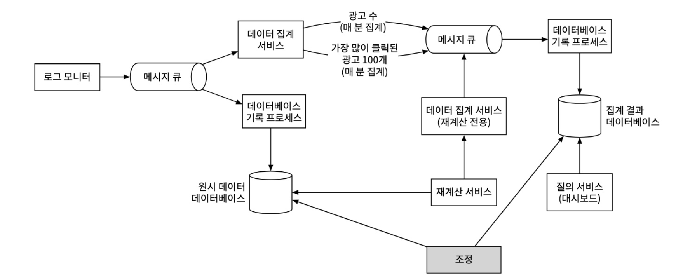

### 대안적 설계안

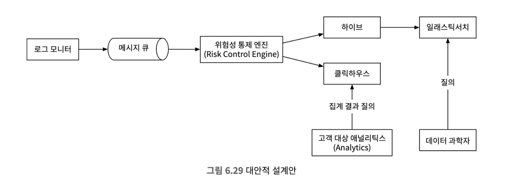

## 4단계:마무리
- 데이터 모델 및 API 설계
- 맵리듀스 데이터 처리 패러다임을 통해 광고 클릭 이벤트를 집계하는 방안
- 메시지 큐, 집계 서비스, 데이터베이스의 규모 확장 방안
- 핫스팟 문제를 해결하는 방안
- 시스템의 지속적 모니터링
- 데이터 조정을 통한 정확성 보증 방안
- 결함 내성