# 7장 호텔 예약 시스템

- 에어비앤비 시스템 설계
- 항공권 예약 시스템 설계
- 영화 티켓 예매 시스템 설계

## 1단계: 문제 이해 및 설계 범위 확정

- 5000개 호텔에 1000만개 객실을 갖춘 호텔 체인을 위한 웹사이트 구축
- 대금은 예약 시 지불
- 웹사이트나 앱을 통해서만 예약이 가능
- 예약 취소가 가능해야 한다.
- 10%의 초과 예약이 가능해야 한다.
    - 실제 객실 수의 110%에 해당하는 객실을 판매. (일부 고객이 예약을 취소할 것을 예상)
- 아래의 기능 지원
    - 호텔 정보 페이지
    - 객실 정보 페이지
    - 객실 예약 지원
    - 호텔이나 객실 정보를 추가/삭제/갱신할 수 있는 관리자 페이지 지원
    - 초과 예약 지원
- 객실 가격은 유동적.
    - 그날 객실의 여유가 얼마나 있는지에 따라 달라짐.(매일 달라질 수 있음.)

비기능 요구사항
- 높은 수준의 동시성 지원: 성수기, 대규모 이벤트 기간에는 일부 인기 호텔의 특정 객실을 예약하려는 고객이 몰릴 수 있음.
- 적절한 지연시간: 사용자가 예약을 할 때 응답 시간이 빠르면 좋지만 몇 초 정도 걸려도 괜찮은 수준

### 개략적 규모 추정
- 5000개의 호텔, 1000만개의 객실
- 평균적으로 객실의 70%가 사용중, 평균 투숙기간은 3일
- 일일 예약 건수: $ {{1백만 \times 0.7} \over 3} = 233,333 (약 240,000) $
- 초당 예약 건수: $ {240,000 \over {하루에 10^5 초}} = 3. $  따라서 초당 예약 트랜잭션 수 (TPS) 는 그닥 높지 않은 수준

시스템 내 모든 페이지의 QPS(Queries-Per-Second) 계산하기
- 호텔/객실 상세 페이지: 사용자가 호텔/객실 정보를 확인(조회)
- 예약 상세 정보 페이지: 사용자가 날짜, 투숙인원, 결제 방법 등의 상세정보를 확인(조회)
- 객실 예약 페이지: `예약` 객실 버튼을 눌러 예약을 실시 (예약 트랜잭션 발생)

QPS 분포
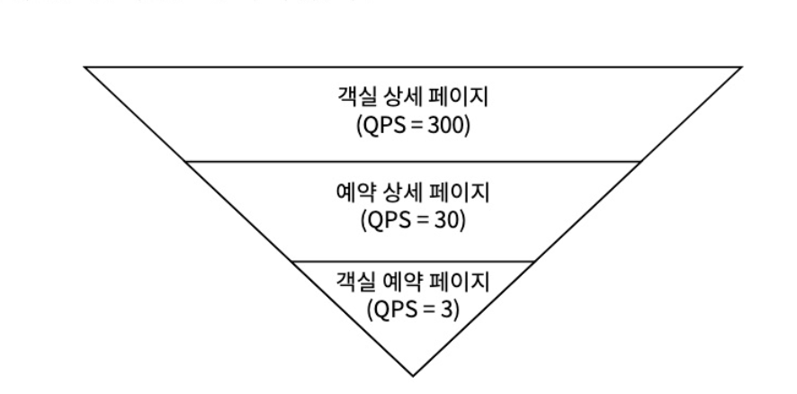

## 2단계:개략적 설계안 제시 및 동의 구하기
### API 설계
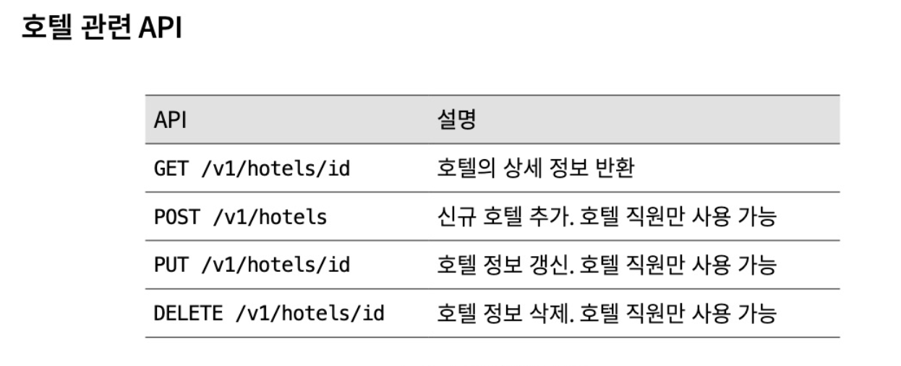
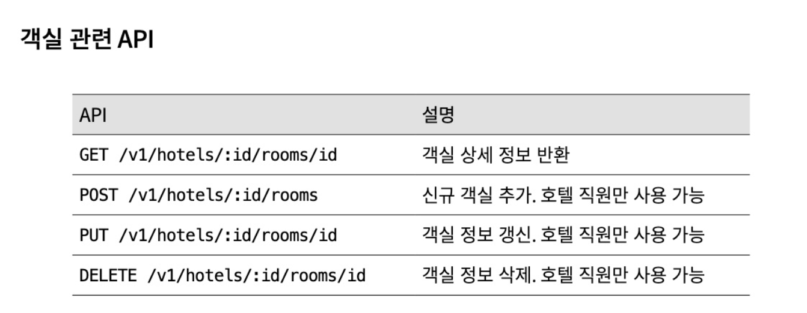
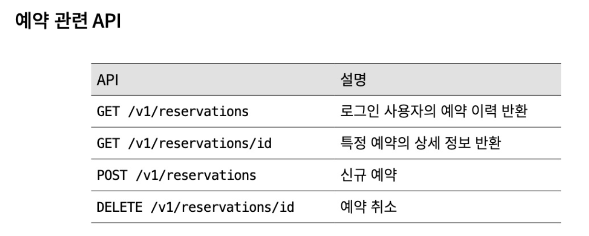

신규 예약 접수에서 아래와 같은 인자를 전달한다.
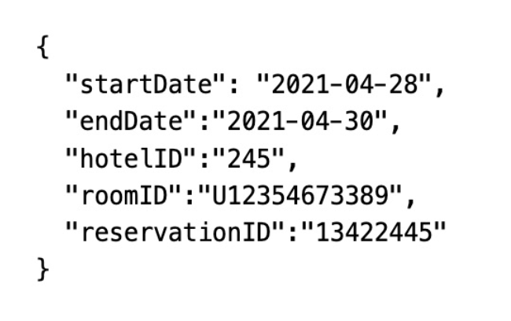
여기서 `reservationID`는 이중 예약을 방지하고,
동일한 예약은 단 한번만 이루어 지도록 보증하는 멱등키(Idempotent Key) 이다.

### 데이터 모델
다음의 질의를 지원해야한다
- 호텔 상세 정보 확인
- 지정된 날짜 범위에 사용 가능한 객실 유형 확인
- 예약 정보 기록
- 예약 내역 또는 과거 예약 이력 정보 조회

대략적인 추정 과정을 통해 시스템 규모가 크지 않고, 이벤트가 있을 경우 트래픽이 급증 할 것을 고려해야한다.
이를 종합적으로 고려하여 RDB를 사용하기로 결정
그 이유는 아래와 같다.
- RDB는 읽기 빈도가 쓰기 연산에 비해 높은 작업 흐름을 잘 지원함.
- NoSQL은 대체로 쓰기 연산에 최적화되어있다.
- RDB는 ACID속성을 보장.
    - 예약 시스템에서 트랜잭션의 속성은 매우 중요
- 관계형 데이터베이스를 이용하면 데이터를 쉽게 모델링 가능하다

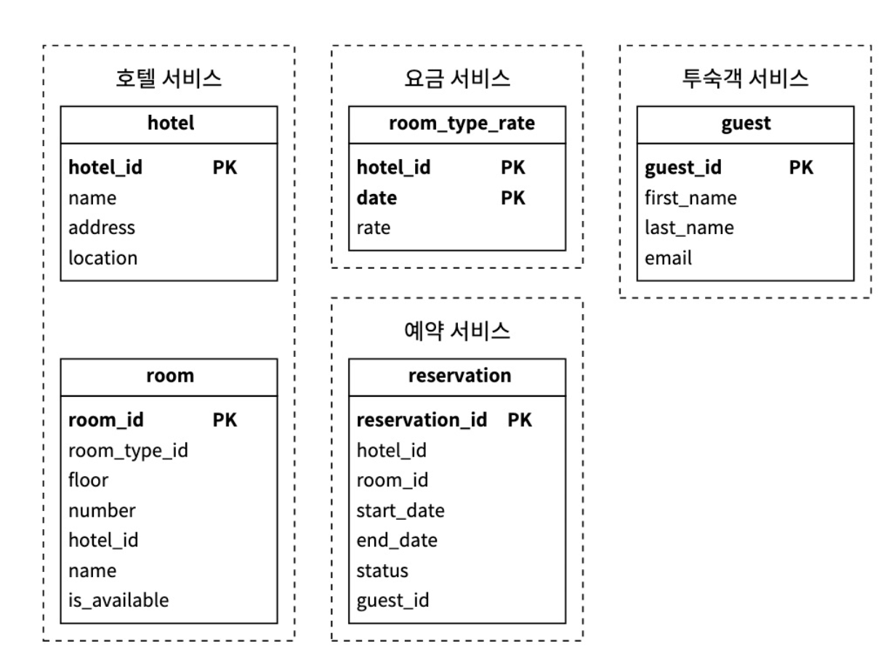

예약 상테에 따른 상태 천이도 (State Machine)
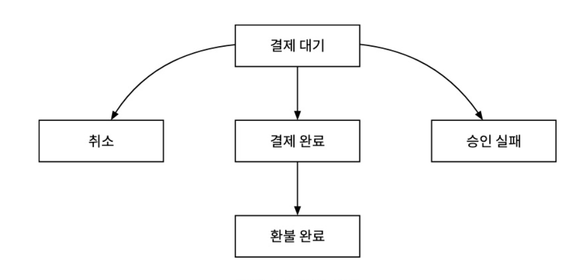

### 계략적 설계안
MSA 를 채탁하였다.
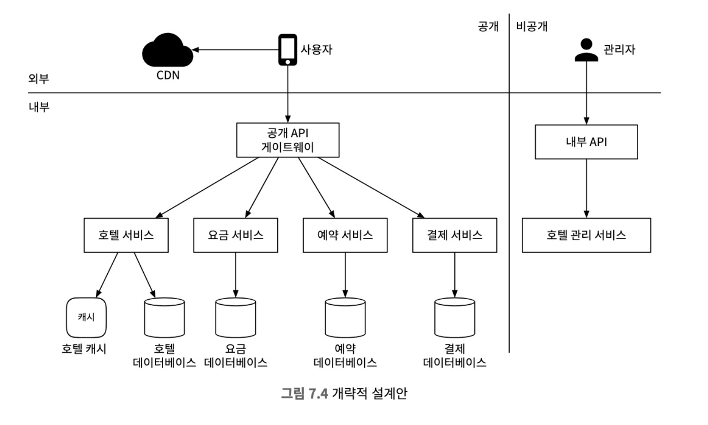
- 사용자: 휴대폰 및 PC 로 객실을 예약하는 당사자다.
- 관리자: 고객 환불, 예약 취소, 객실 정보 갱신 등의 관리 작업을 수행할 권한이 있는 호텔 직원
- CDN: 모든 정적 콘텐츠를 캐시하여 웹사이트 로드 성능을 개선하는데 이용
- API Gateway: 처리율 제한(rate-limiting), 인증 등의 기능을 지원하는 완전 관리형 서비스.
    - 엔드포인트를 기반으로 특정 서비스에 요청을 전달할 수 있도록 구성된다.
- 내부 API: 승인된 호텔 직원만 사용 가능한 API
    - 내부 소프트웨어나 웹사이트를 통해서만 이용 가능. (VPN등의 기술로 외부의 공격으로부터 보호)
- 호텔 서비스: 호텔 및 객실에 대한 상세정보 제공
    - 호텔/객실 데이터는 일반적으로 정적이므로 쉽게 캐시 가능
- 요금 서비스: 미래의 어떤 날에 어떤 요금을 받아야 하는지 데이터를 제공하는 서비스
    - 수요에 따른 요금 계산
- 결제 서비스: 고객의 결제를 맡아 처리
    - 결제가 성공되면 예약 상태를 결제 완료로 갱신
    - 결제 실패 시 승인 실패로 업데이트
- 호텔 관리 서비스: 승인된 호텔 직원만 사용가능
    - 임박한 예약기록 확인, 고객 객실 예약 및 취소 등의 기능 제공

## 3단계: 상세 설계

### 개선된 데이터 모델

호텔객실은 특정 객실이 아닌 객실 유형으로 예약

예약 API 의 경우 호출 인자가 roomID -> roomTypeID로 변경

스키마는 당ㅁ과 같이 변경

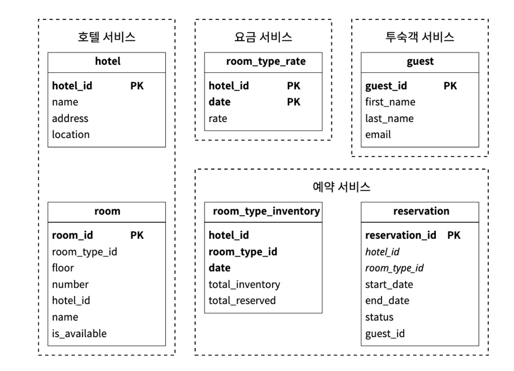

변경사항 중 중요한 부분

room: 객실에 관계된 정보
room_type_rate: 특정 객실 유형의 특정 일자 요금 정보
reservation: 투숙객 예약 정보
room_type_inventory: 호텔의 모든 객실 유형을 담는 테이블
- hotel_id: 호텔 식별자
- room_type_id: 객실 유형 실별자
- date: 일자
- total_inventory: 예약 가능한 객실 수. (총 객실 수 - 예약 불가능 객실 수)
- total_reserved: 저장된 hotel_id, room_type_id, date 에 예약된 모든 객실의 수

저장용량 추정
5000개의 호텔 X 20개의 호텔유형 X 2년 X 365일 = 7300만

많은 용량은 아니지만 DB 를 하나에 몰아두기엔 SPOF 문제 발생 가능성

고용성을 달성하려면 여러 지역, 가용성 구역에 DB를 복제해야된다.

### 동시성 문제
1. 같은 사용자가 예약 버튼을 여러 번 누를 수 있다.
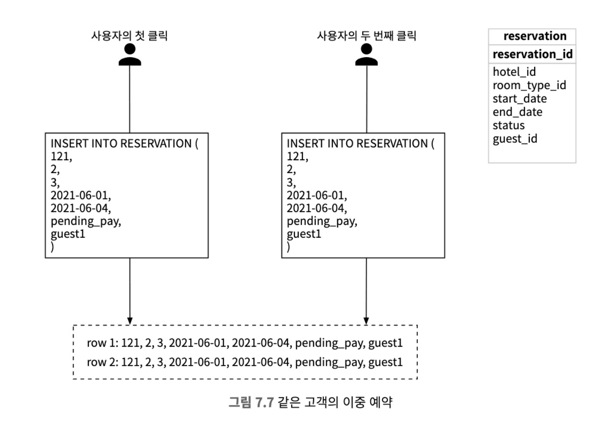
위 그림처럼 예약이 두개 만들어 질 경우
- 클라이언트 측 구현
예약 버튼을 클릭 한 후 예약 버튼을 비활성화 한다.
대부분의 이중클릭 문제는 해결 가능하지만, 사용자가 JS 비활성화하면 우회 가능
- 멱등(Idempotent) API
예약 API 요청에 멱등 키를 추가하는 방안.
몇번을 호출해도 같은 결과를 내는 API
reservation_id 를 추가하여 이중예약 문제를 해결한다.

2. 여러 사용자가 같은 객실을 동시에 예약하려 할 수 있다.
- DB 트랜잭션 격리 수준이 가장 높은 수준이 아닐 경우
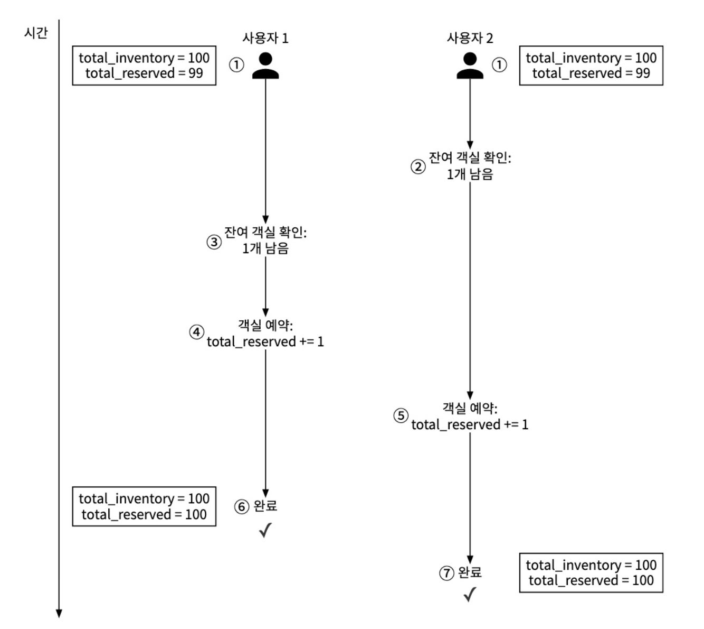

두 경우 모두 성공적으로 예약이 반영된다.

이 경우 어던 형태로든 락(lock)을 활용해야 한다.

잔여 객실 확인 -> 객실 예약 순서

#### 방안1: 비관적 락
비관적 락은 동시성에 의한 경쟁이 무조건 발생할 것이다.
하나의 트랜잭션만 자원을 쓸 수 있도록 락을 건다.

장점: 
- 애플리케이션이 변경 중이거나 변경이 끝난 데이터를 갱신하는 일을 막을 수 있따.
- 구현이 쉽고 모든 갱신 연산을 직렬화하여 충돌을 막는다.
- 데이터에 대한 경합이 심할 때 유용하다.
단점:
- 여러 레코드에 락을 걸면 교착상태(deadlock)가 발생할 수 있다. 이를 방지하기 위한 코드 작성은 까다로울 수 있다.
- 확장성이 낮다. 트랜잭션이 락을 해제하지 않고 오래 가지고 있는다면 다른 트랜잭션은 해당 자원에 접근이 불가능하다. 이는 수명이 길거나 많은 엔티티의 경우 DB 성능 저하를 일으킨다

#### 방안2: 낙관적 락
낙관적 락은 여러 사용자가 동시에 같은 자원에 접근하는 것을 허용한다.
버전 번호와 타임스탬프 두가지 방법으로 구현한다.
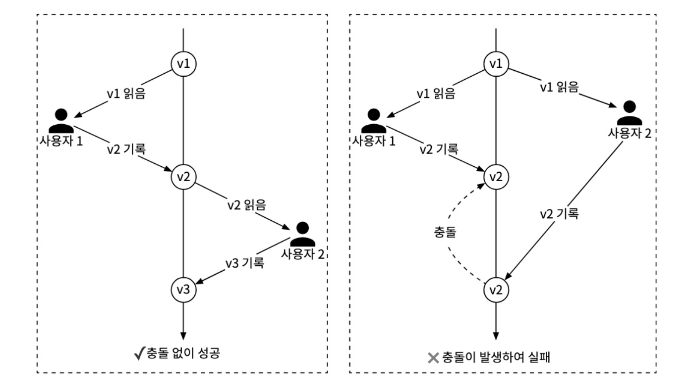
버전검사를 통해 데이터의 유효성을 판단한다.

낙관적 락은 DB에 락을 걸지 않기 때문에 일반적으로는 비관적 락보다 빠르다.
하지만 동시성 수준이 아주 높으면 성능이 급격하게 나빠진다.

장점: 
- 애플리케이션이 유효하지 않은 데이터를 편집하는 일을 막는다.
- DB에 락을 걸 필요가 없다. DB 관점에서 락은 존재하지 않으며 애플리케이션에게 책임이 있다.
- 낙관적 락은 데이터에 대한 경쟁이 치열하지 않은 상황에 적합하다.

단점:
- 경쟁이 치열한 상황에서는 성능이 좋지 못하다.

#### 방안3: 데이터베이스 제약 조건
낙관적 락과 아주 유사하다.
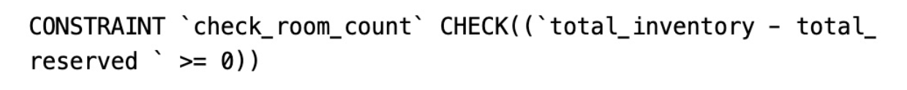

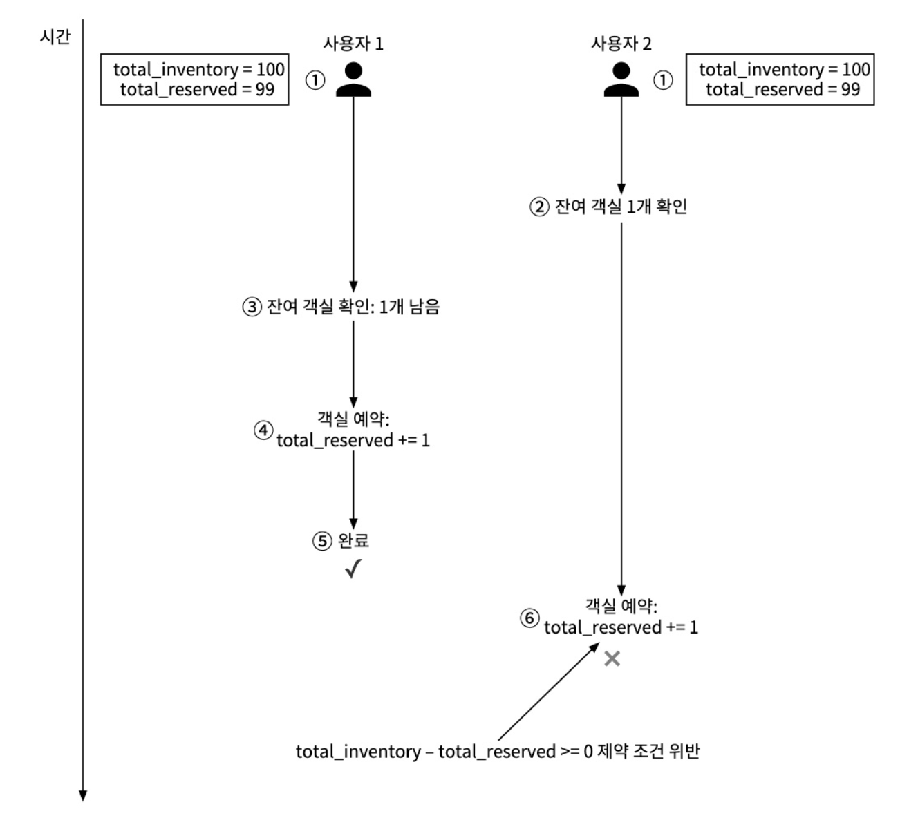

insert 당시의 제약조건을 확인하므로 낙관적 락과 비슷한 개념

장점:
- 구현이 쉽다.
- 데이터에 대한 경쟁이 심하지 않을 때 잘 동작한다.

단점:
- 낙관적 락과 마찬가지로 경쟁이 심하면 실패하는 연산 수가 엄청나게 늘어날 수 있다.
- 애플리케이션 단에서 버전을 통제하기 어렵다.
- 제약조건의 경우 DB마다 다르므로, DB 교체 시 문제가 생길 수 잇다.

### 시스템 규모 확장
일반적으로 호텔 예약 시스템에 대한 부하는 높지 않음

만약 호텔 예약 시스템이 해당 호텔만이 아닌, 외부 유명 서비스와 연동 되어야한다면?
-> QPS 대량 증가 가능성

무상태, 정적 자원 서빙의 경우 서버를 늘리는 것으로 대부분의 성능 문제 해결 가능.

DB 의 경우 어려움

### 데이터베이스 샤딩
DB 규모를 늘리는 방법중 하나는 샤딩(sharding)을 적용하는 것

이 시스템의 대부분의 질의는 `hotel_id`를 필터링 조건으로 사용
따라서 `hotel_id`를 샤딩 조건으로 사용하면 좋음

$ 30,000 QPS $ 일 경우, 16개의 샤드로 샤딩 후 
$ {30,000 \over 16 } = 1875 QPS $ 로 부하를 분산할 수 있다.

### 캐시
호텔 잔여 객실 데이터는 현재, 미래의 데이터만 필요 (과거 데이터에 대한 접근 X)
따라서 낡은 데이터는 자동적으로 소멸되도록 TTL(Time-To-Live) 적용하면 바람직

Redis는 TTL, LRU(Least Recently Used) 캐시 교체 정책을 사용하여 메모리 최적화 가능

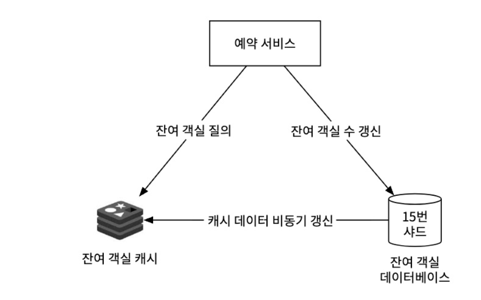

예약서비스: 아래와 같은 잔여 객실 관리 API 제공
- 지정된 호텔과 객실 유형, 주어진 날짜 범위에 이용 가능한 객실의 수 질의
- 객실을 예약하고 total_reserved의 값을 1 증가
- 고객이 예약을 취소하면 잔여 객실 수를 갱신

잔여 객실 캐시: 모든 잔여 객실 관리에 필요한 질의는 레디스로 구현
- 키: hotelId_roomTypeID_{날짜}
- 값: 주어진 호텔 ID, 객실 유형ID, 날짜에 맞는 잔여 객실 수
- 읽기 연산의 빈도가 압도적으로 많기 때문에 해당 연산은 캐시가 처리

잔여 객실 데이터베이스: 잔여 객실 수에 대한 가장 믿을 만한 정보가 보관됨

캐시가 주는 새로운 과제
캐시 계층 추가 시 시스템의 확장성과 처리량은 대폭증가.
DB와 캐시 사이의 데이터 일관성 유지에 관한 관리포인트 추가.

잔여객실데이터는 DB에 먼저 반영되므로, 실제로는 잔여 객실이 없지만 캐시에는 존재한다고 표시될 경우가 있음.

따라서 새로운 데이터 삽입 당시 DB에 직접 확인 필요

### 서비스 간 데이터 일관성

모놀리식 아키텍처의 경우 데이터의 일관성을 보장하기 위해 RDB를 공유하는것이 보통의 경우.

현재 설계안의 MSA 기반 설계는 예약서비스가 예약 및 잔여 객실 API를 보두 담당하고, 예약 테이블과 잔여 객실 테이블을 동일한 RDB에 저장하는 하이브리드 방식이다.
이 방식은 모놀리식 아키텍처처럼 데이터의 일관성을 보장하기 좋다.

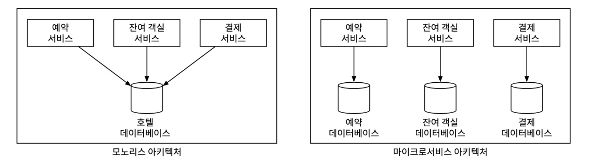

각각의 마이크로서비스가 각자의 DB를 가지고 있다면 트랜잭션으로 데이터 일관성을 보증하는 기법을 사용할 수 없다.

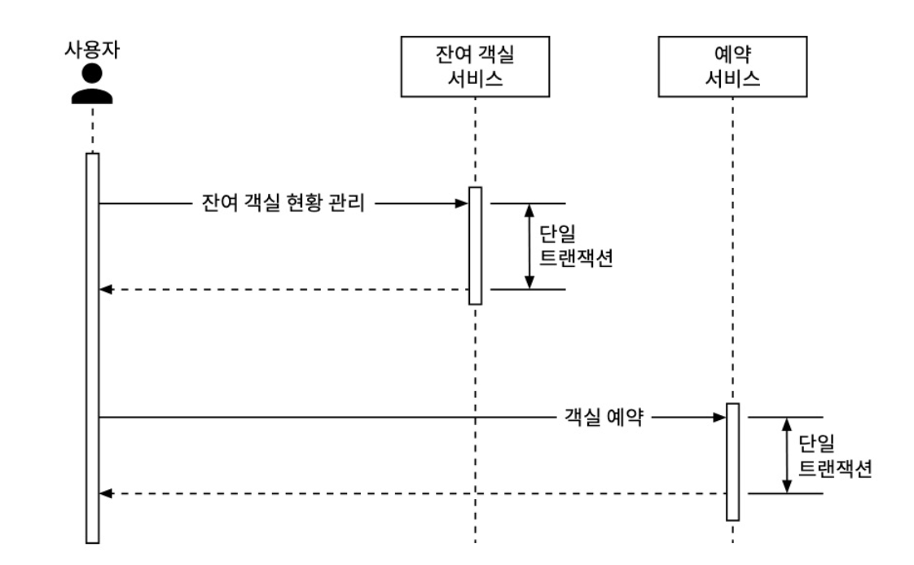
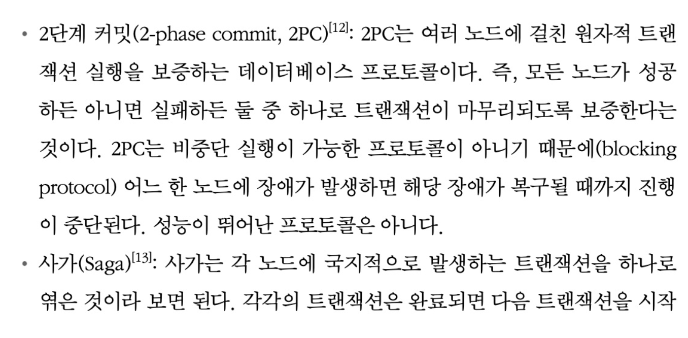
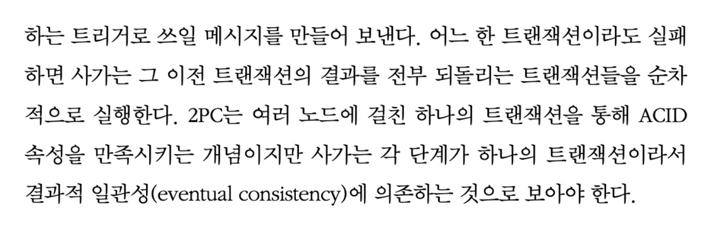

MSA 각 서비스간 데이터 불일치를 해결하기 위해 사용되는 복잡한 메커니즘은 시스템 설게의 복잡성을 증가시킨다.

이것이 그만한 가치가 있는 작업인지는 온전히 설계자의 몫이다.

본 설계안은 그만한 가치가 판단하여 동일한 RDB에 저장하는 실용적인 방식을 선택하였다.

## 4단계: 마무리

락을 통한 동시성 제어와 샤딩 및 캐싱을 통한 부하 분산을 통해 대규모 트래픽을 처리하고,
MSA에서 데이터 일관성 문제를 해결할 수 있는 몇가지 방법을 알 수 있었다.

트레이드 오프를 고려하는것이 가장 중요한듯

